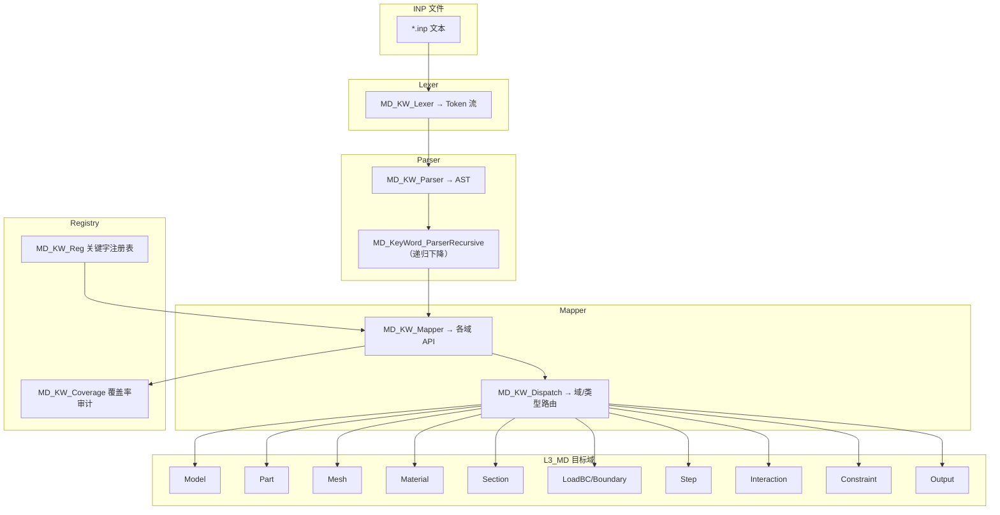

# L3_MD/KeyWord 标准域柱卡

**域路径**：`L3_MD/KeyWord`  
**角色**：S1 单层专属域 -- 输入解析层，INP 关键字 → 模型数据的唯一门户  
**文档日期**：2026-04-30  
**柱型**：单层（仅 L3_MD，不跨 L4/L5）

---

## 0. 源文件与权威入口核对

| 项 | 说明 |
|----|------|
| 合同卡 | `L3_MD/KeyWord/CONTRACT.md` |
| 域柱卡 | `L3_MD/KeyWord/DOMAIN_PILLAR_CARD.md`（本文件） |
| 设计文档 | `L3_MD/KeyWord/DESIGN_KeyWord_Domain.md` |
| 闭环测试 | `tests/TEST_KeyWord_test.f90`（待建） |

### 源文件清单（17 个 .f90）

| # | 文件 | 大小 | 职责 |
|---|------|------|------|
| 1 | `MD_KW_Def.f90` | 18.7KB | Token/Param/AST 底层类型（`KW_TokenType`/`KW_LexerStateType`/`KW_ParserStateType`） |
| 2 | `MD_KeyWord_Def.f90` | 5.9KB | 四型 TYPE（Desc/State/Algo/Ctx）权威定义 |
| 3 | `MD_KW_Lexer.f90` | 18.1KB | Lexer 词法分析（`kw_lexer_init`/`kw_lexer_next_token`） |
| 4 | `MD_KW_Parser.f90` | 27.8KB | Parser 语法分析（`kw_parser_parse_file`/AST 构建） |
| 5 | `MD_KW_Mapper.f90` | 394.4KB | **核心** — 语义映射引擎（AST → L3 域对象，170+ 映射子程序） |
| 6 | `MD_KW_Dispatch.f90` | 13.3KB | 关键字分发（`MD_KW_Dispatch_Info`/`MD_KW_GetDomain`） |
| 7 | `MD_KW_Reg.f90` | 159.3KB | 关键字注册表（所有关键字定义/元数据/分类注册） |
| 8 | `MD_KW.f90` | 113.1KB | 多子模块聚合 + **门面 `MODULE MD_KW`**（末尾）：覆盖率/注册扩展类型 + 再导出 `KW_ASTNodeType` 等（`MD_KWRT_Brg` 等 consumers） |
| 9 | `MD_KW_Abaqus.f90` | 9.8KB | ABAQUS 关键字驱动（`kw_parse_inp_file`/`kw_map_ast_to_model`） |
| 10 | `MD_KW_MemPool.f90` | 11.6KB | 解析内存池（Real/Int MemoryPool） |
| 11 | `MD_KW_Core.f90` | 8.6KB | 域核心 API |
| 12 | `MD_Inp_Parse.f90` | 43.4KB | INP 解析入口（`parse_inp_file` + 各关键字解析） |
| 13 | `MD_KeyWord_Domain.f90` | 17.7KB | 域容器（`MODULE MD_KeyWord_Domain` + TBPs） |
| 14 | `MD_KeyWord_ParserRecursive.f90` | 40.7KB | 递归下降解析（AST → Model 映射） |
| 15 | `MD_KeyWordParser_Def.f90` | 8.7KB | AST Node/Rule 类型 |
| 16 | `MD_KeyWord_Validator.f90` | 7.7KB | 参数校验（`MD_Is_Valid_Keyword`/`MD_Validate_Required_Params`） |
| 17 | `MD_KWAP_Brg.f90` | 3.1KB | L3→L6 AP 桥 |

---

## 1. 域职责十件套

| # | 项 | KeyWord 落地要点 |
|---|----|-----------------|
| 1 | **域定位** | L3 单层型(S1)。**输入→模型的唯一门户**：INP 关键字解析与注册，将文本输入转化为结构化 L3 域对象。 |
| 2 | **职责边界** | **负责**：Lexer（词法分析）、Parser（语法分析）、AST 构建、语义映射（AST→各域 Desc）、关键字注册/分类/覆盖率审计、内存池管理、参数校验。**禁止**：执行计算（本构/单元/求解）、直接修改 L4/L5 数据、存储非解析期数据。 |
| 3 | **功能模块** | 见 §0 源文件清单（17 个 .f90）。 |
| 4 | **四型 TYPE** | **Desc**：RETAINED（`MD_KeyWord_Desc` — n_registered/entries；`KWKeywordDef` 旧条目）。**State**：RETAINED（`MD_KeyWord_State` — current_keyword/current_line/error_count）。**Algo**：RETAINED（`MD_KeyWord_Algo` — strict_mode/case_sensitive/error_limit）。**Ctx**：RETAINED（`MD_KeyWord_Ctx` — parse_stage/ast_root_id；`KW_LexerStateType`/`KW_ParserStateType` legacy）。 |
| 5 | **公开接口** | 以 `CONTRACT.md` 为准：Lexer_Init/NextToken、Parser_Init/Parse、RegisterKeywords、Mapper_Map、Dispatch、Coverage_Report。 |
| 6 | **数据所有权** | KeyWord 持有解析期 AST 和关键字注册表；映射后数据写入各目标域（Model/Part/Mesh/Material/...），KeyWord 不持有映射结果。 |
| 7 | **依赖规则** | 允许：KeyWord 调用各目标域 API（`Add*`/`Set*`）写入 Desc。禁止：目标域反向调用 KeyWord 内部解析逻辑；KeyWord 绕过目标域 API 直接操作数据。 |
| 8 | **合同卡** | `L3_MD/KeyWord/CONTRACT.md`（v3.1）。 |
| 9 | **Harness 验收** | 见 §6。 |
| 10 | **扩展点** | 新关键字：通过 `MD_KW_Reg` 注册 + `MD_KW_Mapper` 新增映射子程序；插件关键字：通过 `MD_KW_Extension` 插件机制。 |

---

## 2. 域柱定位与主链

KeyWord 是 S1 单层专属域（仅 L3_MD）。作为 **输入→模型的唯一门户**：

| 层 | 职责 | 禁止 |
|----|------|------|
| L3_MD | INP 关键字解析（Lexer→Parser→AST→Mapper→各域 API）、关键字注册/分类、覆盖率审计 | 执行计算、存储运行时数据 |

**关键角色：输入→模型的门户**

KeyWord 解析后分发到各目标域：

| 关键字类 | 目标域 |
|----------|--------|
| `*MODEL`/`*PART`/`*ASSEMBLY`/`*INSTANCE` | Model/Part/Assembly |
| `*NODE`/`*ELEMENT`/`*NSET`/`*ELSET`/`*SURFACE` | Mesh/Part(Sets) |
| `*MATERIAL`/`*ELASTIC`/`*PLASTIC`/`*DENSITY`/... | Material |
| `*SOLID SECTION`/`*SHELL SECTION`/`*BEAM SECTION` | Section |
| `*BOUNDARY`/`*CLOAD`/`*DLOAD`/`*AMPLITUDE` | Boundary/LoadBC |
| `*STEP`/`*STATIC`/`*DYNAMIC`/`*FREQUENCY`/... | Step/Analysis |
| `*CONTACT PAIR`/`*SURFACE INTERACTION`/`*FRICTION` | Interaction/Contact |
| `*TIE`/`*COUPLING`/`*MPC`/`*EQUATION`/`*RIGID BODY` | Constraint |
| `*OUTPUT`/`*NODE FILE`/`*EL FILE` | Output |
| `*INITIAL CONDITIONS`/`*TEMPERATURE` | Field/InitCond |

主链：

```text
INP 文件
  -> MD_KW_Lexer (词法分析 → Token 流)
  -> MD_KW_Parser (语法分析 → AST)
  -> MD_KW_Mapper (语义映射 → 各域 API 调用)
  -> 各域 Add*/Set* (Desc 写入)
  -> MD_KW_Coverage_Report (覆盖率审计)
```

---

## 3. 四型裁剪决策

| 层 | Desc | State | Algo | Ctx |
|----|------|-------|------|-----|
| L3 | RETAINED(`MD_KeyWord_Desc` 注册表 + `KWKeywordDef` 旧条目) | RETAINED(`MD_KeyWord_State` 解析进度) | RETAINED(`MD_KeyWord_Algo` 解析策略) | RETAINED(`MD_KeyWord_Ctx` 解析运行时 + `KW_LexerStateType`/`KW_ParserStateType`) |

---

## 4. .f90 功能模块清单

### 4.1 解析管线（Lexer → Parser → Mapper）

| 文件 | 后缀 | 模块命名 | 职责 | 现有 |
|------|------|----------|------|------|
| `MD_KW_Def.f90` | Def | `MD_KW_Def` | Token/Param/AST/Lexer/Parser 底层类型 | Y |
| `MD_KW_Lexer.f90` | Lexer | `MD_KW_Lexer` | 词法分析（Token 识别/行号追踪） | Y |
| `MD_KW_Parser.f90` | Parser | `MD_KW_Parser` | 语法分析（AST 构建/上下文栈） | Y |
| `MD_KW_Mapper.f90` | Mapper | `MD_KW_Mapper` | **核心** — 语义映射引擎（170+ 映射子程序） | Y |
| `MD_KW_Dispatch.f90` | Dispatch | `MD_KW_Dispatch` | 关键字分发（域/类型识别） | Y |
| `MD_Inp_Parse.f90` | Parse | `MD_Inp_Parse` | INP 解析入口（简化路径） | Y |

### 4.2 注册与审计

| 文件 | 后缀 | 模块命名 | 职责 | 现有 |
|------|------|----------|------|------|
| `MD_KW_Reg.f90` | Reg | `MD_KW_Reg` | 关键字注册表（哈希表/分类注册/P0-P1-P2 覆盖） | Y |
| `MD_KW.f90` | — | `MD_KW_Coverage_Type`…`MD_KW` | Coverage（P0/P1 审计）+ Registry + Mapper 检查 + Extension；**`MODULE MD_KW` 门面** | Y |
| `MD_KW_Abaqus.f90` | Abaqus | `MD_KW_Abaqus` | ABAQUS 关键字驱动（全流程入口） | Y |

### 4.3 域容器与类型

| 文件 | 后缀 | 模块命名 | 职责 | 现有 |
|------|------|----------|------|------|
| `MD_KeyWord_Def.f90` | Def | `MD_KeyWord_Def` | 四型 Desc/State/Algo/Ctx 权威定义 | Y |
| `MD_KeyWord_Domain.f90` | Domain | `MD_KeyWord_Domain` | 域容器（`TYPE(MD_KeyWord_Domain)` + Init/Parse/Register/Audit TBPs） | Y |
| `MD_KW_Core.f90` | Core | `MD_KW_Core` | 域核心 API | Y |
| `MD_KeyWordParser_Def.f90` | Def | `MD_KeyWordParser_Def` | AST Node/Rule/ParamSpec 类型 | Y |

### 4.4 高级解析与校验

| 文件 | 后缀 | 模块命名 | 职责 | 现有 |
|------|------|----------|------|------|
| `MD_KeyWord_ParserRecursive.f90` | Parser | `MD_KeyWord_ParserRecursive` | 递归下降解析（规则驱动/AST→Model 映射） | Y |
| `MD_KeyWord_Validator.f90` | Validator | `MD_KeyWord_Validator` | 参数校验（关键字合法性/必需参数/参数值） | Y |
| `MD_KW_MemPool.f90` | MemPool | `MD_KW_MemPool` | 解析内存池（Real/Int MemoryPool + Manager） | Y |

### 4.5 桥接

| 文件 | 后缀 | 模块命名 | 职责 | 现有 |
|------|------|----------|------|------|
| `MD_KWAP_Brg.f90` | Brg | `MD_KWAP_Brg` | L3→L6 AP 桥 | Y |

---

## 5. 数据生命周期图



**文字要点**

1. **文件读取(Input)**：INP 文件文本输入。
2. **词法分析(Lexer)**：`MD_KW_Lexer` 将文本分割为 Token 流（关键字/参数/数据行）。
3. **语法分析(Parser)**：`MD_KW_Parser` / `MD_KeyWord_ParserRecursive` 构建 AST。
4. **语义映射(Mapper)**：`MD_KW_Mapper` 遍历 AST，通过 `MD_KW_Dispatch` 路由到目标域，调用各域 `Add*/Set*` API 写入 Desc。
5. **覆盖率审计(Coverage)**：解析完成后 `MD_KW_Coverage_Report` 生成覆盖率报告（P0/P1/P2）。

---

## 6. Harness 验收项

| 类别 | 验收项 |
|------|--------|
| **命名** | `MD_KW_*` / `MD_KeyWord_*` / `MD_Inp_*` / `MD_KWAP_*` 前缀与层域一致；`check_naming.py` 通过。 |
| **依赖/架构** | KeyWord 域禁止执行计算；解析结果须调用目标域 API 写入，禁止绕过。 |
| **合同** | `CONTRACT.md` 存在且与公开过程签名一致。 |
| **P0 覆盖** | 24 个核心关键字 100% 覆盖。 |
| **P1 覆盖** | 12 个重要关键字 100% 覆盖。 |
| **错误处理** | Lexer/Parser 错误必须包含行号/列号；累计到 `error_count`；不使用 `STOP`。 |
| **精度** | 使用 `IF_Prec_Core` 的 `wp`/`i4`。 |

---

## 7. 清旧资产台账

| 文件 | 处置 | 说明 |
|------|------|------|
| `MD_KW_Mapper.f90` | ACTIVE/LARGE (394.4KB) | 最大文件，170+ 映射子程序，后续可考虑按目标域拆分 |
| `MD_KW_Reg.f90` | ACTIVE/LARGE (159.3KB) | 全量关键字注册，后续可考虑按分类拆分 |
| `MD_KW.f90` | ACTIVE/LARGE (113.1KB) | 多子模块聚合，后续可考虑拆分 |

### 后续任务触发表

| 任务 | 触发条件 | 处理原则 |
|------|----------|----------|
| `KW-Mapper-Split` | `MD_KW_Mapper.f90` (394.4KB) 维护困难 | 按目标域拆分映射子程序 |
| `KW-Reg-Split` | `MD_KW_Reg.f90` (159.3KB) 维护困难 | 按关键字分类拆分注册 |
| `KW-Field-InitCond` | Field 初始条件对接需求 | 收敛到 `map_initial_conditions` 单一真源 |
| `KW-Closure-Test` | 金线闭环测试需求 | 创建 `TEST_KeyWord_test.f90` |

---

## 附录 A：域际关系表

| 关系类型 | 从 | 到 | 机制 |
|----------|----|----|------|
| **包含** | `L3_MD` | `KeyWord/` | 目录与模块前缀 `MD_KW_*`/`MD_KeyWord_*`/`MD_Inp_*` |
| **供给→** | `KeyWord` | `Model` | `*MODEL` 解析 → Model Desc（T 合同） |
| **供给→** | `KeyWord` | `Part` | `*PART` 解析 → Part Desc（T 合同） |
| **供给→** | `KeyWord` | `Mesh` | `*NODE/*ELEMENT` 解析 → Mesh Desc（T 合同） |
| **供给→** | `KeyWord` | `Material` | `*MATERIAL/*ELASTIC` 解析 → Material Desc（T 合同） |
| **供给→** | `KeyWord` | `Section` | `*SECTION` 解析 → Section Desc（T 合同） |
| **供给→** | `KeyWord` | `Boundary` | `*BOUNDARY/*CLOAD/*DLOAD` 解析 → Boundary Desc（T 合同） |
| **供给→** | `KeyWord` | `Interaction` | `*CONTACT PAIR` 解析 → Interaction Desc（T 合同） |
| **供给→** | `KeyWord` | `Output` | `*OUTPUT` 解析 → Output Desc（T 合同） |
| **供给→** | `KeyWord` | `Step` | `*STEP` 解析 → Step Desc（T 合同） |
| **桥接→** | `KeyWord` | `L6_AP` | `MD_KWAP_Brg` L3→L6 AP 桥（B 桥接） |
| **依赖←** | `L1_IF/Error` | `KeyWord` | 错误码定义（U USE） |

### 关键字分类矩阵（P0/P1）

| 优先级 | 关键字 | 目标域 |
|--------|--------|--------|
| **P0** | `*MODEL` | Model |
| **P0** | `*PART` | Part |
| **P0** | `*ASSEMBLY` | Assembly |
| **P0** | `*NODE` | Mesh |
| **P0** | `*ELEMENT` | Mesh |
| **P0** | `*MATERIAL` | Material |
| **P0** | `*STEP` | Step |
| **P0** | `*BOUNDARY` | Boundary |
| **P0** | `*CLOAD` | LoadBC |
| **P0** | `*DLOAD` | LoadBC |
| **P0** | `*INITIAL CONDITIONS` | Field |
| **P0** | `*OUTPUT` | Output |
| **P0** | `*CONTACT PAIR` | Interaction |
| **P0** | `*SURFACE INTERACTION` | Interaction |
| **P0** | `*FRICTION` | Interaction |
| **P0** | `*AMPLITUDE` | LoadBC |
| **P0** | `*SECTION` | Section |
| **P1** | `*ELASTIC` | Material |
| **P1** | `*PLASTIC` | Material |
| **P1** | `*DENSITY` | Material |
| **P1** | `*SOLID SECTION` | Section |
| **P1** | `*SHELL SECTION` | Section |
| **P1** | `*BEAM SECTION` | Section |
| **P1** | `*NSET` | Part/Sets |
| **P1** | `*ELSET` | Part/Sets |
| **P1** | `*SURFACE` | Part/Sets |
| **P1** | `*TIE` | Constraint |
| **P1** | `*COUPLING` | Constraint |
| **P1** | `*MPC` | Constraint |

---

## 附录 B：变更日志

| 版本 | 日期 | 变更 |
|------|------|------|
| v1.0 | 2026-04-28 | 初始版本：基于 17 个 .f90 创建十件套域柱卡 |
