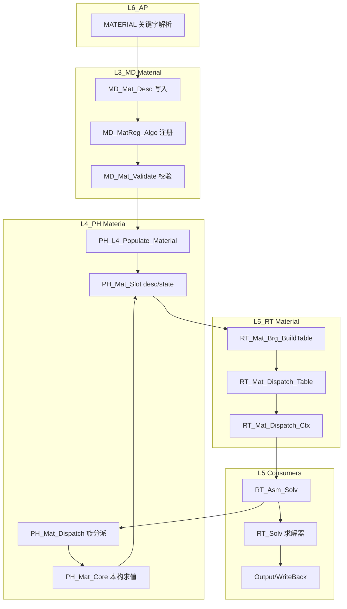

# L3_MD/L4_PH/L5_RT Material 标准域柱卡

**域路径**：`L3_MD/Material` -> `L4_PH/Material` -> `L5_RT/Material`  
**角色**：P1 全贯通域柱 -- 材料定义真源(L3)、本构计算热路径(L4)、路由调度(L5)  
**文档日期**：2026-04-28  
**柱型**：全柱（三层均有独立域目录）

---

## 0. 源文件与权威入口核对

| 项 | 说明 |
|----|------|
| 合同卡 | `L3_MD/Material/CONTRACT.md`、`L4_PH/Material/CONTRACT.md`、`L5_RT/Material/CONTRACT.md` |
| 设计文档 | `L4_PH/Material/DESIGN_Mat_FourTypes.md` |
| 治理台账 | `L3_MD/Material/GOVERNANCE.md`、`L4_PH/Material/GOVERNANCE.md` |
| 审计工具 | `tools/material_pillar_audit.py` -> `docs/03_Domain_Pillars/MaterialPillar/` |
| 闭环测试 | `tests/TEST_Material_L3_L4_Closure.f90` / `TEST_Material_L3_L4_Closure_Runner.f90` |

---

## 1. 域职责十件套

| # | 项 | Material 落地要点 |
|---|----|-------------------|
| 1 | **域定位** | L3/L4/L5 三层贯通域柱：L3 持有材料定义唯一真源，L4 承载本构计算热路径，L5 薄路由调度。 |
| 2 | **职责边界** | **L3 负责**：Desc/State/Algo/Ctx 四型真源、验证、注册、props/table、UMAT/VUMAT 路由数据。**L4 负责**：本构计算、IP 状态、slot/cache、算法参数、热路径执行。**L5 负责**：调度路由、dispatch table/ctx 构建。**禁止**：L3 计算应力/切线/SDV；L4 反复扫描 L3 库；L5 复制 Desc 真源或 IP State。 |
| 3 | **功能模块** | 见 Section 4 三层 `.f90` 清单。 |
| 4 | **四型 TYPE** | **Desc**：`MD_Mat_Desc`(L3) → Populate → `PH_Mat_Slot%desc%props`(L4)。**State**：`MD_MatState`(L3真源) / `PH_Mat_State`(L4 IP级)。**Algo**：`MD_MatAlgo`(L3) / `PH_Mat_Algo`(L4积分参数)。**Ctx**：`MD_MatCtx`(L3) / `PH_Mat_Ctx`(L4) / `RT_Mat_Dispatch_Ctx`(L5唯一保留)。 |
| 5 | **公开接口** | 以各层 `CONTRACT.md` 为准：L3 = Def/Domain/Registry/Validate；L4 = Domain_Core/Mat_Core/Dispatch；L5 = Def/Core/Brg。 |
| 6 | **数据所有权** | L3 持有权威 Desc 真源；Populate 后 L4 持有运行期 slot(ctx/state)；L5 持有 dispatch table；步内热路径不反向读 L3。 |
| 7 | **依赖规则** | 允许：L4 经 Populate 读 L3 Desc；L5 经 Bridge 读 L4 slot。禁止：L4 IP 循环内 USE L3 深层容器；L5 新建第二套 Desc 真源。 |
| 8 | **合同卡** | 三层各维护 `CONTRACT.md`；金线保持一致。 |
| 9 | **Harness 验收** | 见 Section 6。 |
| 10 | **扩展点** | 新材料族：通过 11-family marker 扩展 `PH_MAT_*` 枚举 + L4 kernel；新 UMAT/VUMAT：通过 User 族路径；AI 积分：通过 `PH_Mat_AI_Integ` 插槽（若启用）。 |

---

## 2. 域柱定位与主链

Material 是 P1 全贯通域柱。三层职责正交：

| 层 | 职责 | 禁止 |
|----|------|------|
| L3_MD | 材料 Desc/State/验证/注册真源；保存材料卡、props、table、UMAT/VUMAT 路由数据 | 计算应力、切线、返回映射或 SDV 演化 |
| L4_PH | 本构计算、IP 状态、slot/cache、算法参数；热路径读取 Populate 后的 `slot_pool` | 在积分点循环反复扫描 L3 材料库 |
| L5_RT | 调度和路由；持有 `RT_Mat_Dispatch_Table/Ctx` | 保存材料 Desc 真源或复制 L4 IP State |

主链：

```text
MD_Mat_Desc(L3)
  -> PH_L4_Populate_Material(L4)
  -> PH_Mat_Slot%ctx/state(L4)
  -> RT_Mat_Brg_BuildTable_FromMaterial(L5)
  -> RT_Mat_Dispatch_Table / RT_Mat_Dispatch_Ctx(L5)
  -> L4 Material kernels (PH_Mat_Core/PH_Mat_{族})
```

---

## 3. 四型裁剪决策

| 层 | Desc | State | Algo | Ctx |
|----|------|-------|------|-----|
| L3 | RETAINED(`MD_Mat_Desc`) | RETAINED(`MD_MatState`) | RETAINED(`MD_MatAlgo`) | RETAINED(`MD_MatCtx`) |
| L4 | DELEGATED->L3(via Populate) | RETAINED(`PH_Mat_State`) | RETAINED(`PH_Mat_Algo`) | RETAINED(`PH_Mat_Ctx`) |
| L5 | DELEGATED->L3->L4 | DELEGATED->L4 | DELEGATED->L4 | RETAINED(`RT_Mat_Dispatch_Ctx`) |

设计详情：`L4_PH/Material/DESIGN_Mat_FourTypes.md`

---

## 4. .f90 功能模块清单（三层分列）

### 4.1 L3_MD/Material（真源层）

| 文件 | 后缀 | 模块命名 | 职责 | 现有 |
|------|------|----------|------|------|
| `Contract/MD_Mat_Def.f90` | Def | `MD_Mat_Def` | 四型TYPE：MD_Mat_Desc/State/Algo/Ctx + 材料类别/模型ID常量 | Y |
| `Domain/MD_MatDomain_Def.f90` | Def | `MD_MatDomain_Def` | MD_Mat_Domain/MD_Material_Domain 容器TYPE | Y |
| `Base/MD_Mat_Core.f90` | Core | `MD_Mat_Core` | 模型级 `MD_Material_Desc` 库：注册/查询/校验（无本构积分） | Y |
| `Domain/MD_Mat_Mgr.f90` | Mgr | `MD_Mat_Mgr` | 管理器：兼容再导出 | Y |
| `MD_Mat_Sync.f90` | Sync | `MD_Mat_Sync` | L3 内同步 | Y |
| `Registry/MD_MatReg_Algo.f90` | Reg | `MD_MatReg_Algo` | 模型注册表 | Y |
| `Registry/MD_MatPLM_Reg.f90` | Reg | `MD_MatPLM_Reg` | 默认材料清单 | Y |
| `Dispatch/MD_Mat_Lib.f90` | Lib | `MD_Mat_Lib` | legacy 材料库(冻结) | Y |
| `Bridge/MD_Mat_Brg.f90` | Brg | `MD_Mat_Brg` | UMAT bundle/L4 适配边界 | Y |
| `../Bridge/Bridge_L4/MD_MatLibPH_Brg.f90` | Brg | `MD_MatLibPH_Brg` | L3->L4 兼容桥(冷路径) | Y |
| `../MD_L3_Layer.f90` | Layer | `MD_L3_Layer` | L3 层容器（closure：`material` facet + registry 存储） | Y |
| `Registry/MD_Mat_Registry.f90` | Reg | `MD_Mat_Registry` | 统一材料注册表（Populate 查询） | Y |
| `Shared/MD_Mat_Legacy_State.f90` | Shared | `MD_Mat_Legacy_State` | legacy state types 迁移边界 | Y |
| 各族子域 `Elas/Plast/.../User` | 族内 | `MD_Mat_{族名}_*` | 11族参数定义(Desc层) | Y |

### 4.2 L4_PH/Material（计算层）

| 文件 | 后缀 | 模块命名 | 职责 | 现有 |
|------|------|----------|------|------|
| `PH_Mat_Domain_Core.f90` | Core | `PH_Mat_Domain_Core` | slot 容器 + 生命周期 + 最小索引 API | Y |
| `PH_Mat_Core.f90` | Core | `PH_Mat_Core` | 本构核心：求值/切线/状态更新入口 | Y |
| `PH_Mat_Def.f90` | Def | `PH_Mat_Def` | 四型/常量/`MAT_*` 再导出枢纽（消费侧首选 `USE`） | Y |
| `PH_Mat_Enum.f90` | Def | `PH_Mat_Enum` | `PH_MAT_*` 11-family slot markers | Y |
| `PH_Mat_BaseDefn.f90` | Base | `PH_Mat_BaseDefn` | `PH_Mat_Base` / `PH_Mat_Update_args` | Y |
| `Contract/PH_Mat_Standards.f90` | Def | `PH_Mat_Standards` | 历史标准片段（与 `PH_Mat_Enum` 并存时以 Enum+Def 为准） | Y |
| `PH_Mat_Dispatch.f90` | Dsp | `PH_Mat_Dispatch` | 11族分派守卫（S2 / 路由前校验） | Y |
| `PH_Mat_Reg.f90` | Reg | `PH_Mat_Reg` | `MAT_*` 再导出 + 族级 kernel 注册表 | Y |
| `PH_L4_Populate.f90` | Pop | `PH_L4_Populate` | `PH_L4_Populate_Material`（registry → slot） | Y |
| `PH_L4_L3MatContract.f90` | Contract | `PH_L4_L3MatContract` | L3 `class_id` → `PH_MAT_*` + 默认 `MAT_*` | Y |
| `AI/PH_Mat_AI_Integ.f90` | Eval | `PH_Mat_AI_Integ` | AI 积分插槽 | Y |
| 各族计算 `Elas/Plast/Geo/...` | Eval | `PH_Mat_{族名}_*` | 族内核算法(热路径) | Y |
| `Dispatch/PH_MatEval.f90` | Eval | `PH_MatEval` | legacy Eval 聚合（C2 收敛到族级 Eval 中） | Y |
| `Dispatch/PH_MatPLM_LegacyFacadeUMATs.f90` | Eval | `PH_MatPLM_LegacyFacadeUMATs` | 7×UMAT legacy 门面（C1 拆分中，DEPRECATED） | Y |

### 4.3 L5_RT/Material（路由层）

| 文件 | 后缀 | 模块命名 | 职责 | 现有 |
|------|------|----------|------|------|
| `RT_Mat_Def.f90` | Def | `RT_Mat_Def` | RT_Mat_Dispatch_Ctx / RT_Mat_Dispatch_Table | Y |
| `RT_Mat_Core.f90` | Core | `RT_Mat_Core` | 路由验证 + dispatch table 生命周期 | Y |
| `RT_Mat_Brg.f90` | Brg | `RT_Mat_Brg` | L4 slot -> L5 路由表构造 | Y |

L5 Material 是薄路由域；不新增第二套材料真源。

### 4.4 L5 消费点

| L5 文件 | 消费性质 |
|---------|----------|
| `L5_RT/Assembly/RT_Asm_Solv.f90` | 装配/求解过程中的材料响应消费 |
| `L5_RT/Solver/*` | 求解器中的材料 dispatch |
| `L5_RT/StepDriver/*` | 步驱动中的材料路由调度 |

---

## 5. 数据生命周期图



**文字要点**

1. **创建(Model Build)**：L6 解析关键字 -> L3 写入 `MD_Mat_Desc` -> 注册 -> 校验。
2. **映射(Populate)**：L4 `PH_L4_Populate_Material` 读取 L3 Desc，填充 `PH_Mat_Slot(ctx/state)`。
3. **路由(Step Init)**：L5 `RT_Mat_Brg_BuildTable` 从 L4 slot 构造 dispatch table/ctx。
4. **计算(IP Loop)**：L5 dispatch ctx -> L4 族分派 -> L4 本构核求值 -> State 更新。
5. **收敛/回滚(Converge)**：State commit 或 Rollback。
6. **输出(Output)**：WriteBack 读取 State -> 输出结果。

---

## 6. Harness 验收项

| 类别 | 验收项 |
|------|--------|
| **命名** | `MD_Mat_*` / `PH_Mat_*` / `RT_Mat_*` 前缀与层域一致；`check_naming.py` 通过。 |
| **依赖/架构** | `arch_guardian.py`：L4 IP 循环内禁止 `USE` L3 深层模块；L5 禁止新建 Desc 真源。 |
| **合同** | 三层 `CONTRACT.md` 存在且与公开过程签名一致。 |
| **金线闭环** | `TEST_Material_L3_L4_Closure.f90`：L3 注册 -> L4 Populate -> L5 Route -> 验证。 |
| **四型** | `DESIGN_Mat_FourTypes.md` 与 TYPE 模块字段一致。 |
| **热路径** | 新增调用不得 `USE MD_MatRT_Brg` 或 `MD_PH_RouteToConstitutive*`。 |
| **族覆盖** | 11-family governance matrix：`AC_N_MAT_FAM == 11` 可达。 |

**工具入口**

- `tools/material_pillar_audit.py`
- `ufc_harness/run_harness.py`
- `tools/arch_guardian.py`

---

## 7. 后续任务与清旧资产

### 7.1 清旧资产台账

| 文件 | 处置 | 说明 |
|------|------|------|
| `Dispatch/MD_Mat_Lib.f90` | 冻结 legacy | 不再新增本构求值、应力更新、切线或 SDV 演化 API |
| `Bridge/MD_MatRT_Brg.f90` | 高风险 legacy | 仍被 CPE4/CPS4/C3D8 热路径调用，迁移到 L5 route ctx + L4 kernel |
| `../Bridge/Bridge_L4/MD_MatLibPH_Brg.f90` | 仅保留兼容/冷路径 | `MD_PH_RouteToConstitutive*` 不允许成为新热路径入口 |
| manifest | 以磁盘当前路径为准 | 不为旧 manifest 批量重命名 199 个源文件 |

### 7.2 后续任务触发表

| 任务 | 触发条件 | 处理原则 |
|------|----------|----------|
| `Material-Lib-Split` | `MD_Mat_Lib.f90` 阻碍构建或维护 | 单独拆分，不混入闭环第一批 |
| `Material-Registry-Align` | registry align 指出 Material manifest 漂移 | 记录 drift 后分批修 manifest |
| `Material-HotPath-Audit` | Element/Assembly 热路径绕回 L3 | 迁移到 L4 slot 或 L5 router |
| `Material-UMAT-Closure` | UMAT/VUMAT 贯通测试需求出现 | 在基础 elastic 闭环后追加 |

### 7.3 全量域治理冻结规则

| 规则 | 说明 |
|------|------|
| `MD_Mat_Lib.f90` 冻结为 legacy aggregate | 不再向该文件新增本构求值、应力更新、切线或 SDV 演化 public API |
| `MD_MatRT_Brg` 标记高风险 legacy | 仍被 CPE4/CPS4/C3D8 热路径调用，后续迁移到 L5 route ctx + L4 kernel |
| `MD_MatLibPH_Brg` 仅保留兼容/冷路径 | `MD_PH_RouteToConstitutive*` 不允许成为新的热路径入口 |
| 11 主族以 `MD_Ana_Comp` 和当前目录为准 | `Elas/Plast/Geo/HyperElas/Viscoelas/Creep/Damage/Composite/Thermal/Acoustic/User` |

全量治理台账：`GOVERNANCE.md`。

---

## 8. 域间关系表

| 关系类型 | 从 | 到 | 机制 |
|----------|----|----|------|
| **包含** | `L3_MD` | `Material/` | 目录与模块前缀 `MD_Mat_*` |
| **包含** | `L4_PH` | `Material/` | 目录与模块前缀 `PH_Mat_*` |
| **包含** | `L5_RT` | `Material/` | 目录与模块前缀 `RT_Mat_*` |
| **数据** | `L3_MD` | `L4_PH` | Populate：L3 Desc -> L4 Slot |
| **数据** | `L4_PH` | `L5_RT` | Bridge：L4 Slot -> L5 Route Table |
| **执行** | `L5_RT` | `L4_PH` | Dispatch：L5 Ctx -> L4 Kernels |
| **接口** | `L6_AP` | `L3_MD` | 关键字解析 -> MD_Mat_Desc 写入 |
| **执行** | `L5_RT/Assembly` | `Material` | 装配过程中的材料响应消费 |

---

## 附录 A：当前执行批次（2026-04-28）

| 批次 | 状态 | 验收 |
|------|------|------|
| Inventory | DONE | `tools/material_pillar_audit.py` -> `docs/03_Domain_Pillars/MaterialPillar/` |
| Contract Freeze | ACTIVE | L3=SSOT、L4=slot+kernel、L5=thin router 三层合同保持同一金线 |
| L3 Lib Split | STAGED | `MD_Mat_Lib` compute-like API 冻结；先迁 validation/metadata |
| L4 Populate/Slot | ACTIVE | `PH_Mat_Slot%ctx` 承载 Populate props/model；11-family marker |
| L5 Router | ACTIVE | `RT_Mat_Brg_BuildTable_FromMaterial` 与 `RT_Mat_Brg_MakeCtx` 唯一 typed handoff |
| Tests | ACTIVE | `TEST_Material_L3_L4_Closure_Runner.f90`；L5 `RT_Mat_Test` 增补 bridge 检查 |

## 附录 B：推广到其他域的骨架（复制本域卡 Section 0-8）

下一域（Element/Contact/LoadBC）复制本文结构，替换：
1. 域路径与模块前缀
2. 十件套表中「不负责」一行
3. 四型裁剪表
4. `.f90` 清单（按子域拆分）
5. 数据生命周期图节点
6. Harness 项（单元族矩阵、接触搜索、载荷等效等增量条目）

**完成标准**：新域具备 `CONTRACT.md` + 域柱卡 + Harness 最小勾选集。
