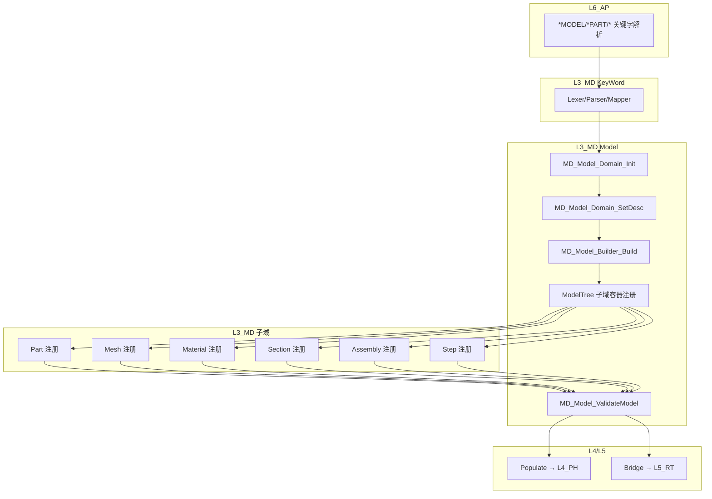

# L3_MD/Model 标准域柱卡

**域路径**：`L3_MD/Model`  
**角色**：S1 单层专属域 -- 模型树根节点，管理子域容器与元数据真源  
**文档日期**：2026-05-07 (v3.2.0 — 对齐 `CONTRACT.md`：`TYPE(MD_Model_AdvProps)`；Orient/Normal 对外仅 `MD_Model_Coord_*_Parse`/`_Cfg` + `Parse_*_Keyword`（P3 已移除 `MD_Mo_*` / `Unified_*` PUBLIC）；Model 域 **26** 个 `MD_Model_*.f90`)  
**柱型**：单层（仅 L3_MD，不跨 L4/L5）

---

## 0. 源文件与权威入口核对


| 项    | 说明                                       |
| ---- | ---------------------------------------- |
| 合同卡  | `L3_MD/Model/CONTRACT.md`                |
| 域柱卡  | `L3_MD/Model/DOMAIN_PILLAR_CARD.md`（本文件） |
| 闭环测试 | `tests/TEST_Model_test.f90`（待建）          |


### 源文件清单（Model/ 目录 **26** 个 `MD_Model_*.f90` + Base/ 目录 11 个 .f90；不含 `Tests/`，2026-05-07 核对）


| #   | 文件                                             | 位置     | 职责                                                  |
| --- | ---------------------------------------------- | ------ | --------------------------------------------------- |
| 1   | `MD_Model_Def.f90`                             | Model/ | **AUTHORITY** — 统一 Desc/State/Ctx/Algo 定义，辅 TYPE 嵌套 |
| 2   | `MD_Model_Mgr.f90`                             | Model/ | 域容器 `MD_Model_Domain` + 扩展 `MD_Model_Ctx` + **`MD_Model_AdvProps`**（Import/Prestress/Substructure 容器） |
| 3   | `MD_Model_Core.f90`                            | Model/ | P0 生命周期：`model_name`/`spatial_dim`                  |
| 4   | `MD_Model_Tree.f90`                            | Model/ | 模型树 (extends MD_Model_Desc)                         |
| 5   | `MD_Model_Access.f90`                          | Model/ | CLASS(MD_Model_Desc) 取子域                            |
| 6   | `MD_Model_Builder.f90`                         | Model/ | 模型构建                                                |
| 7   | `MD_Model_VarCtx.f90`                          | Model/ | 变量上下文管理                                             |
| 8   | `MD_Model_Data.f90`                            | Model/ | 旧 Table 类型再导出 Facade                                |
| 9   | `MD_Model_Data_Def.f90`                        | Model/ | Data Type 再导出 Facade                                |
| 10  | `MD_Model_Data_Table.f90`                      | Model/ | Table：类型+解析+验证（*TABLE，合并；对齐 Parameter）            |
| 11  | `MD_Model_Data_Param.f90`                     | Model/ | Parameter：类型+解析+验证（`*PARAMETER`，模块名短后缀 Param）   |
| 12  | `MD_Model_Data_Field.f90`                      | Model/ | Field：类型+解析+验证（合并）                               |
| 13  | `MD_Model_Data_Dist.f90`                      | Model/ | Distribution：类型+解析+验证（合并；模块 `MD_Model_Data_Dist`） |
| 14  | `MD_Model_Data_Variable.f90`                   | Model/ | Variable：类型+解析+验证（合并）                          |
| 15  | `MD_Model_Data_Filter.f90`                     | Model/ | Filter：类型+解析+验证（Model 数据侧，合并）                 |
| 16  | `MD_Model_Data_PhysConst.f90`                 | Model/ | PhysicalConstants：类型+解析+验证（合并；模块 `MD_Model_Data_PhysConst`） |
| 17  | `MD_Model_Data_Proc.f90`                       | Model/ | Data Parse/Validate 再导出 Facade                      |
| 18  | `MD_Model_Coord_Transform.f90`                 | Model/ | *TRANSFORM：类型+解析+验证（合并；文件名 MD_Model_Coord_Transform） |
| 19  | `MD_Model_Coord_Sys.f90`                       | Model/ | *SYSTEM：类型+解析+验证（合并；文件名 MD_Model_Coord_Sys）   |
| 20  | `MD_Model_Coord_Orient.f90`                    | Model/ | Orientation：类型+解析+验证（*ORIENTATION；模块 `MD_Model_Coord_Orient`） |
| 21  | `MD_Model_Coord_Normal.f90`                   | Model/ | Normal：类型+解析+验证（*NORMAL；模块 `MD_Model_Coord_Normal`） |
| 22  | `MD_Model_Reg.f90`                             | Model/ | 高级关键字（IMPORT/PRESTRESS/SUBSTRUCTURE）注册表 `MD_Model_Reg`   |
| 23  | `MD_Model_Lib_Core.f90`                        | Model/ | Lib 核心（`UF_ModelDef` 等）；消费者 `USE MD_Model_Lib_Core`，**无** `MD_Model_Lib` Facade |
| 24  | `MD_Model_Import.f90`                          | Model/ | *IMPORT：类型+解析（合并；文件名 MD_Model_Import）           |
| 25  | `MD_Model_Prestress.f90`                       | Model/ | *PRESTRESS：类型+解析（合并）                                |
| 26  | `MD_Model_Substruct.f90`                       | Model/ | *SUBSTRUCTURE：类型+解析（合并）                             |
| 55  | `MD_Base_ObjModel.f90`                         | Base/  | 四型基类/容器                                             |
| 56  | `MD_Base_TreeIndex.f90`                        | Base/  | 树索引/路径解析                                            |
| 57  | `MD_Base_DataModMgr.f90`                       | Base/  | 数据模型管理器                                             |
| 58  | `MD_Base_IOSerialMgr.f90`                      | Base/  | IO序列化                                               |
| 59  | `MD_Base_FieldVarMgr.f90`                      | Base/  | 场变量管理器                                              |
| 60  | `MD_Base_MathUtils.f90`                        | Base/  | 数学工具                                                |
| 61  | `MD_BaseTypes.f90`                             | Base/  | Base Types                                          |
| 62  | `MD_Base_Enums.f90`                            | Base/  | Enums                                               |
| 63  | `MD_Base_ElemLib.f90`                          | Base/  | 单元库                                                 |
| 64  | `MD_Base_Def.f90`                              | Base/  | Base 类型聚合                                           |
| 65  | `MD_Kinematics_Def.f90`                        | Base/  | 运动学元类型                                              |


---

## 1. 域职责十件套


| #   | 项              | Model 落地要点                                                                                                                                                                                                 |
| --- | -------------- | ---------------------------------------------------------------------------------------------------------------------------------------------------------------------------------------------------------- |
| 1   | **域定位**        | L3 单层型(S1)。模型树根节点，UFC 所有子域的容器管理者。                                                                                                                                                                          |
| 2   | **职责边界**       | **负责**：模型 Desc 真源（名称、维数、分析类型、子域计数）、模型树管理、子域容器注册/查询/验证、IO 序列化、坐标系管理、模型数据（Table/Field/Distribution/Parameter/Variable）。**禁止**：执行任何计算（本构/单元/求解）、直接写文件。                                                        |
| 3   | **功能模块**       | 见 §0 源文件清单（Model/ **26** 个 `MD_Model_*.f90` + Base/ 11 个）。                                                                                                                                                |
| 4   | **四型 TYPE**    | **Desc**：`MD_Model_Desc`（统一，含 cfg%/pop% 辅 TYPE 嵌套）。**State**：`MD_Model_State`（parsed/populated/validated/build_phase）。**Algo**：`MD_Model_Algo`（精简策略）。**Ctx**：`MD_Model_Ctx`（Def 构建上下文 + Mgr 扩展 BaseCtx 版）。 |
| 5   | **公开接口**       | 以 `CONTRACT.md` 为准：Init/Finalize/SetDesc/GetInfo/ValidateModel/Tree_*。                                                                                                                                     |
| 6   | **数据所有权**      | Model 持有模型树根与所有子域容器引用；Populate 后 L4/L5 消费 Desc，Model 本体只读。                                                                                                                                                 |
| 7   | **依赖规则**       | 允许：L4/L5 经 Bridge 读取 Model Desc。禁止：L4/L5 反向修改 Model 容器；步内热路径直接 USE Model 深层模块。                                                                                                                             |
| 8   | **合同卡**        | `L3_MD/Model/CONTRACT.md`（v3.2.0）。                                                                                                                                                                           |
| 9   | **Harness 验收** | 见 §6。                                                                                                                                                                                                      |
| 10  | **扩展点**        | 新子域：通过 ObjContainer 注册新子域类型 → 模型树新分支；新数据类型：通过 ModelData 模块扩展。                                                                                                                                              |


---

## 2. 域柱定位与主链

Model 是 S1 单层专属域（仅 L3_MD）。作为模型树根节点，承载所有子域的容器管理：


| 层     | 职责                                       | 禁止             |
| ----- | ---------------------------------------- | -------------- |
| L3_MD | 模型 Desc 真源、模型树管理、子域容器注册/查询/验证、坐标系、IO 序列化 | 执行任何计算、直接写物理文件 |


主链：

```text
INP 文件
  -> KeyWord 解析(*MODEL/*PART/...)
  -> MD_Model_Domain_Init (容器初始化)
  -> MD_Model_Domain_SetDesc (Desc 写入)
  -> MD_Model_Builder_Build (模型构建)
  -> 各子域注册到 Model 容器(Part/Mesh/Material/Section/Assembly/Step/...)
  -> MD_Model_ValidateModel (一致性验证)
  -> Bridge → L4/L5 Populate
```

---

## 3. 四型裁剪决策


| 层   | Desc                                 | State                      | Algo                           | Ctx                                                 |
| --- | ------------------------------------ | -------------------------- | ------------------------------ | --------------------------------------------------- |
| L3  | RETAINED(`MD_Model_Desc` 统一，辅TYPE嵌套) | RETAINED(`MD_Model_State`) | RETAINED(`MD_Model_Algo` 策略精简) | RETAINED(`MD_Model_Ctx` Def版 + `MD_Model_Ctx` Mgr版) |


---

## 4. .f90 功能模块清单

### 4.1 核心域文件（与磁盘一致；已删除项勿再引用）

历史文档中的 `MD_Model_Domain.f90`、`MD_Model.f90` / `MD_ModelDomain`、`MD_Model_Types.f90`、`MD_Model_DomBrg.f90` 等**已移除或合并**。当前权威入口：

| 文件 | 模块 | 职责 |
| --- | --- | --- |
| `MD_Model_Def.f90` | `MD_Model_Def` | **AUTHORITY** — 统一 Desc/State/Ctx/Algo，辅 TYPE |
| `MD_Model_Mgr.f90` | `MD_Model_Mgr` | 域容器 `MD_Model_Domain` + 扩展 Ctx + **`TYPE(MD_Model_AdvProps)`** |
| `MD_Model_Core.f90` | `MD_Model_Core` | P0 生命周期字段 |
| `MD_Model_Tree.f90` | `MD_Model_Tree` | 模型树 |
| `MD_Model_Access.f90` | `MD_Model_Access` | 子域访问 |
| `MD_Model_Builder.f90` | `MD_Model_Builder` | 模型构建 |
| `MD_Model_VarCtx.f90` | `MD_Model_VarCtx` | 变量上下文 |
| `MD_Model_Lib_Core.f90` | `MD_Model_Lib_Core` | Lib 核心（**无** `MD_Model_Lib` Facade） |
| `MD_Model_Reg.f90` | `MD_Model_Reg` | 高级特性关键字注册 |
| `MD_Model_Import.f90` / `MD_Model_Prestress.f90` / `MD_Model_Substruct.f90` | 各 `MODULE` 同名 | 高级特性单文件合并 |
| `MD_Model_Data*.f90`、`MD_Model_Coord_*.f90`（单文件合并） | 各子模块 | 数据 / 坐标系拆分实现（见 §0） |

### 4.2 Base 基础设施文件

位于 `L3_MD/Base/`（已从 Model/ 迁出），清单见 `CONTRACT.md`「Base 基础设施」表；模块名以磁盘 `MODULE` 为准（如 `MD_BaseObjModel`、`MD_BaseTreeIndex`）。

### 4.3 数据与坐标系文件

Data 子域与 *NORMAL / *ORIENTATION / *SYSTEM / *TRANSFORM 已试点为单文件合并模块（`MD_Model_Data_Table` 等、**短名** `MD_Model_Data_Param` / `MD_Model_Data_Dist` / `MD_Model_Data_PhysConst`、`MD_Model_Coord_Normal` / `MD_Model_Coord_Orient`、`MD_Model_Coord_Sys`、`MD_Model_Coord_Transform`）。`MD_Model_Data.f90`、`MD_Model_Data_Def.f90`、`MD_Model_Data_Proc.f90` 仍为 **Facade 再导出**。**已删除** `MD_Model_CoordSys.f90` 薄封装。专题对外入口为 **`MD_Model_<TopicSlug>_Parse` / `_Cfg`**（REPORT v1.2 / `CONTRACT.md` v3.2）；关键字级 **`Parse_*_Keyword`**、**`Valid_*_Keyword`** 等保持可读全称。`config/model_naming_lexicon.yaml` 仅保留 **`MD_Mo_*` 历史解码**，不得再作为新 PUBLIC。

| 主题 | 代表模块（示例） |
| --- | --- |
| Data | `MD_Model_Data_Table`、`MD_Model_Data_Param`、`MD_Model_Data_Field`、`MD_Model_Data_Dist`、… |
| Coord | `MD_Model_Coord_Sys`、`MD_Model_Coord_Orient`、`MD_Model_Coord_Normal`、`MD_Model_Coord_Transform` |
| Kinematics | `MD_Kinematics_Def`（`L3_MD/Base/MD_Kinematics_Def.f90`） |


---

## 5. 数据生命周期图




**文字要点**

1. **解析(Parse)**：L6 解析 INP → KeyWord Lexer/Parser → AST → Mapper 分发。
2. **创建(Init)**：`MD_Model_Domain_Init` 初始化容器 → `SetDesc` 写入 Desc。
3. **构建(Build)**：`MD_Model_Builder_Build` 驱动各子域注册到 ModelTree。
4. **验证(Validate)**：`MD_Model_ValidateModel` 检查所有子域一致性。
5. **注入(Populate)**：经 Bridge 将模型数据注入 L4/L5。

---

## 6. Harness 验收项


| 类别             | 验收项                                                                                                                     |
| -------------- | ----------------------------------------------------------------------------------------------------------------------- |
| **命名**         | `MD_Model_`* / `MD_Base_*` 前缀与层域一致；`check_naming.py` 通过。                                                                |
| **依赖/架构**      | Model 域禁止执行计算；L4/L5 禁止反向修改 Model 容器。                                                                                    |
| **合同**         | `CONTRACT.md` 存在且与公开过程签名一致。                                                                                             |
| **模型树**        | ModelTree 结构与 CONTRACT §五 一致（Parts/Assemblies/Materials/Sections/Meshes/Amplitudes/LoadBCs/Steps/Interactions/Outputs）。 |
| **四型**         | `MD_Model_Desc`/`MD_Model_State` 与 `MD_Model_Def.f90` 字段一致。                                                             |
| **Write-Once** | Model Desc 建模完成后只读，不可变。                                                                                                 |


---

## 7. 清旧资产台账


| 文件                                     | 处置                   | 说明                                                     |
| -------------------------------------- | -------------------- | ------------------------------------------------------ |
| `MD_Model_DomBrg.f90`                  | **SKELETON**         | 域桥待补，当前为空壳                                             |
| `MD_Model_Lib.f90`                  | **已删除 (2026-05-07)** | 薄 Facade；消费者改用 `MD_Model_Lib_Core`                         |
| `MD_Model_Data.f90`                    | **已删除 (2026-05-06)** | 拆分为 `MD_Model_Data_Def.f90` + `MD_Model_Data_Proc.f90` |
| `MD_Model_Domain.f90` / `MD_Model.f90` | 历史遗留                 | 文件名/模块名对调，不重命名                                         |
| `MD_Base_*.f90` (11 个)                 | **已移入 L3_MD/Base/**  | 2026-05-06 Base 独立为子域                                  |


### 后续任务触发表


| 任务                   | 触发条件                                | 处理原则                                 |
| -------------------- | ----------------------------------- | ------------------------------------ |
| `Model-DomBrg-Impl`  | L4/L5 需要 Model 数据                   | 补全 `MD_Model_DomBrg.f90` 域桥实现        |
| `Model-Lib-Facade`   | `MD_Model_Lib` 等薄封装                    | v3.1.4 已删除；统一 `USE MD_Model_Lib_Core` / 各专题模块        |
| `Model-Data-Split`   | `MD_Model_Data.f90` 已拆 (2026-05-06) | Def+Proc 分离完成                        |
| `Model-Closure-Test` | 金线闭环测试需求                            | 创建 `TEST_Model_test.f90`             |


---

## 附录 A：域际关系表


| 关系类型    | 从            | 到          | 机制                                 |
| ------- | ------------ | ---------- | ---------------------------------- |
| **包含**  | `L3_MD`      | `Model/`   | 目录与模块前缀 `MD_Model_`* / `MD_Base_*` |
| **供给→** | `Model`      | `Part`     | Model 容器注册 Part                    |
| **供给→** | `Model`      | `Mesh`     | Model 容器注册 Mesh                    |
| **供给→** | `Model`      | `Material` | Model 容器注册 Material                |
| **供给→** | `Model`      | `Section`  | Model 容器注册 Section                 |
| **供给→** | `Model`      | `Assembly` | Model 容器注册 Assembly                |
| **供给→** | `Model`      | `Step`     | Model 容器注册 Step                    |
| **消费←** | `KeyWord`    | `Model`    | KeyWord 解析 → Model Desc 写入         |
| **桥接→** | `Model`      | `L4_PH`    | 经 Bridge Populate 注入               |
| **桥接→** | `Model`      | `L5_RT`    | 经 Bridge 查询                        |
| **依赖←** | `L1_IF/Base` | `Model`    | 基础类型                               |


---

## 附录 B：变更日志


| 版本   | 日期         | 变更                                                                                                                                                    |
| ---- | ---------- | ----------------------------------------------------------------------------------------------------------------------------------------------------- |
| v1.0 | 2026-04-28 | 初始版本：基于 23 个 .f90 创建十件套域柱卡                                                                                                                            |
| v2.0 | 2026-05-06 | Model 域重构：Base 独立为子域 (→ L3_MD/Base/)、Desc 合并统一(含cfg%/pop%辅TYPE)、MD_Model_Mgr 精简、巨文件拆分(MD_Model_Data → Def+Proc; MD_Model_Lib → Lib+VarCtx)、消费者对齐规范类型名 |
|      | v3.0       | 2026-05-06                                                                                                                                            |
| v2.3 | 2026-05-06 | 细化重构：32+ 过程重命名(加 *Core*/*Access*/*Model_Ctx* 中缀)、MD_ModelBuilder → MD_Model_Builder、ModelTree 编译 bug 修复、*Arg SIO 类型添加、模块名映射修正                         |


