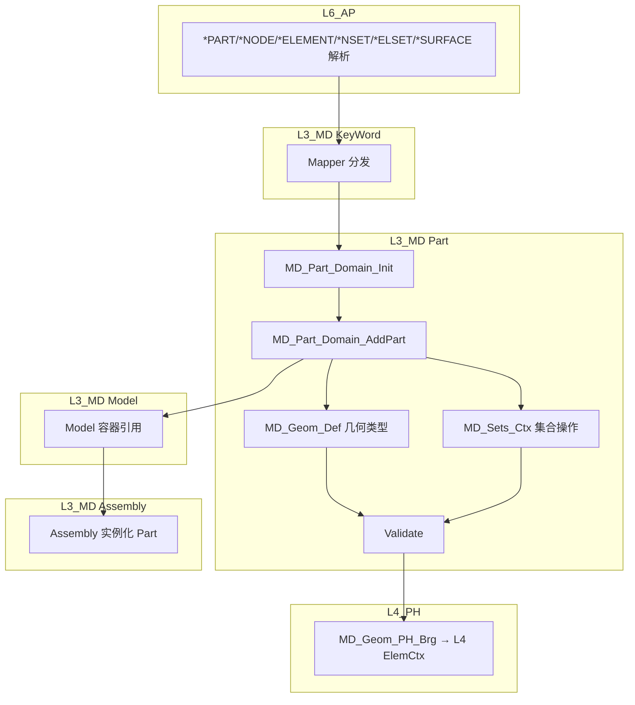

# L3_MD/Part 标准域柱卡

**域路径**：`L3_MD/Part`  
**角色**：S1 单层专属域 -- 零件定义容器，节点/单元/集合的组织单元  
**文档日期**：2026-04-28  
**柱型**：单层（仅 L3_MD，不跨 L4/L5）

---

## 0. 源文件与权威入口核对

| 项 | 说明 |
|----|------|
| 合同卡 | `L3_MD/Part/CONTRACT.md` |
| 域柱卡 | `L3_MD/Part/DOMAIN_PILLAR_CARD.md`（本文件） |
| 闭环测试 | `tests/TEST_Part_test.f90`（待建） |

### 源文件清单（8 个 .f90）

| # | 文件 | 大小 | 职责 |
|---|------|------|------|
| 1 | `MD_Part_Def.f90` | 4.6KB | **AUTHORITY** — Desc/State/Domain/SIO Arg |
| 2 | `MD_Part_Core.f90` | 4.5KB | Init/Add/Get/Assign/Validate |
| 3 | `MD_Part_Brg.f90` | 0.7KB | 域桥（**SKELETON**，待补） |
| 4 | `MD_Part_Mgr.f90` | 4.0KB | 管理器（索引查询 API） |
| 5 | `MD_Part_Sync.f90` | 6.0KB | Legacy 同步（UF → MD） |
| 6 | `MD_Geom_Def.f90` | 4.7KB | 几何类型（Node/Elem Desc, Geom Ctx） |
| 7 | `MD_Sets_Ctx.f90` | 65.3KB | Sets 操作 Ctx（NodeSet/ElemSet/Surface 全功能） |
| 8 | `MD_Sets_Mgr.f90` | 13.3KB | Sets Manager |

---

## 1. 域职责十件套

| # | 项 | Part 落地要点 |
|---|----|--------------|
| 1 | **域定位** | L3 单层型(S1)。零件定义容器：持有 Part Desc 真源，管理 Part 下属的节点/单元/集合。 |
| 2 | **职责边界** | **负责**：Part Desc（名称、维度、节点数、单元数）、Part State（sections_assigned/materials_bound/validated）、节点集(NSET)、单元集(ELSET)、面集(SURFACE)、几何类型（Node/Elem Desc）、Legacy 同步。**禁止**：执行计算、修改 Mesh 拓扑、直接操作 L4/L5 数据。 |
| 3 | **功能模块** | 见 §0 源文件清单（8 个 .f90）。 |
| 4 | **四型 TYPE** | **Desc**：RETAINED（`MD_Part_Desc`）。**State**：RETAINED（`MD_Part_State` — sections_assigned/materials_bound/validated/n_unassigned）。**Algo**：TRIMMED（Part 无算法）。**Ctx**：TRIMMED（Part 本体无 `MD_Part_Ctx`；`MD_Sets_Ctx` 是 Sets 子功能的操作上下文）。 |
| 5 | **公开接口** | 以 `CONTRACT.md` 为准：Init/Add/Get/Assign/Validate/SyncFromLegacy。 |
| 6 | **数据所有权** | Part 持有零件 Desc 真源（Write-Once）；Populate 后 L4 消费几何数据，Part 本体只读。 |
| 7 | **依赖规则** | 允许：L4 经 `MD_Geom_PH_Brg` 读取 Part 几何。禁止：L4 反向修改 Part Desc；计算路径回扫 Part 容器。 |
| 8 | **合同卡** | `L3_MD/Part/CONTRACT.md`。 |
| 9 | **Harness 验收** | 见 §6。 |
| 10 | **扩展点** | 新集合类型：通过 `MD_Sets_Ctx` 扩展；新几何类型：通过 `MD_Geom_Def` 扩展。 |

---

## 2. 域柱定位与主链

Part 是 S1 单层专属域（仅 L3_MD）。作为零件定义容器，隶属于 Model 域：

| 层 | 职责 | 禁止 |
|----|------|------|
| L3_MD | 零件 Desc 真源、节点/单元集合管理、几何类型定义、Legacy 同步 | 执行计算、修改 Mesh 拓扑 |

主链：

```text
INP 文件
  -> KeyWord 解析(*PART)
  -> MD_Part_Domain_Init (Part 容器初始化)
  -> MD_Part_Domain_AddPart (Part 注册)
  -> *NODE/*ELEMENT → Mesh/Sets 注册
  -> *NSET/*ELSET/*SURFACE → Sets 注册
  -> Model 容器引用 Part
  -> Assembly 实例化 Part
  -> MD_Geom_PH_Brg → L4 ElemCtx
```

---

## 3. 四型裁剪决策

| 层 | Desc | State | Algo | Ctx |
|----|------|-------|------|-----|
| L3 | RETAINED(`MD_Part_Desc`) | RETAINED(`MD_Part_State`) | TRIMMED(无算法) | TRIMMED(Part 本体无 Ctx；`MD_Sets_Ctx` 为 Sets 子功能) |

---

## 4. .f90 功能模块清单

| 文件 | 后缀 | 模块命名 | 职责 | 现有 |
|------|------|----------|------|------|
| `MD_Part_Def.f90` | Def | `MD_Part_Def` | **AUTHORITY** — `MD_Part_Desc`/`MD_Part_State`/`MD_Part`/`MD_Part_Ctx`/`MD_Part_Domain` + TBPs | Y |
| `MD_Part_Core.f90` | Core | `MD_Part_Core` | Init/Add/Get/Assign/Validate | Y |
| `MD_Part_Mgr.f90` | Mgr | `MD_Part` | 索引查询 API（`MD_Part_GetPart_Idx`/`MD_Part_GetPartByName_Idx`） | Y |
| `MD_Part_Sync.f90` | Sync | `MD_PartSync` | Legacy 同步（`MD_Part_SyncFromLegacy` → `MD_Part_Append_To_Domain`） | Y |
| `MD_Part_Brg.f90` | Brg | `MD_Part_Brg` | 域桥（**SKELETON**，待补） | Y |
| `MD_Geom_Def.f90` | Def | `MD_Geom_Def` | 几何类型（`MD_Node_Desc`/`MD_Elem_Desc`/`MD_Geom_Ctx`） | Y |
| `MD_Sets_Ctx.f90` | Ctx | `MD_Sets_Ctx` | Sets 全功能操作（NodeSet/ElemSet/Surface + 布尔运算/统计/导出） | Y |
| `MD_Sets_Mgr.f90` | Mgr | `MD_Sets_Mgr` | Sets Manager | Y |

---

## 5. 数据生命周期图



**文字要点**

1. **解析(Parse)**：L6 解析 `*PART` → KeyWord Mapper 分发到 Part 域。
2. **注册(Register)**：`MD_Part_Domain_AddPart` 注册 Part Desc；后续 `*NODE/*ELEMENT` 填充几何。
3. **集合(Sets)**：`*NSET/*ELSET/*SURFACE` → `MD_Sets_Ctx` 注册集合。
4. **验证(Validate)**：Part 一致性检查（至少关联一个 Mesh）。
5. **桥接(Bridge)**：`MD_Geom_PH_Brg` 将几何数据注入 L4 `ElemCtx`。

---

## 6. Harness 验收项

| 类别 | 验收项 |
|------|--------|
| **命名** | `MD_Part_*` / `MD_Sets_*` / `MD_Geom_*` 前缀与层域一致；`check_naming.py` 通过。 |
| **依赖/架构** | Part 域禁止执行计算；L4 禁止反向修改 Part Desc。 |
| **合同** | `CONTRACT.md` 存在且与公开过程签名一致。 |
| **Write-Once** | Part Desc 为 Write-Once；Part 名唯一性。 |
| **四型** | `MD_Part_Desc`/`MD_Part_State` 与 `MD_Part_Def.f90` 字段一致。 |
| **精度** | 使用 `IF_Prec_Core` 的 `wp`/`i4`。 |

---

## 7. 清旧资产台账

| 文件 | 处置 | 说明 |
|------|------|------|
| `MD_Part_Brg.f90` | **SKELETON** | 域桥待补 |
| ~~`MD_Inst_Mgr.f90`~~ | **已删除** | 零调用的 Instance Manager（58KB） |
| ~~`MD_Sets_Mgr.f90`~~ (旧) | **已删除** | 零调用的 Sets Manager（53KB，注意当前 `MD_Sets_Mgr.f90` 13.3KB 为保留版本） |
| ~~`MD_Part_Mgr.f90`~~ (旧) | **已删除** | 零调用的 Part Manager（37KB，注意当前 `MD_Part_Mgr.f90` 4.0KB 为保留版本） |
| ~~`MD_Sets_API.f90`~~ | **已删除** | 零调用的 API 封装层 |
| ~~`MD_Part_API.f90`~~ | **已删除** | 零调用的 API 封装层 |

### 后续任务触发表

| 任务 | 触发条件 | 处理原则 |
|------|----------|----------|
| `Part-Brg-Impl` | L4 需要 Part 几何数据 | 补全 `MD_Part_Brg.f90` 域桥实现 |
| `Part-Closure-Test` | 金线闭环测试需求 | 创建 `TEST_Part_test.f90` |

---

## 附录 A：域际关系表

| 关系类型 | 从 | 到 | 机制 |
|----------|----|----|------|
| **包含** | `L3_MD` | `Part/` | 目录与模块前缀 `MD_Part_*`/`MD_Sets_*`/`MD_Geom_*` |
| **消费←** | `Model` | `Part` | Part 属于 Model 树（T 合同） |
| **供给→** | `Part` | `Mesh` | Part 拥有 Mesh（T 合同） |
| **供给→** | `Part` | `Section` | Part 拥有 Section（T 合同） |
| **消费←** | `Assembly` | `Part` | Assembly 实例化 Part（S 消费） |
| **桥接→** | `Part` | `L4_PH` | 经 `MD_Geom_PH_Brg` → L4 ElemCtx（B 桥接） |
| **消费←** | `KeyWord` | `Part` | `*PART` 解析来源（E 外部） |
| **依赖←** | `L1_IF/Error` | `Part` | 错误码定义（U USE） |

---

## 附录 B：变更日志

| 版本 | 日期 | 变更 |
|------|------|------|
| v1.0 | 2026-04-28 | 初始版本：基于 8 个 .f90 创建十件套域柱卡 |
