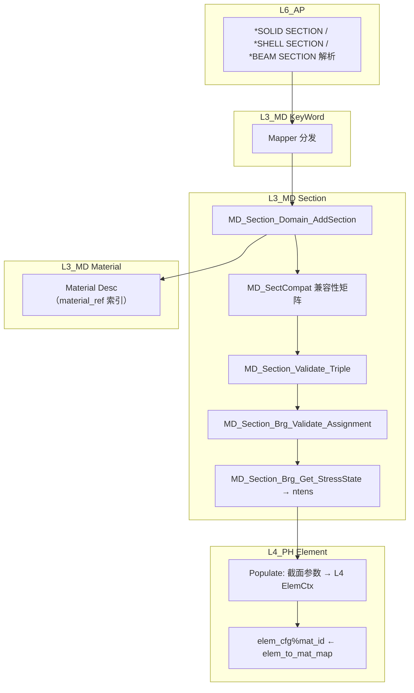

# L3_MD/Section 标准域柱卡

**域路径**：`L3_MD/Section`  
**角色**：S1 单层专属域 -- 截面属性桥梁，Material-Element 绑定枢纽  
**文档日期**：2026-04-28  
**柱型**：单层（仅 L3_MD，不跨 L4/L5）

---

## 0. 源文件与权威入口核对

| 项 | 说明 |
|----|------|
| 合同卡 | `L3_MD/Section/CONTRACT.md` |
| 域柱卡 | `L3_MD/Section/DOMAIN_PILLAR_CARD.md`（本文件） |
| 闭环测试 | `tests/TEST_Section_test.f90`（待建） |

### 源文件清单（12 个 .f90）

| # | 文件 | 大小 | 职责 |
|---|------|------|------|
| 1 | `MD_Sect_Def.f90` | 21.4KB | **AUTHORITY** — 域级四型 + Registry + `*_Arg` |
| 2 | `MD_Sect_Core.f90` | 7.1KB | CRUD + Validate_Triple |
| 3 | `MD_Sect_Brg.f90` | 3.3KB | L3→L4 校验 + 应力态推导 |
| 4 | `MD_Sect_Compat.f90` | 16.8KB | M-S-E 正交兼容性矩阵 |
| 5 | `MD_Sect_Domain.f90` | 0.9KB | 域容器（再导出） |
| 6 | `MD_Sect_Lib.f90` | 15.4KB | Section Library（截面类型工厂） |
| 7 | `MD_Sect_Mgr.f90` | 106.8KB | 旧 UF 面 + 多 Desc（LEGACY 风格） |
| 8 | `MD_Sect_PropMass.f90` | 15.7KB | 质量属性 |
| 9 | `MD_Sect_PropNonStructMass.f90` | 18.4KB | 非结构质量 |
| 10 | `MD_Sect_PropPtMass.f90` | 15.8KB | 点质量 |
| 11 | `MD_Sect_PropRotInertia.f90` | 21.6KB | 转动惯量 |
| 12 | `MD_Sect_ionSync.f90` | 7.8KB | Legacy 同步（`MD_Section_SyncFromLegacy`） |

---

## 1. 域职责十件套

| # | 项 | Section 落地要点 |
|---|----|-----------------|
| 1 | **域定位** | L3 单层型(S1)。截面属性桥梁：作为 **Material-Element 绑定枢纽**，持有截面 Desc 真源，负责截面类型定义与材料-单元兼容性验证。 |
| 2 | **职责边界** | **负责**：截面 Desc（类型/材料引用/几何参数）、截面类型（Solid/Shell/Beam/Membrane/Truss/Cohesive/Gasket/Acoustic/Connector 共 9 族）、材料绑定（`section.material_ref` → Material 域）、几何参数（厚度/惯性矩/截面面积）、M-S-E 正交兼容性矩阵、质量属性（PtMass/NonStructMass/RotInertia）。**禁止**：执行形函数/积分计算、本构求值、直接操作 L4 数据。 |
| 3 | **功能模块** | 见 §0 源文件清单（12 个 .f90）。 |
| 4 | **四型 TYPE** | **Desc**：RETAINED（截面 TYPE，材料引用索引）。**State**：RETAINED（隐式，域级初始化/验证状态）。**Algo**：RETAINED（M-S-E 兼容性检查算法 — triple check）。**Ctx**：RETAINED（材料绑定验证上下文）。 |
| 5 | **公开接口** | 以 `CONTRACT.md` 为准：Init/Add/Get/Set/Validate_Triple/SyncFromLegacy。 |
| 6 | **数据所有权** | Section 持有截面 Desc 真源；Material 引用通过 `material_ref` 索引；Populate 后 L4 消费截面参数，Section 本体只读。 |
| 7 | **依赖规则** | 允许：L4 Element 经 Populate 读取 Section 截面参数。禁止：L4 反向修改 Section Desc；Element 内硬编码 `mat_pt_idx` 绕过 Section assignment。 |
| 8 | **合同卡** | `L3_MD/Section/CONTRACT.md`。 |
| 9 | **Harness 验收** | 见 §6。 |
| 10 | **扩展点** | 新截面族：通过 `MD_Sect_Def` 扩展族 ID + `MD_Sect_Compat` 更新兼容矩阵；新属性：通过 `MD_Sect_Prop*` 系列扩展。 |

---

## 2. 域柱定位与主链

Section 是 S1 单层专属域（仅 L3_MD）。作为 **Material-Element 绑定桥**：

| 层 | 职责 | 禁止 |
|----|------|------|
| L3_MD | 截面 Desc 真源、截面类型定义、材料绑定索引、M-S-E 兼容性验证、质量/惯量属性 | 形函数/积分计算、本构求值 |

**关键角色：Material-Element 绑定桥**

```text
Section.material_ref  ──→  Material 域（材料 Desc）
Section.element_set   ──→  Element 域（单元集绑定）
```

主链：

```text
INP 文件
  -> KeyWord 解析(*SOLID SECTION/*SHELL SECTION/*BEAM SECTION/...)
  -> MD_Section_Domain_AddSection (截面注册)
  -> MD_Section_Validate_Triple (M-S-E 三元组校验)
  -> MD_Section_Brg_Validate_Assignment (Populate 阶段硬错误拦截)
  -> MD_Section_Brg_Get_StressState (应力态推导 → ntens)
  -> L4 Populate: Section Desc → L4 Element 截面参数
```

---

## 3. 四型裁剪决策

| 层 | Desc | State | Algo | Ctx |
|----|------|-------|------|-----|
| L3 | RETAINED(截面 TYPE + 材料引用索引) | RETAINED(隐式，域级初始化/验证) | RETAINED(M-S-E 兼容性检查) | RETAINED(材料绑定验证上下文) |

---

## 4. .f90 功能模块清单

| 文件 | 后缀 | 模块命名 | 职责 | 现有 |
|------|------|----------|------|------|
| `MD_Sect_Def.f90` | Def | `MD_Sect_Def` | **AUTHORITY** — `MD_Sect_Base_Desc` + Registry + Domain + `*_Arg` | Y |
| `MD_Sect_Core.f90` | Core | `MD_Section_Core` | CRUD + `Validate_Triple`（M-S-E 三元组） | Y |
| `MD_Sect_Brg.f90` | Brg | `MD_Section_Brg` | L3→L4 校验（`Validate_Assignment`）+ 应力态推导（`Get_StressState`） | Y |
| `MD_Sect_Compat.f90` | Compat | `MD_SectCompat` | M-S-E 正交兼容性矩阵（`SECT_MAT_COMPAT(9,11)` / `SECT_ELEM_COMPAT(9,12)`） | Y |
| `MD_Sect_Domain.f90` | Domain | `MD_SectDomain` | 域容器（再导出） | Y |
| `MD_Sect_Lib.f90` | Lib | `MD_SectLib` | Section Library（Solid/Shell/Beam/Membrane/Truss 工厂） | Y |
| `MD_Sect_Mgr.f90` | Mgr | `MD_Sect` | 旧 UF 面 + 多 Desc（Solid/Shell/Beam/Cohesive/Gasket/Connector/Surface/Membrane + SectTree） | Y |
| `MD_Sect_PropMass.f90` | Prop | `MD_PropMass` | 质量属性（`PtMassDesc` + 解析/验证） | Y |
| `MD_Sect_PropNonStructMass.f90` | Prop | `MD_PropNonStructMass` | 非结构质量（`NonStructMassDesc` + 解析/验证） | Y |
| `MD_Sect_PropPtMass.f90` | Prop | `MD_PropPtMass` | 点质量（`PtMassAltDesc` + 解析/验证） | Y |
| `MD_Sect_PropRotInertia.f90` | Prop | `MD_PropRotInertia` | 转动惯量（`RotInertiaDesc` + 解析/验证 + 惯性矩阵/正定检查） | Y |
| `MD_Sect_ionSync.f90` | Sync | `MD_SectionSync` | Legacy 同步（`MD_Section_SyncFromLegacy` / `MD_Section_PopulateLegacyFromDomain`） | Y |

---

## 5. 数据生命周期图



**文字要点**

1. **解析(Parse)**：L6 解析 `*SOLID SECTION/*SHELL SECTION/*BEAM SECTION` → KeyWord Mapper 分发。
2. **注册(Register)**：`MD_Section_Domain_AddSection` 注册截面 Desc（类型 + 材料引用 + 几何参数）。
3. **兼容性(Compat)**：`MD_SectCompat` 两张布尔矩阵校验 Section-Material / Section-Element 族间兼容性。
4. **验证(Validate)**：`MD_Section_Validate_Triple` 三级校验体系（L1 家族级 → L2 模型级 → L3 应力态）。
5. **桥接(Bridge)**：`MD_Section_Brg_Validate_Assignment` 硬错误拦截 → `Get_StressState` 推导 `ntens`。
6. **消费(Populate)**：L4 Element Populate 消费截面参数，`elem_cfg%mat_id` 来自 Section assignment。

---

## 6. Harness 验收项

| 类别 | 验收项 |
|------|--------|
| **命名** | `MD_Sect_*` / `MD_Section_*` / `MD_Prop_*` 前缀与层域一致；`check_naming.py` 通过。 |
| **依赖/架构** | Section 域禁止形函数/积分/本构计算；L4 Element 的 `mat_pt_idx` 须来自 Section assignment，不可硬编码。 |
| **合同** | `CONTRACT.md` 存在且与公开过程签名一致。 |
| **兼容矩阵** | `SECT_MAT_COMPAT(9,11)` / `SECT_ELEM_COMPAT(9,12)` 两张矩阵完整。 |
| **四型** | 截面 TYPE 与 `MD_Sect_Def.f90` 字段一致；9 族（Solid/Shell/Beam/Membrane/Truss/Cohesive/Gasket/Acoustic/Connector）可达。 |
| **精度** | 使用 `IF_Prec_Core` 的 `wp`/`i4`；厚度/宽度非负。 |

---

## 7. 清旧资产台账

| 文件 | 处置 | 说明 |
|------|------|------|
| `MD_Sect_Mgr.f90` | ACTIVE/LARGE (106.8KB) | 旧 UF 面 + 多 Desc，LEGACY 风格，后续可考虑拆分 |
| ~~`MD_Sect_Mgr.f90`~~ (旧 58KB 版) | **已删除** | 零调用的 Manager |
| ~~`MD_Section_API.f90`~~ | **已删除** | 零调用的 API 封装层 |

### 后续任务触发表

| 任务 | 触发条件 | 处理原则 |
|------|----------|----------|
| `Section-Mgr-Split` | `MD_Sect_Mgr.f90` (106.8KB) 维护困难 | 拆分为按截面族的子模块 |
| `Section-Compat-Extend` | 新截面/材料族加入 | 更新兼容性矩阵维度 |
| `Section-Closure-Test` | 金线闭环测试需求 | 创建 `TEST_Section_test.f90` |

---

## 附录 A：域际关系表

| 关系类型 | 从 | 到 | 机制 |
|----------|----|----|------|
| **包含** | `L3_MD` | `Section/` | 目录与模块前缀 `MD_Sect_*`/`MD_Section_*`/`MD_Prop_*` |
| **消费←** | `Material` | `Section` | `material_ref` 索引引用 Material Desc（T+U 合同） |
| **消费←** | `Mesh` | `Section` | Element 通过 elset 绑定 Section（U 使用） |
| **供给→** | `Section` | `L4_PH/Element` | Section Desc → L4 Populate 填入截面参数（T+B 合同桥接） |
| **内部** | `Section/SectCompat` | `Section` | 正交兼容性矩阵校验三元组合法性（U 使用） |
| **消费←** | `KeyWord` | `Section` | `*SECTION` 解析来源 |
| **消费←** | `L4_PH/Material` | `Section` | Material 通过 Section 的材料引用获取 `mat_id`（间接） |

### 兼容性矩阵维度

| 矩阵 | 维度 | 源模块 |
|-------|------|--------|
| `SECT_MAT_COMPAT(9,11)` | Section Family × Material Family | `MD_Sect_Compat.f90` |
| `SECT_ELEM_COMPAT(9,12)` | Section Family × Element Family | `MD_Sect_Compat.f90` |

### Section 家族清单（9 族）

| ID | 家族 | 对应单元族 |
|----|------|-----------|
| 1 | Solid | Solid3D, Solid2D, Infinite |
| 2 | Shell | Shell |
| 3 | Beam | Beam |
| 4 | Membrane | Membrane |
| 5 | Truss | Truss |
| 6 | Cohesive | Cohesive |
| 7 | Gasket | Gasket |
| 8 | Acoustic | Acoustic |
| 9 | Connector | Connector, Mass |

---

## 附录 B：变更日志

| 版本 | 日期 | 变更 |
|------|------|------|
| v1.0 | 2026-04-28 | 初始版本：基于 12 个 .f90 创建十件套域柱卡 |
