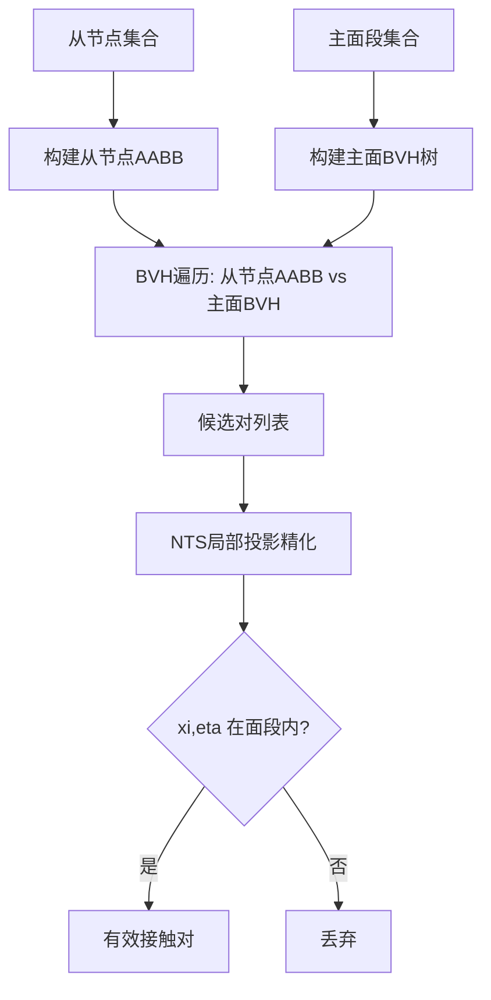
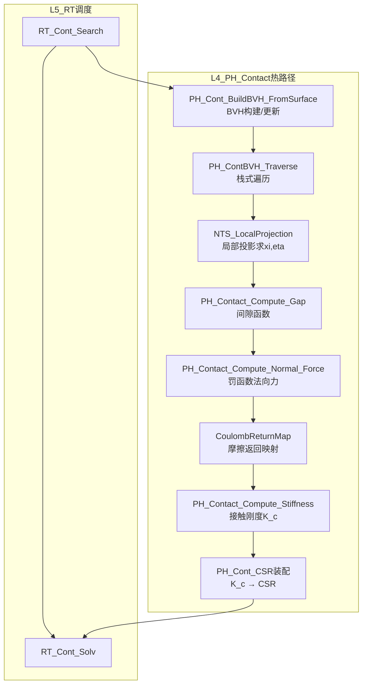

# Contact域热路径算法设计

**Layer**: L4_PH | **Domain**: Contact | **Version**: v1.0 | **Date**: 2026-04-28  
**依据**: `CONTRACT.md` v3.0, Phase A 评估结论  
**关联代码**: `PH_Cont_Core.f90`, `PH_Cont_Def.f90`, `Search/PH_Cont_BVHBuilder.f90`, `Search/PH_Cont_BVHQuery.f90`, `Friction/PH_Cont_Friction.f90`

---

## 1. 设计概要

### 1.1 评估结论摘要

| 算法模块 | 完整度 | 复用级别 | 补齐策略 |
|----------|--------|---------|---------|
| NTS 搜索 | 55% | L2-L3 | BVH框架可用但遍历核心有TODO，需补齐投影+自然坐标求解 |
| 罚函数法向力 | 20% | L3 | 仅标量 gap→force 框架，需重建面级N→S投影+刚度矩阵 |
| Coulomb摩擦 | 15% | L3 | 参数框架完整(`PH_Cont_Friction.f90`), 返回映射算法需实现 |

### 1.2 现有资产

- **BVH构建**: `PH_Cont_BVHBuilder.f90` (385行) — AABB构建 + SAH分裂启发完成, 中序排序TODO
- **BVH查询**: `PH_Cont_BVHQuery.f90` (432行) — 栈式遍历框架完成, 但`QueryPoint`内仍为暴力搜索 (L305)
- **核心力计算**: `PH_Cont_Core.f90` (197行) — 标量gap/force/stiffness, 仅3×3简化节点对
- **摩擦模型库**: `PH_Cont_Friction.f90` (374行) — 5种模型完整, 但基于速度方向而非增量滑移返回映射
- **CSR装配**: `PH_Cont_CSR.f90` — 稀疏格式装配框架

### 1.3 热路径约束 (CONTRACT §八)

- Ctx 零 ALLOCATE (栈分配)
- 64-byte 对齐 (AVX-512)
- IP循环约束: 接触力计算在面级别, 不进入高斯点内循环
- K_contact 经 `PH_Cont_CSR` 直接写入 CSR

---

## 2. Node-to-Segment (NTS) 搜索算法

### 2.1 NTS基本概念

**主面/从节点定义**:
- 主面 (Master surface): 接触对中刚度较大的面, 由 $n_{seg}$ 个面段组成
- 从节点 (Slave node): 接触对中自由度较少的面上节点集合

**投影问题**: 对每个从节点 $\mathbf{x}_s$, 求其在主面段上的最近点 $\mathbf{x}_m(\xi, \eta)$:

$$\mathbf{x}_m(\xi, \eta) = \sum_{I=1}^{n_{node}} N_I(\xi, \eta) \cdot \mathbf{x}_I^{master}$$

其中 $N_I$ 为面段的形函数 (4节点面: 双线性; 8节点面: 二次), $(\xi, \eta) \in [-1, 1]^2$ 为自然坐标.

### 2.2 自然坐标求解 (Newton-Raphson局部投影)

目标: 求 $(\xi, \eta)$ 使残差最小:

$$\mathbf{r}(\xi, \eta) = \mathbf{x}_s - \mathbf{x}_m(\xi, \eta)$$

正交条件 (最近点投影):

$$\begin{cases}
\mathbf{r} \cdot \frac{\partial \mathbf{x}_m}{\partial \xi} = 0 \\
\mathbf{r} \cdot \frac{\partial \mathbf{x}_m}{\partial \eta} = 0
\end{cases}$$

**局部NR迭代**:

```fortran
! 伪代码: NTS_LocalProjection
subroutine NTS_LocalProjection(x_slave, master_coords, xi, eta, converged)
  real(wp) :: xi, eta, dxi, deta
  real(wp) :: r(3), dxm_dxi(3), dxm_deta(3)
  real(wp) :: A(2,2), b(2)
  integer  :: iter

  xi = 0.0_wp; eta = 0.0_wp  ! 初始猜测: 面段中心

  do iter = 1, MAX_LOCAL_ITER   ! 典型 MAX_LOCAL_ITER = 20
    ! 计算主面点及偏导
    call EvalMasterSurface(master_coords, xi, eta, x_m, dxm_dxi, dxm_deta)
    r = x_slave - x_m

    ! 正交条件残差
    b(1) = dot_product(r, dxm_dxi)
    b(2) = dot_product(r, dxm_deta)

    ! 2×2 Jacobian
    A(1,1) = -dot_product(dxm_dxi, dxm_dxi)
    A(1,2) = -dot_product(dxm_dxi, dxm_deta)
    A(2,1) = A(1,2)
    A(2,2) = -dot_product(dxm_deta, dxm_deta)

    ! 求解 A * [dxi, deta]^T = b
    call Solve2x2(A, b, dxi, deta)
    xi  = xi  + dxi
    eta = eta + deta

    if (sqrt(dxi**2 + deta**2) < TOL_LOCAL) then
      converged = .true.; return
    end if
  end do
  converged = .false.
end subroutine
```

### 2.3 BVH加速搜索 (现有框架扩展)

#### 2.3.1 AABB层次包围盒构建 (已有)

**现有实现** (`PH_Cont_BVHBuilder.f90`):
- `PH_Cont_BuildBVH_FromSurface` → `PH_Cont_BuildBVH_Subtree` (递归中序分裂)
- 分裂策略: 最长轴中位数分裂 (L159-165)
- 叶节点: ≤ `PH_BVH_MAX_PRIMITIVES_PER_NODE` (=4) 个基元

**待完善**: 排序目前为简单中位数切分, 应实现 SAH (Surface Area Heuristic):

$$C_{SAH} = C_{trav} + \frac{S_L}{S_P} \cdot n_L \cdot C_{isect} + \frac{S_R}{S_P} \cdot n_R \cdot C_{isect}$$

#### 2.3.2 自顶向下遍历算法 (需补齐)

**现有实现** (`PH_Cont_BVHQuery.f90`):
- `PH_ContBVH_Traverse`: 栈式非递归遍历框架 **已完成** (L46-150)
- `PH_ContBVH_QueryPoint`: 框架完成但内部距离计算使用质心近似 (L410-430)

**需补齐**: 精确的点到面段距离计算, 替换当前 `PointToSegmentDistSq` 的质心近似

```fortran
! 伪代码: 精确点到四边形面段距离
function PointToQuadDistSq(point, quad_coords) result(dist_sq)
  ! 1. 先尝试面内投影: 求(xi, eta)使点投影落在面段内
  call NTS_LocalProjection(point, quad_coords, xi, eta, converged)
  if (converged .and. abs(xi) <= 1+tol .and. abs(eta) <= 1+tol) then
    ! 投影点在面段内
    call EvalMasterSurface(quad_coords, xi, eta, proj_pt)
    dist_sq = sum((point - proj_pt)**2)
  else
    ! 2. 投影点在面段外: 计算到4条边的最短距离
    dist_sq = huge(1.0_wp)
    do iedge = 1, 4
      d2 = PointToEdgeDistSq(point, edge_i)
      dist_sq = min(dist_sq, d2)
    end do
  end if
end function
```

#### 2.3.3 候选对筛选

全局搜索流程:



---

## 3. 罚函数接触力

### 3.1 法向间隙函数

法向间隙 $g_n$ 定义为从节点到主面投影点的有符号距离:

$$g_n = (\mathbf{x}_s - \mathbf{x}_m(\xi^*, \eta^*)) \cdot \mathbf{n}_m$$

其中 $\mathbf{n}_m$ 为主面在投影点处的外法向:

$$\mathbf{n}_m = \frac{\frac{\partial \mathbf{x}_m}{\partial \xi} \times \frac{\partial \mathbf{x}_m}{\partial \eta}}{\left\| \frac{\partial \mathbf{x}_m}{\partial \xi} \times \frac{\partial \mathbf{x}_m}{\partial \eta} \right\|}$$

- $g_n > 0$: 分离 (OPEN)
- $g_n \leq 0$: 穿透 (CLOSED)

**现有实现** (`PH_Cont_Core.f90` L83-95): 标量 `dx = x_slave - x_master`, 需扩展为面级投影.

### 3.2 法向接触力 (罚函数法)

$$f_n = \varepsilon_n \cdot \langle -g_n \rangle$$

其中 $\langle \cdot \rangle$ 为 Macaulay 括号: $\langle x \rangle = \max(0, x)$, $\varepsilon_n$ 为法向罚参数 $[\text{N/m}^3]$.

**现有实现** (`PH_Cont_Core.f90` L100-112): 已实现, 但使用 `desc%penalty_normal`, 需确保单位一致性.

等效节点力向量:

$$\mathbf{f}_c = f_n \cdot \mathbf{n}_m \cdot \begin{bmatrix} -N_1 \\ -N_2 \\ \vdots \\ -N_{n_{master}} \\ 1 \end{bmatrix}$$

### 3.3 接触刚度矩阵

法向接触贡献:

$$\mathbf{K}_c^{nn} = \varepsilon_n \cdot \mathbf{N}_n^T \cdot \mathbf{N}_n$$

其中 $\mathbf{N}_n$ 为形函数与法向的乘积向量:

$$\mathbf{N}_n = \begin{bmatrix} n_1 N_1, & n_2 N_1, & n_3 N_1, & \ldots, & -n_1, & -n_2, & -n_3 \end{bmatrix}$$

**现有实现** (`PH_Cont_Core.f90` L149-168): 仅 3×3 简化 $K_{ij} = \varepsilon_n n_i n_j$, 需扩展为完整 $(3 n_{master}+3) \times (3 n_{master}+3)$ 矩阵.

### 3.4 罚参数选择策略

自动估算 (已有 `PH_Contact_Penalty_Param`, L173-177):

$$\varepsilon_n = \alpha \cdot \frac{E}{h_e}$$

其中 $E$ 为杨氏模量, $h_e$ 为特征单元尺寸, $\alpha$ 为缩放因子 (典型 $\alpha = 10 \sim 100$).

自适应调整 (需新增):
- 穿透过大 ($|g_n| > g_{tol}$): $\varepsilon_n \leftarrow \beta \cdot \varepsilon_n$, $\beta \in [2, 10]$
- 收敛困难: $\varepsilon_n \leftarrow \varepsilon_n / \gamma$, $\gamma \in [2, 5]$

---

## 4. Coulomb摩擦返回映射

### 4.1 切向滑移增量

$$\Delta g_t = \Delta \mathbf{x}_s - \sum_I N_I(\xi, \eta) \cdot \Delta \mathbf{x}_I^{master} - \sum_I \frac{\partial N_I}{\partial \xi} \cdot \Delta \xi \cdot \mathbf{x}_I^{master}$$

简化为投影面内分量:

$$\Delta \mathbf{g}_t = (\mathbf{I} - \mathbf{n}_m \otimes \mathbf{n}_m) \cdot (\Delta \mathbf{x}_s - \Delta \mathbf{x}_m)$$

### 4.2 摩擦定律

Coulomb摩擦锥:

$$\Phi(\mathbf{f}_t, f_n) = \|\mathbf{f}_t\| - \mu \cdot f_n \leq 0$$

- **粘结** (stick): $\Phi < 0$, $\|\mathbf{f}_t\| < \mu f_n$
- **滑动** (slip): $\Phi = 0$, $\mathbf{f}_t = \mu f_n \cdot \frac{\mathbf{g}_t}{\|\mathbf{g}_t\|}$

### 4.3 返回映射算法 (增量形式)

**现有实现** (`PH_Cont_Core.f90` L117-144): 使用速度方向的简化形式. 需重构为增量滑移的返回映射:

```fortran
! 伪代码: Coulomb返回映射
subroutine CoulombReturnMap(eps_t, delta_g_t, f_t_n, f_n, mu, f_t, status_flag)
  real(wp), intent(in)  :: eps_t          ! 切向罚参数
  real(wp), intent(in)  :: delta_g_t(3)   ! 切向滑移增量
  real(wp), intent(in)  :: f_t_n(3)       ! 上一步切向力
  real(wp), intent(in)  :: f_n            ! 当前法向力
  real(wp), intent(in)  :: mu             ! 摩擦系数
  real(wp), intent(out) :: f_t(3)         ! 当前切向力
  integer,  intent(out) :: status_flag    ! STICK=1, SLIP=2

  real(wp) :: f_trial(3), f_trial_mag, f_limit

  ! Step 1: 试切向力 (弹性预测)
  f_trial = f_t_n + eps_t * delta_g_t

  ! Step 2: 屈服判断
  f_trial_mag = sqrt(sum(f_trial**2))
  f_limit = mu * f_n

  if (f_trial_mag <= f_limit) then
    ! 粘结: 试切向力即为最终力
    f_t = f_trial
    status_flag = 1  ! STICK
  else
    ! 滑动: 返回映射到摩擦锥表面
    f_t = f_limit * (f_trial / f_trial_mag)
    status_flag = 2  ! SLIP
  end if
end subroutine
```

### 4.4 一致切线刚度

粘结状态:

$$\mathbf{K}_t^{stick} = \varepsilon_t \cdot (\mathbf{I} - \mathbf{n} \otimes \mathbf{n})$$

滑动状态:

$$\mathbf{K}_t^{slip} = \frac{\mu f_n}{\|\mathbf{f}_t^{trial}\|} \left( \varepsilon_t (\mathbf{I} - \mathbf{n} \otimes \mathbf{n}) - \varepsilon_t \frac{\mathbf{f}_t^{trial} \otimes \mathbf{f}_t^{trial}}{\|\mathbf{f}_t^{trial}\|^2} \right)$$

**现有实现** (`PH_Cont_Friction.f90` L333-372): `PH_ContFric_TangentStiff` 提供近似切线 $K_t \approx \mu |f_n| / |v_t| \cdot \mathbf{t} \otimes \mathbf{t}$, 需重构为上述一致形式.

---

## 5. 数据流图



---

## 6. 与现有代码映射

| 设计模块 | 现有文件 | 现有过程/行号 | 完整度 | 补齐工作 |
|----------|---------|-------------|--------|---------|
| BVH构建 | `Search/PH_Cont_BVHBuilder.f90` | `PH_Cont_BuildBVH_FromSurface` L188 | 70% | SAH排序, 增量更新 |
| BVH遍历 | `Search/PH_Cont_BVHQuery.f90` | `PH_ContBVH_Traverse` L46 | 80% | 精确距离计算替换质心近似 |
| NTS投影 | 无 | — | 0% | 新增 `PH_Cont_NTSProjection` |
| 间隙计算 | `PH_Cont_Core.f90` | `PH_Contact_Compute_Gap` L83 | 40% | 扩展为面级投影后间隙 |
| 法向力 | `PH_Cont_Core.f90` | `PH_Contact_Compute_Normal_Force` L100 | 60% | 扩展等效节点力向量 |
| 接触刚度 | `PH_Cont_Core.f90` | `PH_Contact_Compute_Stiffness` L149 | 30% | 扩展3×3→完整矩阵 |
| 罚参数估算 | `PH_Cont_Core.f90` | `PH_Contact_Penalty_Param` L173 | 80% | 增加自适应调整 |
| Coulomb返回映射 | `Friction/PH_Cont_Friction.f90` | `PH_ContFric_Coulomb` L75 | 40% | 重构为增量返回映射 |
| 一致切线 | `Friction/PH_Cont_Friction.f90` | `PH_ContFric_TangentStiff` L333 | 30% | 重构为粘结/滑动分支 |
| CSR装配 | `Core/PH_Cont_CSR.f90` | — | 60% | 对接新刚度矩阵格式 |

---

## 7. 工期估算

| 子任务 | 工期 | 前置依赖 |
|--------|------|---------|
| NTS局部投影实现 | 2天 | 无 |
| BVH遍历精化 (距离计算) | 1天 | 无 |
| 面级间隙+法向力+等效节点力 | 2天 | NTS投影 |
| Coulomb返回映射重构 | 2天 | 间隙函数 |
| 一致切线刚度 | 2天 | 返回映射 |
| 完整接触刚度矩阵 + CSR装配 | 2天 | 切线刚度 |
| 集成测试 | 2天 | 全部 |
| **合计** | **13天** | — |
