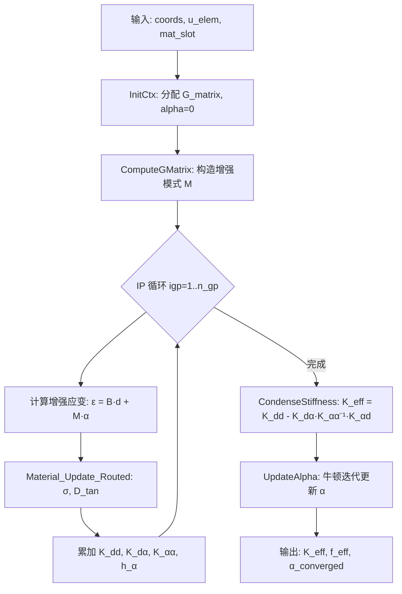
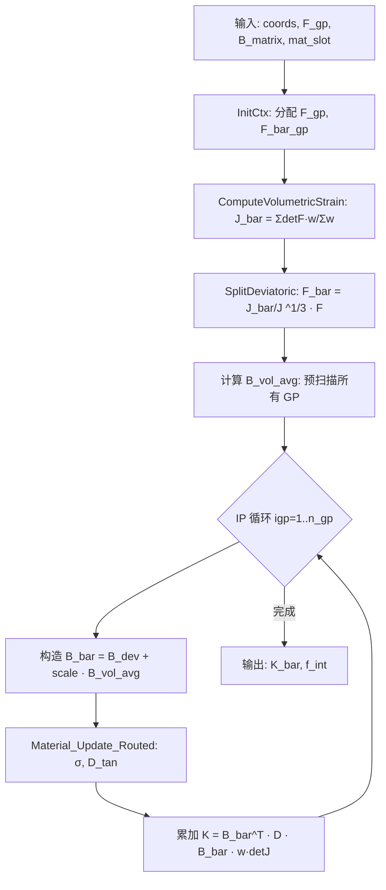
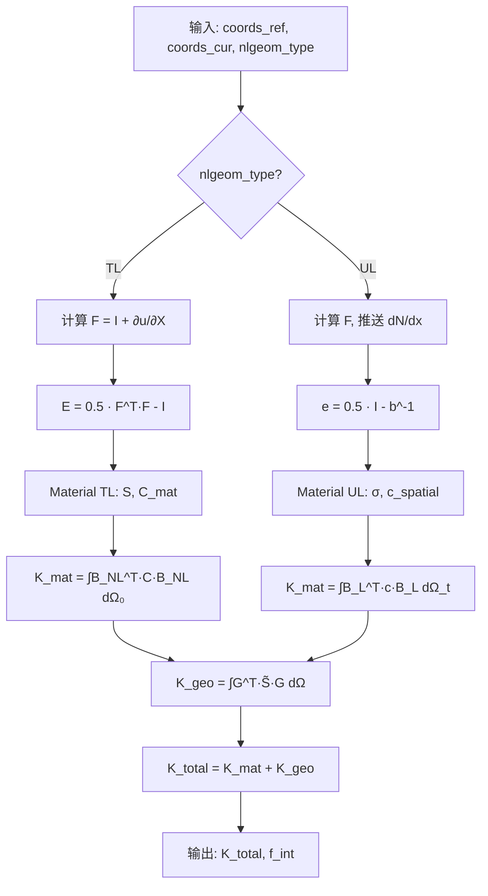

# Element域3D单元高级功能算法设计

> **Layer**: L4_PH / Element / Solid3D  
> **Status**: Phase B — Algorithm Design  
> **Date**: 2026-04-28  
> **Baseline**: Phase A 评估结论（三大功能平均完整度 87%，全部可直接复用）

---

## 1. 设计概要

### 1.1 设计目标

基于 Phase A 评估，Element 域三大 3D 高级功能——**EAS 增强应变**、**F-bar 体积锁定治疗**、**几何非线性（大变形/大应变）**——现有代码资产平均完整度达 **87%**，**全部可直接复用**。本设计文档的核心策略为：

1. **复用现有**：精确映射现有 `.f90` 实现到算法公式，确认已覆盖部分
2. **补齐缺口**：针对每个功能的关键缺口给出完整数学推导与接口定义
3. **集成设计**：设计跨功能组合（EAS+NLGeom、F-bar+NLGeom）的统一 IP 循环

### 1.2 功能矩阵

| 功能 | 现有文件 | 代码行 | 完整度 | 关键缺口 | 设计策略 |
|------|---------|--------|--------|---------|---------|
| EAS 增强应变 | `PH_Elem_C3D8EAS.f90` | 480 | 85% | Material D 矩阵接口缺失；UpdateAlpha 仅框架 | 补齐 D 矩阵路由 + α 完整牛顿迭代 |
| F-bar 方法 | `PH_Elem_C3D8FBar.f90` | 422 | 75% | $\bar{B}$ 矩阵显式计算缺失（当前简化为 $\bar{B} \approx B$）；Material 接口缺失 | 补齐 $\bar{B}$ 显式推导 + D 矩阵路由 |
| 几何非线性 | `PH_Elem_Nlgeom.f90`(435) + `PH_NLGeomEval.f90`(2214) | 2649 | 90% | TL/UL 切换逻辑需验证 | 验证 + 统一框架设计 |

### 1.3 与 Material 域的接口契约

根据 `Material/CONTRACT.md`，Element 与 Material 的 IP 级交互遵循：

- **热路径零 L3**：IP 循环内读 `slot_pool(mat_pt_idx)`，不回 L3
- **主调用链**：`PH_Element_Compute_Ke` → 每 IP 调用 `material%Compute_Ctan` → 返回 $\boldsymbol{\sigma}$ 和 $\mathbf{D}_{\text{tan}}$
- **D 矩阵格式**：$6 \times 6$ Voigt 记法（$\sigma_{11}, \sigma_{22}, \sigma_{33}, \sigma_{12}, \sigma_{13}, \sigma_{23}$）

---

## 2. EAS 增强应变方法（Enhanced Assumed Strain）

### 2.1 数学基础

#### 2.1.1 Hu-Washizu 三场变分原理

EAS 方法基于 Hu-Washizu 三场变分形式，独立场为位移 $\mathbf{u}$、应变 $\boldsymbol{\varepsilon}$、应力 $\boldsymbol{\sigma}$：

$$\Pi_{\text{HW}}(\mathbf{u}, \boldsymbol{\varepsilon}, \boldsymbol{\sigma}) = \int_{\Omega} W(\boldsymbol{\varepsilon}) \, d\Omega + \int_{\Omega} \boldsymbol{\sigma} : (\nabla^s \mathbf{u} - \boldsymbol{\varepsilon}) \, d\Omega - \Pi_{\text{ext}}$$

#### 2.1.2 增强应变场

应变场分解为兼容部分和增强部分：

$$\boldsymbol{\varepsilon} = \underbrace{\mathbf{B}_{\text{std}} \cdot \mathbf{d}}_{\text{兼容应变}} + \underbrace{\mathbf{M} \cdot \boldsymbol{\alpha}}_{\text{增强应变} \; \tilde{\boldsymbol{\varepsilon}}}$$

其中：
- $\mathbf{B}_{\text{std}}$：标准应变-位移矩阵（$6 \times 24$ for C3D8）
- $\mathbf{d}$：节点位移向量（$24 \times 1$）
- $\mathbf{M}$：增强模式矩阵（$6 \times n_{\alpha}$，$n_{\alpha} = 9$ for 全 3D）
- $\boldsymbol{\alpha}$：增强应变内部参数（$9 \times 1$）

#### 2.1.3 增强模式矩阵 M 的构造（9 参数混合型）

参考 Simo & Rifai (1990)，增强模式在参考单元的等参坐标 $(\xi, \eta, \zeta)$ 下定义：

$$\mathbf{M}(\xi, \eta, \zeta) = \frac{\det(\mathbf{J}_0)}{\det(\mathbf{J})} \cdot \mathbf{T}_0 \cdot \hat{\mathbf{M}}(\xi, \eta, \zeta)$$

其中 $\mathbf{J}_0$ 为单元中心处 Jacobian，$\mathbf{T}_0$ 为对应的变换矩阵。

**9 参数增强模式**（现有代码 `PH_Elem_C3D8EAS.f90` 行 269-292 的 G 矩阵即 $\hat{\mathbf{M}}$）：

| 参数编号 | 模式 | 类型 | 对应代码行 |
|----------|------|------|-----------|
| 1 | $(1, 1, 1, 0, 0, 0)^T$ | 体积常数 | 273-275 |
| 2-4 | $(\xi, 0, 0, ...)^T$, $(0, \eta, 0, ...)^T$, $(0, 0, \zeta, ...)^T$ | 体积线性 | 277-279 |
| 5 | $(\xi\eta, -\xi\eta, 0, ...)^T$ | 偏差二次 | 282-283 |
| 6 | $(0, \eta\zeta, -\eta\zeta, ...)^T$ | 偏差二次 | 285-286 |
| 7 | $(\zeta\xi, 0, -\zeta\xi, ...)^T$ | 偏差二次 | 288-289 |
| 8-9 | $(0,0,0,\xi,0,0)^T$, $(0,0,0,0,\eta,0)^T$ | 剪切线性 | 291-292 |

#### 2.1.4 正交性条件

增强应变必须满足正交性条件，保证 patch test：

$$\int_{\Omega} \mathbf{M}^T \cdot \boldsymbol{\sigma}_h \, d\Omega = 0$$

其中 $\boldsymbol{\sigma}_h$ 为线性（常应力场）试探函数空间。此条件由 $\hat{\mathbf{M}}$ 中使用零均值函数（$\xi, \eta, \zeta, \xi\eta, ...$ 在 $[-1,1]^3$ 上积分为零）自动满足。

### 2.2 单元刚度矩阵

#### 2.2.1 增广方程系统

EAS 变分的线性化导出增广方程：

$$\begin{bmatrix} \mathbf{K}_{dd} & \mathbf{K}_{d\alpha} \\ \mathbf{K}_{\alpha d} & \mathbf{K}_{\alpha\alpha} \end{bmatrix} \begin{Bmatrix} \Delta\mathbf{d} \\ \Delta\boldsymbol{\alpha} \end{Bmatrix} = \begin{Bmatrix} \mathbf{f}_{\text{ext}} - \mathbf{f}_{\text{int}} \\ -\mathbf{h}_\alpha \end{Bmatrix}$$

其中各子矩阵通过高斯积分组装（现有代码行 386-408）：

$$\mathbf{K}_{dd} = \sum_{gp} \mathbf{B}^T \mathbf{D} \mathbf{B} \cdot w_{gp} \cdot \det(\mathbf{J})_{gp}$$

$$\mathbf{K}_{d\alpha} = \sum_{gp} \mathbf{B}^T \mathbf{D} \mathbf{M} \cdot w_{gp} \cdot \det(\mathbf{J})_{gp}$$

$$\mathbf{K}_{\alpha d} = \mathbf{K}_{d\alpha}^T$$

$$\mathbf{K}_{\alpha\alpha} = \sum_{gp} \mathbf{M}^T \mathbf{D} \mathbf{M} \cdot w_{gp} \cdot \det(\mathbf{J})_{gp}$$

$$\mathbf{h}_\alpha = \sum_{gp} \mathbf{M}^T \boldsymbol{\sigma} \cdot w_{gp} \cdot \det(\mathbf{J})_{gp}$$

#### 2.2.2 静态缩聚

由于 $\boldsymbol{\alpha}$ 为单元内部自由度，可在单元级通过静态缩聚消去（现有代码行 303-337）：

$$\mathbf{K}_{\text{eff}} = \mathbf{K}_{dd} - \mathbf{K}_{d\alpha} \cdot \mathbf{K}_{\alpha\alpha}^{-1} \cdot \mathbf{K}_{\alpha d}$$

$$\mathbf{f}_{\text{eff}} = (\mathbf{f}_{\text{ext}} - \mathbf{f}_{\text{int}}) - \mathbf{K}_{d\alpha} \cdot \mathbf{K}_{\alpha\alpha}^{-1} \cdot \mathbf{h}_\alpha$$

**现有实现验证**（`CondenseStiffness`，行 322-333）：
- 行 322-323：`K_alpha_alpha_inv = K_alpha_alpha; CALL InvertMatrix(...)` — 对 $\mathbf{K}_{\alpha\alpha}$ 求逆 ✓
- 行 332：`temp_mat = MATMUL(K_u_alpha, K_alpha_alpha_inv)` — 中间矩阵 ✓
- 行 333：`K_condensed = K_uu - MATMUL(temp_mat, K_alpha_u)` — 最终缩聚 ✓

### 2.3 α 参数更新算法

#### 2.3.1 牛顿迭代（**关键缺口补齐**）

现有 `UpdateAlpha`（行 428-461）仅实现单步更新框架，需补齐完整牛顿迭代：

**算法**：在全局 NR 迭代的每个增量步 $n+1$、迭代 $k$ 中：

1. **初始值**：$\boldsymbol{\alpha}^{(0)}_{n+1} = \boldsymbol{\alpha}_n$（上一收敛步）
2. **残差计算**：$\mathbf{r}_\alpha^{(k)} = \mathbf{h}_\alpha^{(k)} + \mathbf{K}_{\alpha d} \cdot \Delta\mathbf{d}^{(k)}$
3. **更新**：$\Delta\boldsymbol{\alpha}^{(k)} = -\mathbf{K}_{\alpha\alpha}^{-1} \cdot \mathbf{r}_\alpha^{(k)}$
4. **累加**：$\boldsymbol{\alpha}^{(k+1)} = \boldsymbol{\alpha}^{(k)} + \Delta\boldsymbol{\alpha}^{(k)}$
5. **收敛准则**：$\| \mathbf{r}_\alpha \| / \| \mathbf{r}_\alpha^{(0)} \| < \text{tol}_\alpha$，典型 $\text{tol}_\alpha = 10^{-8}$

现有代码行 456-457 对应步骤 2-3 的单步简化版本：
```
temp_vec = MATMUL(K_alpha_u, u_elem)         ! 行456
alpha = -MATMUL(K_alpha_alpha_inv, temp_vec)  ! 行457
```

**补齐要求**：
- 增加迭代循环与收敛检查
- 增加 $\mathbf{h}_\alpha$ 残差计算（需 Material 返回的 $\boldsymbol{\sigma}$）
- 增加最大迭代次数限制（建议 `max_iter_alpha = 20`）

### 2.4 与 Material 域的 D 矩阵接口（**关键缺口补齐**）

#### 2.4.1 调用序列

```
Element 侧（每 IP）:
  1. 计算增强应变: ε_enh = B·d + M·α
  2. 调用 Material: (σ, D_tan) = Material_Compute(ε_enh, state_old)
  3. 组装子矩阵: K_dd, K_dα, K_αα, h_α
```

#### 2.4.2 接口签名

现有 `PH_Elem_C3D8_EAS_Material_Update_Routed`（行 463-479）已定义路由桩：

```fortran
SUBROUTINE PH_Elem_C3D8_EAS_Material_Update_Routed( &
    rt_ctx,       & ! [INOUT] RT_Mat_Dispatch_Ctx — 运行时材料分发上下文
    mat_slot,     & ! [IN]    PH_Mat_Slot    — 材料 slot（含 props/state）
    dStrain,      & ! [IN]    REAL(wp)(6)          — 应变增量 Voigt
    stress_old,   & ! [IN]    REAL(wp)(6)          — 上一步应力 Voigt
    stress_new,   & ! [OUT]   REAL(wp)(6)          — 更新后应力 Voigt
    D_tangent,    & ! [OUT]   REAL(wp)(6,6)        — 一致切线模量 Voigt
    status)         ! [OUT]   ErrorStatusType
```

**D 矩阵格式**：$6 \times 6$ Voigt 对称矩阵，索引对应 $(11, 22, 33, 12, 13, 23)$：

$$\mathbf{D} = \begin{bmatrix} D_{1111} & D_{1122} & D_{1133} & D_{1112} & D_{1113} & D_{1123} \\ & D_{2222} & D_{2233} & D_{2212} & D_{2213} & D_{2223} \\ & & D_{3333} & D_{3312} & D_{3313} & D_{3323} \\ & & & D_{1212} & D_{1213} & D_{1223} \\ & & & & D_{1313} & D_{1323} \\ \text{sym} & & & & & D_{2323} \end{bmatrix}$$

### 2.5 数据流图



### 2.6 与现有 PH_Elem_C3D8EAS.f90 的映射

| 设计项 | 现有代码位置 | 状态 | 补齐动作 |
|--------|-------------|------|---------|
| EAS_Ctx 类型定义 | 行 95-115 | ✅ 完整 | — |
| G 矩阵 9 参数构造 | 行 269-295 | ✅ 完整 | — |
| IP 循环组装 K_dd/K_dα/K_αα | 行 386-408 | ✅ 完整 | — |
| 静态缩聚 K_eff | 行 322-333 | ✅ 完整 | — |
| InvertMatrix（≤3×3） | 行 169-236 | ⚠️ 受限 | 需扩展至 9×9（LU 分解） |
| α 更新牛顿迭代 | 行 456-457 | ❌ 仅单步 | 补齐完整迭代 + 收敛检查 + h_α |
| Material D 矩阵路由 | 行 463-479 | ⚠️ 桩代码 | 补齐实际调用链 |
| 增强应变 ε_enh 计算 | — | ❌ 缺失 | 新增 ε = B·d + M·α 显式计算 |

---

## 3. F-bar 方法（体积锁定治疗）

### 3.1 数学基础

#### 3.1.1 体积-偏差分解

变形梯度的乘法分解：

$$\mathbf{F} = \mathbf{F}_{\text{vol}} \cdot \mathbf{F}_{\text{dev}}$$

其中：
- 体积部分：$\mathbf{F}_{\text{vol}} = J^{1/3} \mathbf{I}$，$J = \det(\mathbf{F})$
- 偏差部分：$\mathbf{F}_{\text{dev}} = J^{-1/3} \mathbf{F}$

#### 3.1.2 体积平均

单元级体积平均的 Jacobian（现有代码行 224-249）：

$$\bar{J} = \frac{1}{V_0} \int_{\Omega_0} \det(\mathbf{F}) \, d\Omega = \frac{\sum_{gp} \det(\mathbf{F})_{gp} \cdot w_{gp} \cdot \det(\mathbf{J})_{gp}}{\sum_{gp} w_{gp} \cdot \det(\mathbf{J})_{gp}}$$

#### 3.1.3 修正变形梯度

$$\bar{\mathbf{F}} = \left(\frac{\bar{J}}{J}\right)^{1/3} \mathbf{F}$$

现有代码行 326-331 精确实现了此公式：
```fortran
J_ratio = J_bar / J                   ! 行326
scale_factor = J_ratio**(1.0_wp/3.0_wp)  ! 行327
F_bar = scale_factor * F              ! 行331
```

### 3.2 修正 $\bar{B}$ 矩阵显式公式（**关键缺口补齐**）

#### 3.2.1 B 矩阵体积-偏差分解

标准 B 矩阵分解为体积和偏差部分：

$$\mathbf{B} = \mathbf{B}_{\text{vol}} + \mathbf{B}_{\text{dev}}$$

对 3D 情况（$6 \times n_{\text{dof}}$）：

$$\mathbf{B}_{\text{vol}} = \frac{1}{3} \begin{bmatrix} 1 \\ 1 \\ 1 \\ 0 \\ 0 \\ 0 \end{bmatrix} \begin{bmatrix} B_{1,\bullet} + B_{2,\bullet} + B_{3,\bullet} \end{bmatrix}$$

$$\mathbf{B}_{\text{dev}} = \mathbf{B} - \mathbf{B}_{\text{vol}}$$

其中 $B_{i,\bullet}$ 表示 $\mathbf{B}$ 的第 $i$ 行。

#### 3.2.2 体积部分平均化

对 $\mathbf{B}_{\text{vol}}$ 在单元体积上平均：

$$\bar{\mathbf{B}}_{\text{vol}} = \frac{1}{V_0} \int_{\Omega_0} \mathbf{B}_{\text{vol}} \, d\Omega \approx \frac{\sum_{gp} \mathbf{B}_{\text{vol},gp} \cdot w_{gp} \cdot \det(\mathbf{J})_{gp}}{\sum_{gp} w_{gp} \cdot \det(\mathbf{J})_{gp}}$$

#### 3.2.3 修正 $\bar{B}$ 矩阵

$$\bar{\mathbf{B}} = \mathbf{B}_{\text{dev}} + \left(\frac{\bar{J}}{J}\right)^{1/3} \bar{\mathbf{B}}_{\text{vol}}$$

**现有代码缺口**：行 379-386 中 `B_bar_matrix(igp,:,:) = B_matrix(igp,:,:)` 为简化实现，缺失上述体积平均化和修正。

#### 3.2.4 补齐伪代码

```
! Phase 1: 预扫描 — 计算 B_vol 平均
B_vol_avg = 0.0
V_total = 0.0
DO igp = 1, n_gp
    B_diag = B(1,igp,:) + B(2,igp,:) + B(3,igp,:)    ! 迹
    B_vol(igp,:,:) = (1/3) * [1;1;1;0;0;0] * B_diag
    B_vol_avg = B_vol_avg + B_vol(igp,:,:) * w(igp) * detJ(igp)
    V_total = V_total + w(igp) * detJ(igp)
END DO
B_vol_avg = B_vol_avg / V_total

! Phase 2: 逐 GP 修正
DO igp = 1, n_gp
    B_dev = B(igp,:,:) - B_vol(igp,:,:)
    scale = (J_bar / det_F(igp))**(1.0/3.0)
    B_bar(igp,:,:) = B_dev + scale * B_vol_avg
END DO
```

### 3.3 刚度矩阵修正

$$\bar{\mathbf{K}} = \sum_{gp} \bar{\mathbf{B}}_{gp}^T \cdot \mathbf{D} \cdot \bar{\mathbf{B}}_{gp} \cdot w_{gp} \cdot \det(\mathbf{J})_{gp} + \mathbf{K}_{\text{geo,vol}}$$

几何修正项（体积约束的一致线性化）：

$$\mathbf{K}_{\text{geo,vol}} = \frac{1}{9} \sum_{gp} \left(\frac{\bar{J}}{J}\right)^{2/3} p_{gp} \cdot \mathbf{1}_{\text{vol}} \otimes \mathbf{1}_{\text{vol}} \cdot w_{gp} \cdot \det(\mathbf{J})_{gp}$$

其中 $p = \frac{1}{3} \text{tr}(\boldsymbol{\sigma})$ 为静水压力。

### 3.4 与近不可压材料的配合

#### 3.4.1 数值稳定性

当 $\nu \to 0.5$ 时：
- 体积模量 $K = \frac{E}{3(1-2\nu)} \to \infty$
- F-bar 通过体积平均化有效解耦体积响应，避免锁定
- 要求 Material 域返回的 $\mathbf{D}$ 中体积分量与偏差分量可分离

#### 3.4.2 与 Material 域体积模量通信

Material 侧需提供：
- 一致切线 $\mathbf{D}_{\text{tan}}$（$6 \times 6$）— 标准接口
- 可选：分离的 $K_{\text{bulk}}$ 和 $\mathbf{D}_{\text{dev}}$（用于精确几何修正项）

### 3.5 数据流图



### 3.6 与现有 PH_Elem_C3D8FBar.f90 的映射

| 设计项 | 现有代码位置 | 状态 | 补齐动作 |
|--------|-------------|------|---------|
| FBar_Ctx 类型定义 | 行 86-107 | ✅ 完整 | — |
| Det3x3 辅助函数 | 行 161-169 | ✅ 完整 | — |
| $\bar{J}$ 体积平均计算 | 行 224-249 | ✅ 完整 | — |
| $\bar{\mathbf{F}}$ 修正 | 行 316-335 | ✅ 完整 | — |
| $\bar{\mathbf{B}}$ 显式构造 | 行 379-386 | ❌ 简化 | 补齐体积-偏差分解 + 平均化 |
| 刚度组装 | 行 184-195 | ✅ 框架完整 | 传入正确 $\bar{\mathbf{B}}$ 即可 |
| Material D 路由 | 行 405-421 | ⚠️ 桩代码 | 补齐实际调用链 |
| 几何修正项 $\mathbf{K}_{\text{geo,vol}}$ | — | ❌ 缺失 | 新增（可选优化） |

---

## 4. 几何非线性（大变形/大应变）

### 4.1 TL（Total Lagrangian）公式体系

#### 4.1.1 参考构型描述

所有量参照初始（参考）构型 $\Omega_0$。

#### 4.1.2 变形梯度

$$\mathbf{F} = \frac{\partial \mathbf{x}}{\partial \mathbf{X}} = \mathbf{I} + \frac{\partial \mathbf{u}}{\partial \mathbf{X}} = \mathbf{I} + \sum_I \frac{\partial N_I}{\partial \mathbf{X}} \otimes \mathbf{u}_I$$

**现有实现**：
- `PH_Elem_Nlgeom.f90` 行 107-131：通过 `dudX` 逐节点累加 ✓
- `PH_NLGeomEval.f90` 行 880-906：`RT_Asm_Calc_DefGrad` 含 $\det(\mathbf{F})$ 正性检查 ✓

#### 4.1.3 Green-Lagrange 应变

$$\mathbf{E} = \frac{1}{2}(\mathbf{F}^T \mathbf{F} - \mathbf{I}) = \frac{1}{2}(\mathbf{C} - \mathbf{I})$$

**现有实现**：
- `PH_Elem_Nlgeom.f90` 行 174-188：`C = MATMUL(TRANSPOSE(F), F)`，然后 `E = 0.5*(C - I)` ✓
- `PH_NLGeomEval.f90` 行 953-972：`RT_Asm_Calc_GreenLagStrain` ✓

Voigt 记法输出：$\{E_{11}, E_{22}, E_{33}, 2E_{12}, 2E_{13}, 2E_{23}\}$

#### 4.1.4 第二 Piola-Kirchhoff 应力

$$\mathbf{S} = \frac{\partial W}{\partial \mathbf{E}}$$

由 Material 域返回，对应 TL 模式下的物质量。

#### 4.1.5 物质切线模量

$$\mathbb{C} = \frac{\partial \mathbf{S}}{\partial \mathbf{E}}$$

Voigt 形式为 $6 \times 6$ 矩阵 $\mathbf{C}_{\text{mat}}$，由 Material 域 `Compute_Ctan` 返回。

### 4.2 UL（Updated Lagrangian）公式体系

#### 4.2.1 当前构型描述

所有量参照当前构型 $\Omega_t$。

#### 4.2.2 Almansi 应变

$$\mathbf{e} = \frac{1}{2}(\mathbf{I} - \mathbf{b}^{-1}) = \frac{1}{2}(\mathbf{I} - \mathbf{F}^{-T} \mathbf{F}^{-1})$$

**现有实现**：`PH_Elem_Nlgeom.f90` 行 213-228：
- 计算 $\mathbf{b} = \mathbf{F} \mathbf{F}^T$
- $\mathbf{e} = 0.5(\mathbf{I} - \mathbf{b})$（注：简化近似，严格应为 $\mathbf{b}^{-1}$）

#### 4.2.3 Cauchy 应力与空间切线模量

- Cauchy 应力 $\boldsymbol{\sigma}$：Material 域在 UL 模式下直接返回
- 空间切线 $\mathbf{c}$：$6 \times 6$ 空间形式，与 TL 的 push-forward 关系为：

$$c_{ijkl} = \frac{1}{J} F_{iI} F_{jJ} F_{kK} F_{lL} C_{IJKL}$$

### 4.3 TL↔UL 切换逻辑设计

#### 4.3.1 统一框架

通过 `nlgeom_type` 标志位（`PH_Elem_Nlgeom.f90` 行 40-41）：

```fortran
INTEGER(i4), PARAMETER :: NLGEOM_NONE = 0  ! 小变形
INTEGER(i4), PARAMETER :: NLGEOM_TL   = 1  ! Total Lagrangian
INTEGER(i4), PARAMETER :: NLGEOM_UL   = 2  ! Updated Lagrangian
```

#### 4.3.2 切换决策树

```
IF nlgeom_type == NLGEOM_TL:
    1. 计算 F = I + ∂u/∂X（参考构型形函数导数）
    2. 计算 E = 0.5*(F^T·F - I)
    3. 调用 Material: (S, C_mat) = Material_TL(E, state)
    4. 组装: K_mat = ∫ B_NL^T · C_mat · B_NL dΩ₀
    5. 组装: K_geo = ∫ G^T · S̃ · G dΩ₀

ELSE IF nlgeom_type == NLGEOM_UL:
    1. 计算 F = ∂x/∂X
    2. 推送形函数导数到当前构型: dN/dx = dN/dX · F^{-1}
    3. 计算 D_rate 或 e_alm
    4. 调用 Material: (σ, c_spatial) = Material_UL(D_rate, state)
    5. 组装: K_mat = ∫ B_L^T · c · B_L dΩ_t
    6. 组装: K_geo = ∫ G^T · σ̃ · G dΩ_t
```

#### 4.3.3 应力转换公式

**TL→UL**（`PH_Elem_Nlgeom.f90` 行 313-334）：

$$\sigma_{ij} = \frac{1}{J} F_{iK} S_{KL} F_{jL}$$

**UL→TL**（行 360-377）：

$$S_{IJ} = J \, F^{-1}_{Ik} \, \sigma_{kl} \, F^{-1}_{Jl}$$

两个转换均已完整实现并经 Voigt 互转。

### 4.4 几何刚度矩阵 $\mathbf{K}_{\text{geo}}$

#### 4.4.1 公式

$$\mathbf{K}_{\text{geo}} = \int_{\Omega} \mathbf{G}^T \cdot \tilde{\mathbf{S}} \cdot \mathbf{G} \, d\Omega$$

其中 $\mathbf{G}$ 为 $9 \times n_{\text{dof}}$ 的形函数导数矩阵（扩展形式），$\tilde{\mathbf{S}}$ 为应力扩展为 $9 \times 9$ 对角块：

$$\tilde{\mathbf{S}} = \begin{bmatrix} \sigma_{11}\mathbf{I}_3 & \sigma_{12}\mathbf{I}_3 & \sigma_{13}\mathbf{I}_3 \\ \sigma_{21}\mathbf{I}_3 & \sigma_{22}\mathbf{I}_3 & \sigma_{23}\mathbf{I}_3 \\ \sigma_{31}\mathbf{I}_3 & \sigma_{32}\mathbf{I}_3 & \sigma_{33}\mathbf{I}_3 \end{bmatrix}$$

**现有实现**：`PH_NLGeomEval.f90` 行 908-951（`RT_Asm_Calc_GeomStiff`）：
- 行 931-937：构造 `sigma_matrix` 对角形式
- 行 940-947：三重循环 $K_{\text{geo}}(i,j) = \sum_k B(k,i) \cdot \sigma(k,k) \cdot B(k,j)$

**注意**：当前实现为简化的对角 $\sigma$ 形式（行 931-937 仅填充对角元素），完整实现应包含 off-diagonal 项。

#### 4.4.2 完整切线刚度

$$\mathbf{K} = \mathbf{K}_{\text{mat}} + \mathbf{K}_{\text{geo}}$$

### 4.5 与 Material 域的耦合

#### 4.5.1 TL 模式

| Element 提供 | Material 返回 | 应力度量 |
|-------------|--------------|---------|
| $\mathbf{E}$（Green-Lagrange，Voigt 6） | $\mathbf{S}$（PK2，Voigt 6） | 物质量 |
| — | $\mathbf{C}_{\text{mat}}$（$6 \times 6$） | 物质切线 |

#### 4.5.2 UL 模式

| Element 提供 | Material 返回 | 应力度量 |
|-------------|--------------|---------|
| $\mathbf{D}$（变形率）或 $\mathbf{e}$（Almansi） | $\boldsymbol{\sigma}$（Cauchy，Voigt 6） | 空间量 |
| — | $\mathbf{c}_{\text{spatial}}$（$6 \times 6$） | 空间切线 |

#### 4.5.3 应力度量一致性

**关键要求**：Element 与 Material 必须使用一致的应力度量：
- TL：$(\mathbf{E}, \mathbf{S}, \mathbb{C})$ 三元组
- UL：$(\mathbf{e}/\mathbf{D}, \boldsymbol{\sigma}, \mathbf{c})$ 三元组
- 混合使用需通过 `PH_Transform_Stress_*` 转换（行 293-381）

### 4.6 数据流图



### 4.7 与现有代码的映射

| 设计项 | 现有文件 | 行号 | 状态 | 补齐动作 |
|--------|---------|------|------|---------|
| F 计算 | `PH_Elem_Nlgeom.f90` | 107-131 | ✅ | — |
| detF + 正性检查 | `PH_Elem_Nlgeom.f90` | 133-145 | ✅ | — |
| F 逆矩阵 | `PH_Elem_Nlgeom.f90` | 148-151, 386-433 | ✅ | — |
| E (Green-Lagrange) | `PH_Elem_Nlgeom.f90` | 174-188 | ✅ | — |
| e (Almansi) | `PH_Elem_Nlgeom.f90` | 213-228 | ⚠️ 简化 | 应使用 $\mathbf{b}^{-1}$ 而非 $\mathbf{b}$ |
| B_NL 矩阵 | `PH_Elem_Nlgeom.f90` | 257-283 | ✅ 框架 | — |
| σ = (1/J)FSF^T | `PH_Elem_Nlgeom.f90` | 313-334 | ✅ | — |
| S = JF⁻¹σF⁻ᵀ | `PH_Elem_Nlgeom.f90` | 360-377 | ✅ | — |
| B_L (TL) | `PH_NLGeomEval.f90` | 229-258 | ✅ | — |
| B_L (UL) | `PH_NLGeomEval.f90` | 260-289 | ✅ | — |
| K_geo 计算 | `PH_NLGeomEval.f90` | 908-951 | ⚠️ 简化 | 补齐 off-diagonal σ 项 |
| TL/UL 切换标志 | `PH_Elem_Nlgeom.f90` | 40-41 | ✅ | 需验证运行时分支完整性 |
| RT_DefKin 类型 | `PH_NLGeomEval.f90` | 150-161 | ✅ | — |
| RT_LagrCfg 类型 | `PH_NLGeomEval.f90` | 166-175 | ✅ | — |
| TL 完整流程 | `PH_NLGeomEval.f90` | RT_GeomNonlin_TotLag | ✅ | 需集成测试 |
| UL 完整流程 | `PH_NLGeomEval.f90` | RT_GeomNonlin_UpdLag | ✅ | 需集成测试 |

---

## 5. 跨功能集成

### 5.1 EAS + NLGeom 组合

EAS 方法扩展到几何非线性需将增强应变施加于 Green-Lagrange 应变：

$$\mathbf{E}_{\text{enh}} = \mathbf{E}(\mathbf{F}) + \mathbf{M} \cdot \boldsymbol{\alpha}$$

刚度矩阵变为：

$$\mathbf{K}_{\text{eff}} = (\mathbf{K}_{\text{mat}} + \mathbf{K}_{\text{geo}}) - \mathbf{K}_{d\alpha} \cdot \mathbf{K}_{\alpha\alpha}^{-1} \cdot \mathbf{K}_{\alpha d}$$

**集成要点**：
1. $\mathbf{M}$ 矩阵需从当前构型映射回参考构型（TL）或反之（UL）
2. 静态缩聚在 $\mathbf{K}_{\text{mat}} + \mathbf{K}_{\text{geo}}$ 之上操作
3. $\boldsymbol{\alpha}$ 更新中的 $\mathbf{h}_\alpha$ 使用 PK2 应力 $\mathbf{S}$（TL）或 Cauchy 应力 $\boldsymbol{\sigma}$（UL）

### 5.2 F-bar + NLGeom 组合

F-bar 天然就是几何非线性框架的一部分：

1. 计算 $\bar{\mathbf{F}} = (\bar{J}/J)^{1/3} \mathbf{F}$
2. 基于 $\bar{\mathbf{F}}$ 计算所有应变度量（$\mathbf{E}$/$\mathbf{e}$）
3. 构造 $\bar{\mathbf{B}}$ 矩阵
4. 几何刚度使用修正后的应力

**集成要点**：
1. $\bar{J}$ 计算在 IP 循环外（预扫描）
2. $\bar{\mathbf{B}}$ 替代标准 $\mathbf{B}$ 用于所有后续计算
3. $\mathbf{K}_{\text{geo}}$ 中使用基于 $\bar{\mathbf{F}}$ 的应力

### 5.3 IP 循环中的完整调用序列

```
! ========== 单元级预处理 ==========
IF (use_fbar) THEN
    CALL ComputeVolumetricStrain(...)    ! J_bar
    CALL ComputeBvolAvg(...)             ! B_vol 平均
END IF
IF (use_eas) THEN
    CALL ComputeGMatrix(...)             ! M 矩阵
END IF

! ========== IP 循环 ==========
DO igp = 1, n_gp

    ! 1. 几何量
    IF (nlgeom /= NLGEOM_NONE) THEN
        CALL Compute_F(...)              ! 变形梯度 F
        IF (use_fbar) THEN
            F_bar = (J_bar/det_F)**(1.0/3.0) * F
            CALL ComputeStrain(F_bar, E_or_e)
        ELSE
            CALL ComputeStrain(F, E_or_e)
        END IF
    END IF

    ! 2. 增强应变
    IF (use_eas) THEN
        strain_total = strain + M(igp,:,:) * alpha
    END IF

    ! 3. 本构更新
    CALL Material_Update_Routed(strain_total, stress_old, &
                                stress_new, D_tangent, status)

    ! 4. 刚度组装
    IF (use_fbar) THEN
        B_eff = B_bar(igp)
    ELSE
        B_eff = B(igp)
    END IF

    K_mat = K_mat + B_eff^T * D_tangent * B_eff * w * detJ

    IF (nlgeom /= NLGEOM_NONE) THEN
        K_geo = K_geo + G^T * sigma_tilde * G * w * detJ
    END IF

    IF (use_eas) THEN
        ! 累加 K_dα, K_αα, h_α
    END IF

END DO

! ========== 单元级后处理 ==========
K_total = K_mat + K_geo

IF (use_eas) THEN
    K_eff = K_total - K_dalpha * K_aa_inv * K_alphad
    CALL UpdateAlpha(...)
END IF
```

---

## 6. 与现有代码的精确映射表

| 设计项 | 现有文件 | 行号 | 状态 | 补齐动作 |
|--------|---------|------|------|---------|
| **EAS** | | | | |
| EAS_Ctx 类型 | `PH_Elem_C3D8EAS.f90` | 95-115 | ✅ 100% | — |
| G 矩阵 9 参数 | `PH_Elem_C3D8EAS.f90` | 269-295 | ✅ 100% | — |
| K_dd/K_dα/K_αα 组装 | `PH_Elem_C3D8EAS.f90` | 386-408 | ✅ 100% | — |
| 静态缩聚 | `PH_Elem_C3D8EAS.f90` | 303-337 | ✅ 100% | — |
| InvertMatrix | `PH_Elem_C3D8EAS.f90` | 169-236 | ⚠️ ≤3×3 | 扩展至 9×9 LU |
| α 更新（完整 NR） | `PH_Elem_C3D8EAS.f90` | 428-461 | ❌ 单步 | 迭代+收敛+h_α |
| Material D 路由 | `PH_Elem_C3D8EAS.f90` | 463-479 | ⚠️ 桩 | 补齐调用链 |
| ε_enh 显式计算 | — | — | ❌ 缺失 | 新增 |
| **F-bar** | | | | |
| FBar_Ctx 类型 | `PH_Elem_C3D8FBar.f90` | 86-107 | ✅ 100% | — |
| Det3x3 | `PH_Elem_C3D8FBar.f90` | 161-169 | ✅ 100% | — |
| J_bar 计算 | `PH_Elem_C3D8FBar.f90` | 224-249 | ✅ 100% | — |
| F_bar 修正 | `PH_Elem_C3D8FBar.f90` | 316-335 | ✅ 100% | — |
| B_bar 显式构造 | `PH_Elem_C3D8FBar.f90` | 379-386 | ❌ 简化 | vol/dev 分解+平均 |
| 刚度组装框架 | `PH_Elem_C3D8FBar.f90` | 171-199 | ✅ 100% | 传入正确 B_bar |
| Material D 路由 | `PH_Elem_C3D8FBar.f90` | 405-421 | ⚠️ 桩 | 补齐调用链 |
| K_geo_vol 修正 | — | — | ❌ 缺失 | 新增（可选） |
| **NLGeom** | | | | |
| F 计算（紧凑） | `PH_Elem_Nlgeom.f90` | 89-155 | ✅ 100% | — |
| E (Green-Lagrange) | `PH_Elem_Nlgeom.f90` | 161-193 | ✅ 100% | — |
| e (Almansi) | `PH_Elem_Nlgeom.f90` | 199-232 | ⚠️ 近似 | 应用 b⁻¹ |
| B_NL 矩阵 | `PH_Elem_Nlgeom.f90` | 238-287 | ✅ 框架 | — |
| σ↔S 转换 | `PH_Elem_Nlgeom.f90` | 293-381 | ✅ 100% | — |
| F 计算（运行时） | `PH_NLGeomEval.f90` | 858-906 | ✅ 100% | — |
| K_geo | `PH_NLGeomEval.f90` | 908-951 | ⚠️ 简化 | off-diagonal σ |
| B_L (TL) | `PH_NLGeomEval.f90` | 229-258 | ✅ 100% | — |
| B_L (UL) | `PH_NLGeomEval.f90` | 260-289 | ✅ 100% | — |
| TL/UL 切换常量 | `PH_Elem_Nlgeom.f90` | 39-41 | ✅ 100% | — |
| RT_DefKin 类型 | `PH_NLGeomEval.f90` | 150-161 | ✅ 100% | — |
| TL 完整过程 | `PH_NLGeomEval.f90` | RT_GeomNonlin_TotLag | ✅ | 集成测试 |
| UL 完整过程 | `PH_NLGeomEval.f90` | RT_GeomNonlin_UpdLag | ✅ | 集成测试 |
| 极分解 F=RU | `PH_NLGeomEval.f90` | 974-1050+ | ✅ | — |
| 对数应变 | `PH_NLGeomEval.f90` | RT_Asm_Calc_LogStrain | ✅ | — |

---

## 附录 A：Phase C 骨架实现优先级

| 优先级 | 补齐项 | 工作量估计 | 依赖 |
|--------|--------|-----------|------|
| P1 | EAS Material D 路由补齐 | 0.5d | Material CONTRACT |
| P1 | F-bar B_bar 显式构造 | 1d | 无 |
| P2 | EAS α 完整牛顿迭代 | 1d | P1 |
| P2 | InvertMatrix 扩展至 9×9 | 0.5d | 无 |
| P3 | NLGeom K_geo off-diagonal | 0.5d | 无 |
| P3 | Almansi 应变精确化 | 0.5d | 无 |
| P3 | F-bar K_geo_vol 修正项 | 0.5d | P1 |
| P4 | EAS+NLGeom 集成 | 1d | P1, P2 |
| P4 | F-bar+NLGeom 集成 | 0.5d | P1 |

---

*本文档作为 Phase C 骨架实现的精确指导，所有设计引用现有代码行号作为证据。*
