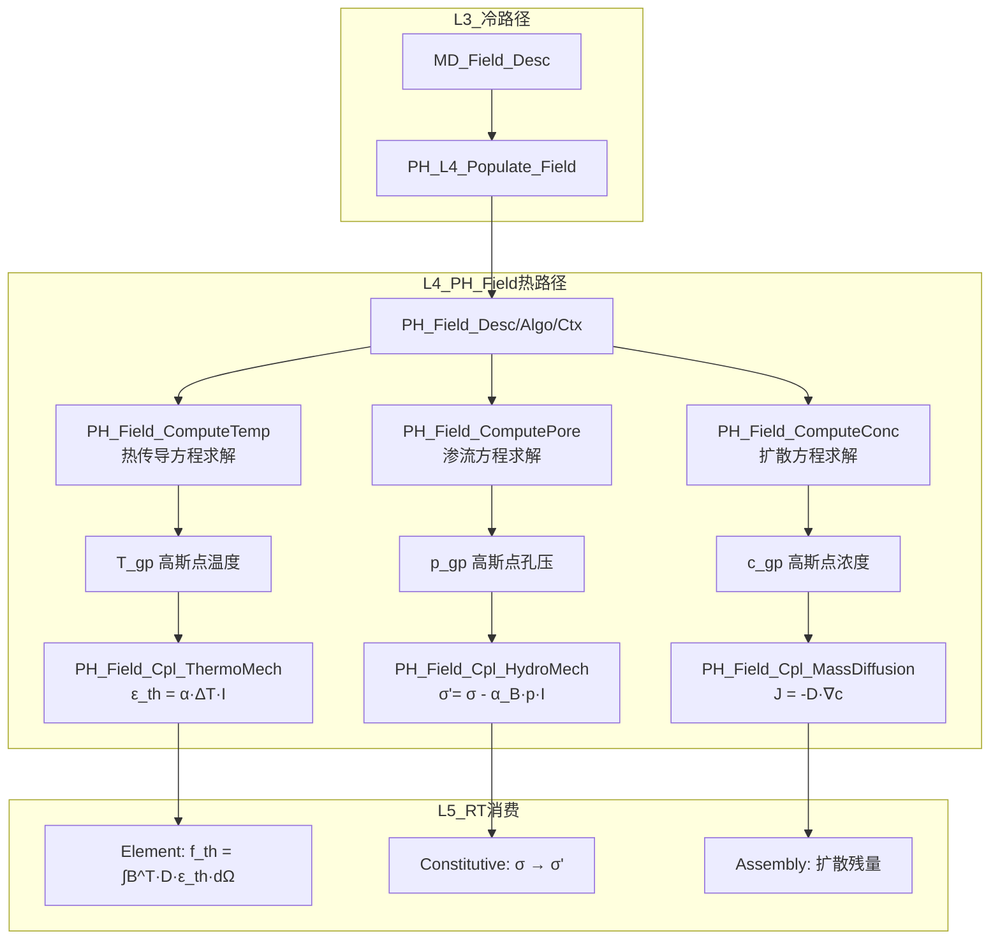

# Field域热路径算法设计

**Layer**: L4_PH | **Domain**: Field | **Version**: v1.0 | **Date**: 2026-04-28  
**依据**: `CONTRACT.md`, Phase A 评估结论 (94% 完整度, L1 直接复用)  
**关联代码**: `PH_Field_ComputeTemp.f90` (682行), `PH_Field_Cpl.f90` (465行), `PH_Field_Ops.f90`, `PH_Field_ShapeFunc.f90`, `PH_Field_GaussQuadrature.f90`

---

## 1. 设计概要

### 1.1 评估结论

Field 域 **94%** 已实现, L1 直接复用. 三类场 (温度/孔压/浓度) 完整, 三类 BC (Dirichlet/Neumann/Robin) 完整, 三种耦合 (热-力/水-力/质量扩散) 完整. 本文档聚焦:
- 高斯点场量插值与梯度计算的数学规范
- 多物理耦合贡献项的算法内核
- 场量平滑 (GP→Node 外推) 的完善

### 1.2 现有资产

| 模块 | 文件 | 功能 | 状态 |
|------|------|------|------|
| 温度场 | `PH_Field_ComputeTemp.f90` | 显式/隐式求解, 热传导/质量/源/BC | ✅ 完整 |
| 孔压场 | `PH_Field_ComputePore.f90` | 显式/隐式求解, 渗流/源/BC | ✅ 完整 |
| 浓度场 | `PH_Field_ComputeConc.f90` | 显式/隐式求解, 扩散/反应/源/BC | ✅ 完整 |
| 耦合 | `PH_Field_Cpl.f90` | 热膨胀/Biot有效应力/Fick扩散 + 声学/电磁/压电 | ✅ 完整 |
| 通用操作 | `PH_Field_Ops.f90` | 插值/外推/节点平均/梯度/不变量 | ✅ 完整 |
| 形函数 | `PH_Field_ShapeFunc.f90` | Field域形函数/梯度/Jacobian | ✅ 完整 |
| 高斯积分 | `PH_Field_GaussQuadrature.f90` | 体/面高斯点与权重 | ✅ 完整 |

### 1.3 热路径约束

- L4 Field 热路径不直接遍历 L3 容器
- 不在本模板新增 `PH_Field_Proc.f90` (避免制造第二套 API 真源)

---

## 2. 高斯点场量插值

### 2.1 节点值 → 积分点

标量场 $T$ 在高斯点 $\mathbf{\xi}_g$ 处的值:

$$T(\mathbf{\xi}_g) = \sum_{I=1}^{n_{pe}} N_I(\mathbf{\xi}_g) \cdot T_I$$

其中 $N_I$ 为形函数, $T_I$ 为节点值.

**向量形式**:

$$T_{gp} = \mathbf{N}^T \cdot \mathbf{T}_e$$

**实现**: `PH_Field_Ops.f90` 中通用插值过程, 消费 `PH_Field_ShapeFunc.f90` 提供的 $N_I$.

### 2.2 梯度计算

标量场梯度:

$$\nabla T(\mathbf{\xi}_g) = \sum_{I=1}^{n_{pe}} \frac{\partial N_I}{\partial \mathbf{x}} \cdot T_I$$

其中物理空间梯度通过 Jacobian 变换:

$$\frac{\partial N_I}{\partial \mathbf{x}} = \mathbf{J}^{-1} \cdot \frac{\partial N_I}{\partial \mathbf{\xi}}$$

$$\mathbf{J} = \frac{\partial \mathbf{x}}{\partial \mathbf{\xi}} = \sum_{I=1}^{n_{pe}} \frac{\partial N_I}{\partial \mathbf{\xi}} \otimes \mathbf{x}_I$$

**实现**: `PH_Field_GetShapeFunctionGradient` (`PH_Field_ShapeFunc.f90`)  
**输入**: `PH_Field_Gradient_Arg` (自然坐标, 单元坐标)  
**输出**: $\partial N / \partial x$ 矩阵, $\det \mathbf{J}$

```fortran
! 伪代码: 高斯点场量计算
subroutine FieldAtGaussPoint(T_nodal, elem_coords, xi, T_gp, gradT)
  real(wp) :: N(npe), dNdx(3, npe), detJ
  ! 获取形函数及梯度
  call PH_Field_GetShapeFunctions(xi, N)
  call PH_Field_GetShapeFunctionGradient(xi, elem_coords, dNdx, detJ)
  ! 插值
  T_gp = dot_product(N, T_nodal)
  ! 梯度
  gradT = matmul(dNdx, T_nodal)  ! (3) = (3, npe) × (npe)
end subroutine
```

---

## 3. 热膨胀应变贡献

### 3.1 各向同性热膨胀应变

$$\boldsymbol{\varepsilon}_{th} = \alpha \cdot (T - T_{ref}) \cdot \mathbf{I}$$

Voigt 记法 (6分量):

$$\boldsymbol{\varepsilon}_{th} = \alpha \cdot \Delta T \cdot \begin{bmatrix} 1 \\ 1 \\ 1 \\ 0 \\ 0 \\ 0 \end{bmatrix}$$

**实现**: `PH_Field_Cpl_ThermoMech` (`PH_Field_Cpl.f90` L186-219)
- 输入: $T_{gp}$, $T_{ref}$, $\alpha$, $n_{dim}$
- 输出: `eps_th(6)` — 2D时仅 `eps_th(1:2)` 非零, 3D时 `eps_th(1:3)` 非零

### 3.2 对Element域K和F的贡献

热膨胀等效节点力:

$$\mathbf{f}_{th} = \int_\Omega \mathbf{B}^T \cdot \mathbf{D} \cdot \boldsymbol{\varepsilon}_{th} \, d\Omega$$

Gauss 数值积分:

$$\mathbf{f}_{th} \approx \sum_{g=1}^{n_{gp}} w_g \cdot \mathbf{B}^T(\mathbf{\xi}_g) \cdot \mathbf{D} \cdot \boldsymbol{\varepsilon}_{th}(\mathbf{\xi}_g) \cdot \det\mathbf{J}_g$$

其中 $\mathbf{B}$ 为应变-位移矩阵 (由 Element 域提供), $\mathbf{D}$ 为弹性矩阵 (由 Material 域提供).

```fortran
! 伪代码: 热膨胀等效力向量
subroutine ThermalExpansionForce(T_nodal, T_ref, alpha, D_mat, B_gp, detJ, w, F_th)
  do igp = 1, n_gp
    ! 插值高斯点温度
    T_gp = dot_product(N(:, igp), T_nodal)
    ! 热膨胀应变
    call PH_Field_Cpl_ThermoMech(T_gp, T_ref, alpha, 3, eps_th, status)
    ! 热应力
    sigma_th = matmul(D_mat, eps_th)  ! (6) = (6,6) × (6)
    ! 等效节点力
    F_th = F_th + w(igp) * matmul(transpose(B_gp(:,:,igp)), sigma_th) * detJ(igp)
  end do
end subroutine
```

---

## 4. 孔压有效应力修正

### 4.1 Terzaghi 有效应力

经典形式 (Biot 系数 $\alpha_B = 1$):

$$\boldsymbol{\sigma}' = \boldsymbol{\sigma} + p \cdot \mathbf{I}$$

### 4.2 Biot 有效应力

一般形式:

$$\sigma'_{ij} = \sigma_{ij} + \alpha_B \cdot p \cdot \delta_{ij}$$

Voigt 记法:

$$\boldsymbol{\sigma}' = \boldsymbol{\sigma} - \alpha_B \cdot p \cdot \begin{bmatrix} 1 \\ 1 \\ 1 \\ 0 \\ 0 \\ 0 \end{bmatrix}$$

> 注: `PH_Field_Cpl_HydroMech` (L233-261) 使用减号约定 `sigma_eff(i) = sigma_total(i) - biot_alpha * pore_p`, 与 Biot 有效应力的压缩正约定一致.

**实现**: `PH_Field_Cpl_HydroMech` (`PH_Field_Cpl.f90` L233-261)
- 输入: `sigma_total(6)`, `pore_p`, `biot_alpha`
- 输出: `sigma_eff(6)`
- 校验: $0 \leq \alpha_B \leq 1$

### 4.3 对本构的影响

有效应力原理下, 本构关系作用于有效应力:

$$\boldsymbol{\sigma}' = \mathbf{D} : (\boldsymbol{\varepsilon} - \boldsymbol{\varepsilon}_{th})$$

全应力回传:

$$\boldsymbol{\sigma} = \boldsymbol{\sigma}' - \alpha_B \cdot p \cdot \mathbf{I}$$

---

## 5. Fick质量扩散

### 5.1 Fick第一定律

扩散通量:

$$\mathbf{J} = -D \cdot \nabla c$$

**实现**: `PH_Field_Cpl_MassDiffusion` (`PH_Field_Cpl.f90` L274-316)
- 输入: `grad_c(:)`, `D_coeff`, `ndim`
- 输出: `flux(3)` — 零填充至3D

### 5.2 Fick第二定律

浓度场控制方程:

$$\frac{\partial c}{\partial t} = \nabla \cdot (D \cdot \nabla c)$$

弱形式 (Galerkin):

$$\int_\Omega N_i \cdot \frac{\partial c}{\partial t} \, d\Omega + \int_\Omega D \cdot \nabla N_i \cdot \nabla c \, d\Omega = \int_{\Gamma_N} N_i \cdot \bar{J} \, d\Gamma$$

离散形式:

$$\mathbf{M} \cdot \dot{\mathbf{c}} + \mathbf{K}_D \cdot \mathbf{c} = \mathbf{f}_D$$

其中:
- 质量矩阵: $M_{IJ} = \int_\Omega N_I \cdot N_J \, d\Omega$
- 扩散刚度: $K_{D,IJ} = \int_\Omega D \cdot \nabla N_I \cdot \nabla N_J \, d\Omega$
- 源/通量: $f_{D,I} = \int_\Omega N_I \cdot Q \, d\Omega + \int_{\Gamma_N} N_I \cdot \bar{J} \, d\Gamma$

**实现**: `PH_Field_ComputeConc.f90` (隐式/显式求解器)

---

## 6. 场量平滑 (GP→Node 外推)

### 6.1 超收敛点外推

对 2×2×2 Gauss 点 (C3D8), 外推到节点:

$$T_I^{node} = \sum_{g=1}^{n_{gp}} E_{Ig} \cdot T_g^{gp}$$

外推矩阵 $\mathbf{E}$ 为形函数在超收敛点处的逆:

$$E_{Ig} = N_I(\mathbf{\xi}_g^{extrap})$$

其中 $\mathbf{\xi}_g^{extrap} = \sqrt{3} \cdot \mathbf{\xi}_g^{gauss}$ (2×2×2 Gauss → 8节点).

### 6.2 全局节点平均

多单元共享节点的平滑:

$$T_I^{smooth} = \frac{\sum_{e \in \text{patch}(I)} T_I^{e}}{\text{count}(I)}$$

**实现**: `PH_Field_Ops.f90` 中通用节点平均过程.

---

## 7. 数据流图



---

## 8. 完善点清单

| 项目 | 当前状态 | 需完善 | 工期 |
|------|---------|--------|------|
| 温度场求解 | ✅ 完整 | 无 | 0天 |
| 孔压场求解 | ✅ 完整 | 无 | 0天 |
| 浓度场求解 | ✅ 完整 | 无 | 0天 |
| 热膨胀耦合 | ✅ 完整 | 无 | 0天 |
| Biot有效应力 | ✅ 完整 | 无 | 0天 |
| Fick扩散 | ✅ 完整 | 无 | 0天 |
| GP→Node外推精度 | ⚠️ 基础 | 超收敛点外推优化 | 1天 |
| 各向异性扩散 | ⚠️ 缺 | 张量扩散系数支持 | 1天 |
| **合计** | 94% | — | **1-2天** |
