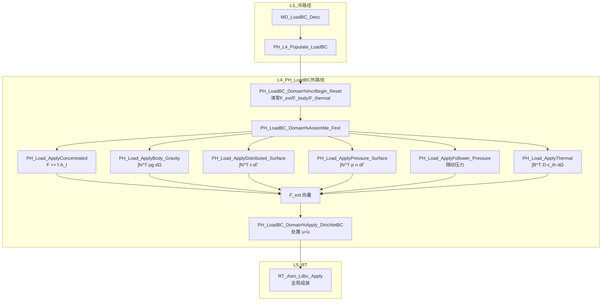

# LoadBC域热路径算法设计

**Layer**: L4_PH | **Domain**: LoadBC | **Version**: v1.0 | **Date**: 2026-04-28  
**依据**: `CONTRACT.md`, Phase A 评估结论 (95% 完整度, L1 直接复用)  
**关联代码**: `PH_Load_Mgr.f90` (1125行), `PH_Ldbc.f90`, `PH_Load_Def.f90`, `PH_BC_Brg.f90`

---

## 1. 设计概要

### 1.1 评估结论

LoadBC 域 **95%** 已实现, L1 直接复用. 本文档聚焦:
- 数学公式的精确文档化, 与代码实现对齐
- 8个载荷积分子程序的算法内核详解
- 与 Element 域形函数的接口规范
- 压力面随动载荷 (follower load) 的完善点

### 1.2 现有资产

| 子程序 | 文件 | 行号 | 功能 | 状态 |
|--------|------|------|------|------|
| `PH_Load_AssembleCLoad` | `PH_Load_Mgr.f90` | — | 集中力组装 | ✅ 完整 |
| `PH_Load_AssembleGravity` | `PH_Load_Mgr.f90` | — | 重力组装 | ✅ 完整 |
| `PH_Load_ApplyBody_Gravity` | `PH_Load_Mgr.f90` | — | 重力体力 | ✅ 完整 |
| `PH_Load_ApplyBody_Generic` | `PH_Load_Mgr.f90` | — | 通用体力 | ✅ 完整 |
| `PH_Load_ApplyConcentrated_Single` | `PH_Load_Mgr.f90` | — | 单点集中力 | ✅ 完整 |
| `PH_Load_ApplyConcentrated_Batch` | `PH_Load_Mgr.f90` | — | 批量集中力 | ✅ 完整 |
| `PH_Load_ApplyDistributed_Surface` | `PH_Load_Mgr.f90` | — | 面分布力 | ✅ 完整 |
| `PH_Load_ApplyDistributed_Edge` | `PH_Load_Mgr.f90` | — | 边分布力 | ✅ 完整 |
| `PH_Load_ApplyFollower_Pressure` | `PH_Load_Mgr.f90` | — | 随动压力 | ✅ 完整 |
| `PH_Load_ApplyPressure_Surface` | `PH_Load_Mgr.f90` | — | 面压力 | ✅ 完整 |
| `PH_Load_ApplyThermal_Uniform` | `PH_Load_Mgr.f90` | — | 均匀热载 | ✅ 完整 |
| `PH_Load_ApplyThermal_Gradient` | `PH_Load_Mgr.f90` | — | 梯度热载 | ✅ 完整 |
| `PH_Load_ComputeEquivForce` | `PH_Load_Mgr.f90` | — | 等效节点力 | ✅ 完整 |
| `PH_Load_ComputeFollowerTangent` | `PH_Load_Mgr.f90` | — | 随动切线刚度 | ✅ 完整 |
| `PH_Load_ComputeSurfaceNormal` | `PH_Load_Mgr.f90` | — | 面法向计算 | ✅ 完整 |

### 1.3 热路径约束 (CONTRACT §热路径)

- 步内 `Assemble_Fext` 禁止直读 L3
- 步内禁止 ALLOCATE (`IncrBegin_Reset` 就地清零而非反复分配)
- 使用 `IF_Prec_Core` 的 `wp`/`i4`

---

## 2. 面力积分 (Surface Traction → 等效节点力)

### 2.1 数学公式

面力 (traction) $\mathbf{t}$ 在面 $\Gamma_t$ 上的等效节点力向量:

$$\mathbf{f}_e = \int_{\Gamma_t} \mathbf{N}^T \cdot \mathbf{t} \, d\Gamma$$

参数化表示 (四边形面, 自然坐标 $\xi, \eta \in [-1, 1]$):

$$d\Gamma = \left\| \frac{\partial \mathbf{x}}{\partial \xi} \times \frac{\partial \mathbf{x}}{\partial \eta} \right\| d\xi \, d\eta \equiv J_s(\xi, \eta) \, d\xi \, d\eta$$

Gauss 数值积分:

$$\mathbf{f}_e \approx \sum_{i=1}^{n_{gp}} w_i \cdot \mathbf{N}^T(\xi_i, \eta_i) \cdot \mathbf{t}(\xi_i, \eta_i) \cdot J_s(\xi_i, \eta_i)$$

**积分方案** (由 `PH_Load_Ctx%integration_method` 控制):

| 枚举 | 常量 | 说明 |
|------|------|------|
| `LOAD_INTEG_GAUSS` | 1 | Gauss 求积 (默认, 2×2 面) |
| `LOAD_INTEG_LOBATTO` | 2 | Gauss-Lobatto (含边界点) |
| `LOAD_INTEG_UNIFORM` | 3 | 均匀分布 |

### 2.2 压力载荷 (法向均布)

当 $\mathbf{t} = -p \cdot \mathbf{n}$ (外压为正, 指向面内):

$$\mathbf{f}_e^{press} = -\int_{\Gamma_t} p \cdot \mathbf{N}^T \cdot \mathbf{n} \, d\Gamma$$

其中外法向:

$$\mathbf{n} = \frac{\frac{\partial \mathbf{x}}{\partial \xi} \times \frac{\partial \mathbf{x}}{\partial \eta}}{\left\| \frac{\partial \mathbf{x}}{\partial \xi} \times \frac{\partial \mathbf{x}}{\partial \eta} \right\|}$$

化简 (注意 $J_s = \|\partial\mathbf{x}/\partial\xi \times \partial\mathbf{x}/\partial\eta\|$):

$$\mathbf{f}_e^{press} = -\int_{-1}^{1} \int_{-1}^{1} p \cdot \mathbf{N}^T \cdot \left( \frac{\partial \mathbf{x}}{\partial \xi} \times \frac{\partial \mathbf{x}}{\partial \eta} \right) d\xi \, d\eta$$

**实现**: `PH_Load_ApplyPressure_Surface`, `PH_Load_ComputeSurfaceNormal`

### 2.3 随动压力 (大变形)

大变形下法向随构型更新:

$$\mathbf{f}^{follow}(\mathbf{u}) = -p \cdot \int_{\Gamma_t} \mathbf{N}^T \cdot \mathbf{n}(\mathbf{u}) \cdot J_s(\mathbf{u}) \, d\xi \, d\eta$$

此时载荷刚度矩阵 (load stiffness) 非零:

$$\mathbf{K}_p = -\frac{\partial \mathbf{f}^{follow}}{\partial \mathbf{u}}$$

**实现**: `PH_Load_ApplyFollower_Pressure` + `PH_Load_ComputeFollowerTangent`

```fortran
! 伪代码: 随动压力等效节点力
subroutine FollowerPressure(elem_coords, pressure, n_gp, Fe)
  real(wp) :: xi, eta, w, N(npe), dxdxi(3), dxdeta(3), cross(3), Js
  do igp = 1, n_gp
    call GetGaussPoint2D(igp, n_gp, xi, eta, w)
    call EvalShapeFunc(xi, eta, N)
    ! 当前构型下的面切向量
    dxdxi  = matmul(elem_coords, dN_dxi)
    dxdeta = matmul(elem_coords, dN_deta)
    ! 外法向 (含面积)
    call Cross3(dxdxi, dxdeta, cross)
    ! 等效节点力 (不归一化: cross已含Js)
    do I = 1, npe
      Fe(3*I-2 : 3*I) = Fe(3*I-2 : 3*I) - w * pressure * N(I) * cross
    end do
  end do
end subroutine
```

---

## 3. 体力积分

### 3.1 一般体力

$$\mathbf{f}_b = \int_\Omega \mathbf{N}^T \cdot \mathbf{b} \, d\Omega$$

Gauss 数值积分 (3D体):

$$\mathbf{f}_b \approx \sum_{i=1}^{n_{gp}} w_i \cdot \mathbf{N}^T(\xi_i, \eta_i, \zeta_i) \cdot \mathbf{b} \cdot \det\mathbf{J}(\xi_i, \eta_i, \zeta_i)$$

### 3.2 重力

$\mathbf{b} = \rho \cdot \mathbf{g}$, 其中 $\rho$ 为密度, $\mathbf{g}$ 为重力加速度向量.

**实现**: `PH_Load_ApplyBody_Gravity` — 典型 2×2×2 Gauss 积分 (C3D8)

```fortran
! 伪代码: 重力体力
subroutine GravityBodyForce(elem_coords, density, gravity, n_gp, Fe)
  do igp = 1, n_gp
    call GetGaussPoint3D(igp, n_gp, xi, eta, zeta, w)
    call EvalShapeFunc3D(xi, eta, zeta, N, dNdxi)
    call ComputeJacobian(elem_coords, dNdxi, J, detJ)
    body = density * gravity   ! (3) vector
    do I = 1, npe
      Fe(3*I-2 : 3*I) = Fe(3*I-2 : 3*I) + w * N(I) * body * detJ
    end do
  end do
end subroutine
```

---

## 4. 集中力直接施加

$$F_{ext}(dof) = F_{ext}(dof) + f \cdot A(t)$$

其中 $A(t)$ 为幅值因子, 由 `PH_LoadBC_Eval_Amplitude` 查询.

**实现**: `PH_Load_ApplyConcentrated_Single` (单点), `PH_Load_ApplyConcentrated_Batch` (批量)

DOF 映射: `dof = (node_id - 1) * ndof_per_node + dof_dir`

---

## 5. 与Element域形函数的接口

### 5.1 接口约定

LoadBC 域需要从 Element 域获取:
1. **面形函数** $N_I(\xi, \eta)$: 面积分用
2. **体形函数** $N_I(\xi, \eta, \zeta)$: 体积分用
3. **形函数梯度** $\partial N_I / \partial \xi$: Jacobian 计算用
4. **单元连接** `elem_conn`: 节点→DOF 映射

### 5.2 面号约定 (C3D8)

| face_id | 节点 (局部编号) | 外法向指向 |
|---------|----------------|-----------|
| 1 | 1-2-3-4 | $-\zeta$ |
| 2 | 5-6-7-8 | $+\zeta$ |
| 3 | 1-2-6-5 | $-\eta$ |
| 4 | 2-3-7-6 | $+\xi$ |
| 5 | 3-4-8-7 | $+\eta$ |
| 6 | 4-1-5-8 | $-\xi$ |

**CONTRACT 对齐**: `RegisterPressureSurface` 中 `face_id` 使用 1-based 编号 (1..6).

---

## 6. 数据流图



---

## 7. 完善点清单

| 项目 | 当前状态 | 需完善 | 工期 |
|------|---------|--------|------|
| 面力积分 | ✅ 完整 | 文档对齐 | 0天 |
| 体力积分 | ✅ 完整 | 文档对齐 | 0天 |
| 集中力 | ✅ 完整 | 无 | 0天 |
| 随动压力切线 | ✅ 框架 | 完善大变形更新 | 0.5天 |
| 幅值插值外推 | ⚠️ 基础 | 高阶插值 | 0.5天 |
| **合计** | 95% | — | **0-1天** |
