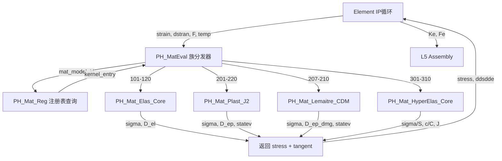

# Material域本构内核算法设计

**文档编号**: DESIGN-MAT-CK-001  
**层级**: L4_PH / Material  
**状态**: ACTIVE  
**日期**: 2026-04-28  
**依据**: `Material_HotPath_算法复用评估.md` (Task #22) + `CONTRACT.md` (L4_PH/Material)

---

## 1. 设计概要

### 1.1 评估总结

Material域11族本构评估结论（来源: `REPORTS/Material_HotPath_算法复用评估.md`）：

| 分类 | 族 | L3完整% | L4完整% | 工作量 |
|------|-----|---------|---------|--------|
| **直接复用** | 弹性(100%)、岩土(80%) | 100/95 | 100/80 | 0-10天 |
| **适配复用** | 塑性(85%)、损伤(40%)、超弹性(75%) | 90/50/100 | 85/40/0 | 55-70天 |
| **全新实现** | 蠕变(60%)、粘弹性(30%)、热(50%)、UMAT(20%)、复合(20%)、断裂(0%) | — | — | 235-310天 |

### 1.2 本文档覆盖范围

本文档聚焦 **三个优先族** 的完整算法设计：

1. **J2塑性（Von Mises）径向返回算法** — L4已有85%实现（`Plast/PH_Mat_Plast_J2.f90`, 532行），需补全非线性硬化Newton迭代
2. **超弹性（Neo-Hookean / Mooney-Rivlin）** — L3有23个完整模型（`Shared/MD_MAT_HYPERELASTIC_CORE.f90`, 206KB），L4空目录需迁移
3. **Lemaitre连续损伤力学（CDM）** — 全新实现，与J2塑性耦合

### 1.3 设计约束（来源: `CONTRACT.md`）

- **热路径零L3**: IP循环内禁止反复调用 `MD_Mat_Get*`，只读 `slot_pool%desc%props`
- **ErrorStatusType**: 所有公开过程必须携带 `ErrorStatusType`，禁止 `STOP`
- **族内核通过注册表分发**: 不绕过 `PH_Mat_Reg`
- **四型TYPE**: Desc/State/Ctx/Algo 正交职责

---

## 2. 统一本构接口规范

### 2.1 IP循环调用序列

来源: `REPORTS/Material_HotPath_算法复用评估.md` §6 与 `CONTRACT.md` §跨层主链。

```text
L5_RT Element Loop:
  ForAllElements(e)
    ForAllGaussPoints(gp)
      [1] Gradients: F, dF/dX, ε, Δε  (Element域)
      [2] Kinematics: stretch, strain   (Element域)
      [3] MaterialEvaluation:
          INPUT  (Element → Material):
            strain(6)       — 总应变 (Voigt记法: ε₁₁,ε₂₂,ε₃₃,γ₁₂,γ₁₃,γ₂₃)
            dstran(6)       — 增量应变 Δε
            time_old, time_new  — 时间步 [t_n, t_{n+1}]
            temp, dtemp     — 温度及增量 (热-力耦合)
            statev_old(:)   — 旧状态变量 (大小=nstatv)
            nstatv          — 状态变量数
            F(3,3)          — 变形梯度 (NLGeom时)
          OUTPUT (Material → Element):
            stress(6)       — Cauchy应力 σ (Voigt)
            ddsdde(6,6)     — 一致切线模量 D_ep 或 C_tan
            statev_new(:)   — 更新后状态变量
            status          — ErrorStatusType (收敛/发散)
            pnewdt          — 时间步调节建议
      [4] StressAssembly: σ, ddsdde → Ke, Fe
      [5] StateVariableCommit: statev_new → statev_old (收敛后)
```

**实现入口**: `Dispatch/PH_MatEval.f90` → 族分发 → `PH_Mat_{族}_*`

### 2.2 状态变量协议

**L3定义** (`MD_Mat_Def.f90`):
```fortran
TYPE :: MD_Mat_Desc
  INTEGER(i4) :: nstatv     ! 当前配置状态变量数
END TYPE
```

**L4运行时** (`PH_Mat_Domain_Core.f90`):
```fortran
TYPE :: PH_Mat_State
  REAL(wp), ALLOCATABLE :: C_tan(:,:)      ! (6,6) 一致切线
  REAL(wp), ALLOCATABLE :: stress(:)       ! (6) Cauchy应力
  REAL(wp), ALLOCATABLE :: stateVars(:)    ! (nstatv) 当前步状态
  REAL(wp), ALLOCATABLE :: stateVars_n(:)  ! (nstatv) 上一收敛步状态
END TYPE
```

**状态变量布局标准**:

| 族 | nstatv | 布局 | 来源 |
|----|--------|------|------|
| 弹性 | 0 | — | `PH_Mat_Elas_Core.f90` |
| J2塑性(等向) | 7 | `(1)`=ε̄_p, `(2:7)`=ε_p(6) | `PH_Mat_Plast_J2.f90` L69 |
| J2塑性(运动) | 13 | `(1)`=ε̄_p, `(2:7)`=ε_p, `(8:13)`=α(6) | `PH_Mat_Plast_J2.f90` L70 |
| GTN损伤 | 9 | `(1)`=ε̄_p, `(2:7)`=ε_p, `(8)`=f(孔隙度), `(9)`=f* | `PH_MatDam_Gurson.f90` |
| Lemaitre损伤 | 8 | `(1)`=ε̄_p, `(2:7)`=ε_p, `(8)`=D(损伤) | 本文新设计 |
| Neo-Hookean超弹 | 1 | `(1)`=J(体积比) | 本文新设计 |
| Mooney-Rivlin | 1 | `(1)`=J | 本文新设计 |

**更新时机**: trial → converged commit
- `stateVars` 在族内核中更新为 trial 值
- 全局Newton收敛后 `stateVars_n = stateVars`（commit）
- 不收敛时 `stateVars = stateVars_n`（rollback）

### 2.3 TYPE体系

四型职责分配（来源: `CONTRACT.md` §四型裁剪决策 + `PH_Mat_Def.f90`）:

| TYPE | 职责 | 写入时机 | 读取者 |
|------|------|----------|--------|
| **PH_Mat_Ctx** (Desc) | `matId`, `matModel`, `mat_model_id`, `props(:)` | Populate（冷路径，仅一次） | 族内核（热路径只读） |
| **PH_Mat_State** (State) | `stress(:)`, `C_tan(:,:)`, `stateVars(:)`, `stateVars_n(:)` | 每IP每迭代（族内核写入） | Element（装配），L5（输出） |
| **PH_Mat_Ctx** (Ctx) | `step_idx`, `incr_idx` + 族内核临时工作区 | Step/Incr 级别更新 | 族内核 |
| **PH_Mat_Algo** (Algo) | 积分格式、子步容差、有限应变开关、`auto_cut`, `pnewdt_min` | 配置时设定 | 族内核（算法控制） |

**族内核专用TYPE**（以J2为例，`PH_Mat_Plast_J2.f90`）:
```fortran
TYPE, EXTENDS(MD_Mat_Base_Desc) :: MD_Mat_PLM_J2_Desc
  REAL(wp) :: PH_MAT_E, nu, sigma_y0, H
  REAL(wp) :: alpha_thermal, hardening_exponent
  INTEGER(i4) :: hardening_type   ! 1=线性, 2=Swift, 3=Voce
  REAL(wp) :: kinematic_C, kinematic_gamma
  LOGICAL  :: use_kinematic
END TYPE

TYPE, EXTENDS(MD_Mat_Base_State) :: PH_Mat_PLM_J2_State
  REAL(wp) :: peeq = 0.0_wp              ! 等效塑性应变
  REAL(wp) :: back_stress(6) = 0.0_wp     ! 背应力α (运动硬化)
  REAL(wp) :: strain_plastic(6) = 0.0_wp  ! 塑性应变ε_p
  LOGICAL  :: is_plastic = .FALSE.
END TYPE
```

---

## 3. J2塑性（Von Mises）径向返回算法

**现有实现**: `Plast/PH_Mat_Plast_J2.f90` (532行, 21KB)  
**核心子程序**: `PH_Mat_PLM_J2_UMAT_API`, `PLM_J2_Yield_Stress_iso`, `PLM_J2_EP_Tangent`  
**完整度**: 85% — 线性硬化径向返回完整，非线性硬化局部Newton迭代缺失

### 3.1 数学基础

**Von Mises屈服准则**:

$$f(\boldsymbol{\sigma}) = \sqrt{\frac{3}{2}} \|\mathbf{s}\| - \sigma_y(\bar{\varepsilon}_p) = q - \sigma_y(\bar{\varepsilon}_p) = 0$$

其中：
- $\mathbf{s} = \boldsymbol{\sigma} - \frac{1}{3}\text{tr}(\boldsymbol{\sigma})\mathbf{I}$ — 偏应力张量
- $q = \sqrt{\frac{3}{2} \mathbf{s}:\mathbf{s}}$ — Von Mises等效应力
- $\bar{\varepsilon}_p$ — 等效塑性应变（标量内变量）
- $\sigma_y(\bar{\varepsilon}_p)$ — 屈服应力（硬化函数）

**Voigt记法**(6分量): $\boldsymbol{\sigma} = [\sigma_{11}, \sigma_{22}, \sigma_{33}, \sigma_{12}, \sigma_{13}, \sigma_{23}]^T$

**偏应力Voigt分解**:
$$s_i = \sigma_i - p \cdot \delta_i, \quad p = \frac{1}{3}(\sigma_1 + \sigma_2 + \sigma_3)$$

**Von Mises等效应力Voigt公式**:
$$q = \sqrt{s_1^2 + s_2^2 + s_3^2 + 2(s_4^2 + s_5^2 + s_6^2)}$$

注: 因子 $\sqrt{3/2}$ 已包含在 $q$ 定义中（剪切分量需乘 $\sqrt{2}$）。

### 3.2 径向返回映射算法

隐式后向Euler积分（Simo & Hughes, 1998）。当前L4实现位于 `PH_Mat_PLM_J2_UMAT_API`（L234-L330）。

**Step 1: 弹性预测（试应力）**

$$\boldsymbol{\sigma}^{\text{trial}} = \boldsymbol{\sigma}_n + \mathbf{D}_e : \Delta\boldsymbol{\varepsilon}$$

其中 $\mathbf{D}_e$ 为各向同性弹性刚度（Voigt 6×6）：

$$\mathbf{D}_e = \begin{bmatrix} \lambda+2\mu & \lambda & \lambda & 0 & 0 & 0 \\ \lambda & \lambda+2\mu & \lambda & 0 & 0 & 0 \\ \lambda & \lambda & \lambda+2\mu & 0 & 0 & 0 \\ 0 & 0 & 0 & \mu & 0 & 0 \\ 0 & 0 & 0 & 0 & \mu & 0 \\ 0 & 0 & 0 & 0 & 0 & \mu \end{bmatrix}$$

$\lambda = \frac{E
u}{(1+
u)(1-2
u)}, \quad \mu = G = \frac{E}{2(1+
u)}$

**现有代码映射**: `PLM_J2_Build_D_el` (L152-L159) 调用 `Construct_Elastic_D`。

**试偏应力与试等效应力**:
$$\mathbf{s}^{\text{trial}} = \text{dev}(\boldsymbol{\sigma}^{\text{trial}}), \quad q^{\text{trial}} = \sqrt{\frac{3}{2}} \|\mathbf{s}^{\text{trial}}\|$$

**Step 2: 屈服判断**

$$f^{\text{trial}} = q^{\text{trial}} - \sigma_y(\bar{\varepsilon}_{p,n})$$

- 若 $f^{\text{trial}} \leq 0$: 弹性步，接受试应力，跳转Step 4
- 若 $f^{\text{trial}} > 0$: 塑性步，进入Step 3

**现有代码映射**: L283-L290。

**Step 3: 塑性修正（径向返回）**

**线性硬化情况**（$H' = \text{const}$，当前L4实现）:

$$\Delta\gamma = \frac{f^{\text{trial}}}{3G + H'} = \frac{q^{\text{trial}} - \sigma_y(\bar{\varepsilon}_{p,n})}{3G + H'}$$

**偏应力更新（径向返回核心）**:
$$\mathbf{s}_{n+1} = \left(1 - \frac{3G \cdot \Delta\gamma}{q^{\text{trial}}}\right) \mathbf{s}^{\text{trial}} = \beta \cdot \mathbf{s}^{\text{trial}}$$

其中 $\beta = 1 - \frac{3G \cdot \Delta\gamma}{q^{\text{trial}}}$

**等效塑性应变更新**:
$$\bar{\varepsilon}_{p,n+1} = \bar{\varepsilon}_{p,n} + \Delta\gamma$$

**塑性应变增量**:
$$\Delta\boldsymbol{\varepsilon}_p = \Delta\gamma \cdot \mathbf{n}, \quad \mathbf{n} = \frac{\mathbf{s}^{\text{trial}}}{\|\mathbf{s}^{\text{trial}}\|}$$

**现有代码映射**: L296-L321，变量 `delta_gamma`, `beta`, `s_dev`, `n_dir`。

**Step 4: 应力更新**

$$\boldsymbol{\sigma}_{n+1} = \mathbf{s}_{n+1} + p \cdot \mathbf{I}, \quad p = \frac{1}{3}\text{tr}(\boldsymbol{\sigma}^{\text{trial}})$$

注: 静水压力不受塑性修正影响（$J_2$ 不可压塑性）。

**现有代码映射**: `PLM_J2_Assem_Dev` / `Assem_Stress_From_Deviatoric` (L161-L182)。

### 3.3 硬化律

来源: `PLM_J2_Yield_Stress_iso` (L103-L118) 与 `PLM_J2_Hardening_Tangent_iso` (L120-L136)。

**Type 1 — 线性等向硬化**:
$$\sigma_y = \sigma_{y0} + H \cdot \bar{\varepsilon}_p, \quad H' = \frac{d\sigma_y}{d\bar{\varepsilon}_p} = H$$

**Type 2 — Swift幂律硬化**:
$$\sigma_y = \sigma_{y0} (1 + \bar{\varepsilon}_p)^n, \quad H' = \sigma_{y0} \cdot n \cdot (1 + \bar{\varepsilon}_p)^{n-1}$$

**Type 3 — Voce指数硬化**:
$$\sigma_y = \sigma_{y0} + H(1 - e^{-\delta \bar{\varepsilon}_p}), \quad H' = H \delta \cdot e^{-\delta \bar{\varepsilon}_p}$$

其中 `hardening_exponent` 对应 $n$（Type 2）或 $\delta$（Type 3）。

**Armstrong-Frederick运动硬化**（可选, `use_kinematic=.TRUE.`）:
$$d\boldsymbol{\alpha} = \frac{2}{3} C \cdot d\boldsymbol{\varepsilon}_p - \gamma \cdot \boldsymbol{\alpha} \cdot d\bar{\varepsilon}_p$$

离散形式（`PLM_J2_Back_Stress_Update`, L138-L146）:
$$\boldsymbol{\alpha}_{n+1} = \boldsymbol{\alpha}_n + C \cdot \Delta\gamma \cdot \mathbf{n} - \gamma \cdot \boldsymbol{\alpha}_n \cdot \Delta\gamma$$

运动硬化时，屈服函数修正为:
$$f = q(\boldsymbol{\sigma} - \boldsymbol{\alpha}) - \sigma_y(\bar{\varepsilon}_p) = 0$$

### 3.4 一致切线模量 $\mathbf{D}_{ep}$

来源: `PLM_J2_EP_Tangent` (L188-L228)。

**弹性步**: $\mathbf{D}_{ep} = \mathbf{D}_e$

**塑性步**（标准一致切线, Simo & Taylor 1985）:

$$\mathbf{D}_{ep} = \mathbf{D}_e - \frac{6G^2}{3G + H'} \mathbf{n} \otimes \mathbf{n}$$

其中:
- $\mathbf{n} = \frac{\mathbf{s}^{\text{trial}}}{\|\mathbf{s}^{\text{trial}}\|} = \frac{\mathbf{s}^{\text{trial}}}{q^{\text{trial}}} \cdot \sqrt{3/2}$ — 流动方向
- $G = \frac{E}{2(1+\nu)}$ — 剪切模量
- $H' = \frac{d\sigma_y}{d\bar{\varepsilon}_p}\bigg|_{\bar{\varepsilon}_{p,n+1}}$ — 硬化切线

**完整一致切线**（含偏应力投影修正，文献形式）:

$$\mathbf{D}_{ep} = \mathbf{D}_e - \frac{6G^2 \Delta\gamma}{q^{\text{trial}}} \mathbf{I}_{dev} + 6G^2 \left(\frac{\Delta\gamma}{q^{\text{trial}}} - \frac{1}{3G+H'}\right) \mathbf{n} \otimes \mathbf{n}$$

其中 $\mathbf{I}_{dev} = \mathbf{I}_{sym} - \frac{1}{3}\mathbf{I}\otimes\mathbf{I}$ 为偏应力投影张量。

**现有代码映射**: L225-L227 使用简化形式 `D_e - fac * n_dyad`，其中 `fac = 6G²/(3G+H')`。

### 3.5 非线性硬化的局部Newton迭代

**现有缺口**: 当 $H' = H'(\bar{\varepsilon}_p)$ 非常量时（Type 2 Swift、Type 3 Voce），L4当前实现仅取 $H'(\bar{\varepsilon}_{p,n})$ 作为常量近似。严格实现需局部Newton迭代。

**残差方程**:
$$R(\Delta\gamma) = q^{\text{trial}} - 3G \cdot \Delta\gamma - \sigma_y\!\left(\bar{\varepsilon}_{p,n} + \Delta\gamma\right) = 0$$

**Newton线性化**:
$$\frac{dR}{d\Delta\gamma} = -3G - H'(\bar{\varepsilon}_{p,n} + \Delta\gamma)$$

**Newton迭代**:
$$\Delta\gamma^{(k+1)} = \Delta\gamma^{(k)} - \frac{R(\Delta\gamma^{(k)})}{dR/d\Delta\gamma\big|^{(k)}}$$

**初始猜测**: $\Delta\gamma^{(0)} = \frac{q^{\text{trial}} - \sigma_y(\bar{\varepsilon}_{p,n})}{3G + H'(\bar{\varepsilon}_{p,n})}$ （线性近似）

**收敛准则**: $|R| < \text{tol\_nrloc} \cdot \sigma_{y0}$, $\text{tol\_nrloc} = 10^{-10}$

**最大迭代**: $k_{\max} = 25$; 不收敛时 `status = IF_STATUS_ERROR`, `pnewdt = pnewdt_min`

### 3.6 伪代码

```fortran
subroutine PH_Mat_PLM_J2_RadialReturn(desc, ctx, state, algo, pnewdt, status)
  ! --- Types ---
  type(MD_Mat_PLM_J2_Desc),  intent(in)    :: desc
  type(PH_Mat_Base_Ctx),     intent(in)    :: ctx   ! contains dstran(6), ntens
  type(PH_Mat_PLM_J2_State), intent(inout) :: state ! stress, peeq, eps_p, alpha
  type(PH_Mat_Base_Algo),    intent(in)    :: algo  ! tol, max_iter, auto_cut
  real(wp),                  intent(inout) :: pnewdt
  type(ErrorStatusType),     intent(out)   :: status

  real(wp) :: D_el(6,6), sigma_trial(6), s_trial(6), q_trial
  real(wp) :: f_trial, dg, G, H_tan, sigma_y, beta, n_dir(6)
  real(wp) :: R_nrloc, dR_ddg, peeq_trial
  integer  :: iter, ntens

  ! Step 1: 弹性预测
  call PLM_J2_Build_D_el(desc, D_el)
  sigma_trial(1:ntens) = state%stress(1:ntens) &
      + matmul(D_el(1:ntens,1:ntens), ctx%dstran(1:ntens))
  call compute_deviatoric(sigma_trial, s_trial, q_trial)

  ! Step 2: 屈服判断
  sigma_y = PLM_J2_Yield_Stress_iso(desc, state%peeq)
  f_trial = q_trial - sigma_y
  if (f_trial <= 0.0_wp) then
    ! 弹性步: 接受试应力
    state%stress = sigma_trial
    state%ddsdde = D_el
    status%status_code = IF_STATUS_OK
    return
  end if

  ! Step 3: 塑性修正 — 局部Newton迭代
  G = desc%PH_MAT_E / (2.0_wp * (1.0_wp + desc%nu))
  dg = f_trial / (3.0_wp * G + PLM_J2_Hardening_Tangent_iso(desc, state%peeq))

  do iter = 1, algo%max_local_iter   ! default 25
    peeq_trial = state%peeq + dg
    sigma_y    = PLM_J2_Yield_Stress_iso(desc, peeq_trial)
    H_tan      = PLM_J2_Hardening_Tangent_iso(desc, peeq_trial)
    R_nrloc    = q_trial - 3.0_wp * G * dg - sigma_y
    if (abs(R_nrloc) < algo%tol_nrloc * desc%sigma_y0) exit
    dR_ddg     = -(3.0_wp * G + H_tan)
    dg         = dg - R_nrloc / dR_ddg
  end do

  if (iter > algo%max_local_iter) then
    status%status_code = IF_STATUS_ERROR
    status%message = '[PLM_J2]: local Newton did not converge'
    if (algo%auto_cut) pnewdt = algo%pnewdt_min
    return
  end if

  ! Step 3b: 更新
  n_dir = s_trial / q_trial
  beta  = 1.0_wp - 3.0_wp * G * dg / q_trial
  state%stress(1:ntens) = beta * s_trial(1:ntens) + p_mean * I_vec(1:ntens)
  state%peeq = state%peeq + dg
  state%strain_plastic = state%strain_plastic + dg * n_dir
  call PLM_J2_Back_Stress_Update(desc, dg, n_dir, state%back_stress)

  ! Step 4: 一致切线
  call PLM_J2_EP_Tangent(desc, state%stress, ntens, .true., state%peeq, state%ddsdde)

  status%status_code = IF_STATUS_OK
end subroutine
```

### 3.7 与现有L4代码的映射

| 算法步骤 | 现有实现 | 文件:行号 | 状态 |
|----------|----------|-----------|------|
| 弹性刚度D_el | `PLM_J2_Build_D_el` | `PH_Mat_Plast_J2.f90:152-159` | 完整 |
| 弹性预测 | `PH_Mat_PLM_J2_UMAT_API` | `PH_Mat_Plast_J2.f90:271-273` | 完整 |
| 偏应力/q_trial | `Calc_Deviatoric_Stress`+`Calc_Von_Mises` | 引用`PH_Mat_Integ_Shared` | 完整 |
| 屈服函数 | `PLM_J2_Yield_Stress_iso` | `PH_Mat_Plast_J2.f90:103-118` | 完整(3型) |
| 硬化切线 | `PLM_J2_Hardening_Tangent_iso` | `PH_Mat_Plast_J2.f90:120-136` | 完整(3型) |
| 线性径向返回 | `PH_Mat_PLM_J2_UMAT_API` | `PH_Mat_Plast_J2.f90:296-325` | 完整 |
| **非线性Newton** | **缺失** | — | **需新增** |
| 运动硬化 | `PLM_J2_Back_Stress_Update` | `PH_Mat_Plast_J2.f90:138-146` | 完整 |
| 一致切线D_ep | `PLM_J2_EP_Tangent` | `PH_Mat_Plast_J2.f90:188-228` | 完整(简化形式) |
| 应力装配 | `PLM_J2_Assem_Dev` | `PH_Mat_Plast_J2.f90:173-182` | 完整 |

**需新增项**:
1. 局部Newton迭代子程序 `PLM_J2_Newton_RadialReturn`
2. 完整一致切线（含偏应力投影修正项）

---

## 4. 超弹性（Neo-Hookean / Mooney-Rivlin）

**现有资产**: `L3_MD/Material/Shared/MD_MAT_HYPERELASTIC_CORE.f90` (206KB, 23个模型)  
**L4目录**: `L4_PH/Material/HyperElas/` — **空目录**  
**L4接口定义**: `Contract/PH_MatHyperElasDefn.f90` — `UF_Mat_HyperElas_Calc`  
**Eval入口**: `Dispatch/PH_MatEval.f90` — `PH_Mat_HyperelasticNeoHookean_Eval`, `PH_Mat_HyperelasticMooneyRivlin_Eval`

### 4.1 数学基础

**运动学量**:
- 变形梯度: $\mathbf{F} = \frac{\partial \mathbf{x}}{\partial \mathbf{X}}$
- 右Cauchy-Green张量: $\mathbf{C} = \mathbf{F}^T \mathbf{F}$
- 左Cauchy-Green张量: $\mathbf{b} = \mathbf{F} \mathbf{F}^T$
- Jacobian: $J = \det(\mathbf{F})$
- 不变量:
  - $I_1 = \text{tr}(\mathbf{C})$
  - $I_2 = \frac{1}{2}\left[(\text{tr}\,\mathbf{C})^2 - \text{tr}(\mathbf{C}^2)\right]$
  - $I_3 = \det(\mathbf{C}) = J^2$

**修正不变量**（体积-偏应分解）:
$$\bar{I}_1 = J^{-2/3} I_1, \quad \bar{I}_2 = J^{-4/3} I_2$$

**应变能函数一般形式**: $W = W_{\text{iso}}(\bar{I}_1, \bar{I}_2) + W_{\text{vol}}(J)$

### 4.2 Neo-Hookean模型

**应变能密度**:
$$W = C_{10}(\bar{I}_1 - 3) + \frac{1}{D_1}(J - 1)^2$$

其中:
- $C_{10} = \frac{\mu}{2}$ — 剪切参数
- $D_1 = \frac{2}{K}$ — 体积参数
- $\mu, K$ — 初始剪切、体积模量

**第二Piola-Kirchhoff应力** $\mathbf{S} = 2\frac{\partial W}{\partial \mathbf{C}}$:

$$\mathbf{S} = 2C_{10} J^{-2/3} \left(\mathbf{I} - \frac{1}{3}I_1 \mathbf{C}^{-1}\right) + \frac{2}{D_1}(J-1)J \mathbf{C}^{-1}$$

分解为偏应和体积部分:

$$\mathbf{S} = \mathbf{S}_{\text{iso}} + \mathbf{S}_{\text{vol}}$$

$$\mathbf{S}_{\text{iso}} = 2C_{10} J^{-2/3}\left(\mathbf{I} - \frac{1}{3}I_1 \mathbf{C}^{-1}\right)$$

$$\mathbf{S}_{\text{vol}} = \frac{2}{D_1}(J-1)J \mathbf{C}^{-1} = p J \mathbf{C}^{-1}$$

其中 $p = \frac{2}{D_1}(J-1)$ 为静水Kirchhoff压力。

**物质切线模量** $\mathbb{C} = 4\frac{\partial^2 W}{\partial \mathbf{C} \partial \mathbf{C}}$:

$$\mathbb{C}_{\text{iso}} = 4C_{10} J^{-2/3}\left[\frac{1}{3}I_1 \left(\frac{1}{3}\mathbf{C}^{-1}\otimes\mathbf{C}^{-1} + \frac{1}{2}\mathbb{I}_{C^{-1}}\right) - \frac{1}{3}\left(\mathbf{I}\otimes\mathbf{C}^{-1} + \mathbf{C}^{-1}\otimes\mathbf{I}\right)\right]$$

$$\mathbb{C}_{\text{vol}} = \frac{2}{D_1}\left[(2J-1)J\,\mathbf{C}^{-1}\otimes\mathbf{C}^{-1} - 2(J-1)J\,\mathbb{I}_{C^{-1}}\right]$$

其中 $\mathbb{I}_{C^{-1},IJKL} = -\frac{1}{2}(C^{-1}_{IK}C^{-1}_{JL} + C^{-1}_{IL}C^{-1}_{JK})$。

**L3现有实现映射**:
- `UF_NeoHookeanHyp_StrainEnergy` — $W$ 计算
- `UF_NeoHookeanHyp_CalcPKStress` — $\mathbf{S}$ 计算
- `UF_NeoHookeanHyp_CalcTangent` — $\mathbb{C}$ 计算
- `UF_NeoHookeanHyp_PushForward` — $\mathbf{S}$ → $\boldsymbol{\sigma}$ 推前

### 4.3 Mooney-Rivlin模型

**应变能密度**:
$$W = C_{10}(\bar{I}_1 - 3) + C_{01}(\bar{I}_2 - 3) + \frac{1}{D_1}(J - 1)^2$$

**第二PK应力**:
$$\mathbf{S} = 2J^{-2/3}\left[C_{10}\mathbf{I} + C_{01}(I_1\mathbf{I} - \mathbf{C})\right] J^{-2/3}\mathbf{P} + \frac{2}{D_1}(J-1)J\mathbf{C}^{-1}$$

其中 $\mathbf{P} = \mathbf{I} - \frac{1}{3}\mathbf{C}^{-1}\otimes\mathbf{C}$ 为修正投影张量。

展开的等价偏应分量:
$$\mathbf{S}_{\text{iso}} = 2J^{-2/3}\left[(C_{10} + C_{01}I_1)\mathbf{I} - C_{01}\mathbf{C}\right] - \frac{2}{3}J^{-2/3}(C_{10}I_1 + 2C_{01}I_2)\mathbf{C}^{-1}$$

**切线模量**在 $C_{10}$ 基础上增加 $C_{01}$ 对 $\bar{I}_2$ 的二阶导:
$$\mathbb{C}_{01} = 4C_{01}J^{-4/3}\left[\mathbf{I}\otimes\mathbf{I} - \mathbf{I}\boxtimes\mathbf{I} + \text{(修正项)}\right]$$

**L3现有实现映射**:
- `UF_MRHyp_StrainEnergy` — $W$
- L3核心库中含完整PK应力与切线实现

### 4.4 Cauchy应力表达

从第二PK应力推前到Cauchy应力（空间描述）:
$$\boldsymbol{\sigma} = \frac{1}{J}\mathbf{F}\mathbf{S}\mathbf{F}^T$$

**Neo-Hookean Cauchy应力**:
$$\boldsymbol{\sigma} = \frac{2C_{10}}{J}\left(\mathbf{b}_{\text{dev}}\right) + \frac{2}{D_1}(J-1)\mathbf{I}$$

其中 $\mathbf{b}_{\text{dev}} = J^{-2/3}\mathbf{b} - \frac{1}{3}\text{tr}(J^{-2/3}\mathbf{b})\mathbf{I}$

**空间切线** $\mathbf{c}$ 从物质切线推前:
$$c_{ijkl} = \frac{1}{J} F_{iI}F_{jJ}F_{kK}F_{lL}\,\mathbb{C}_{IJKL}$$

### 4.5 与Element域NLGeom的耦合

| 模式 | Element提供 | Material返回 | 应用场景 |
|------|-------------|-------------|---------|
| **TL (Total Lagrangian)** | $\mathbf{F}$, $\mathbf{C}$ | $\mathbf{S}$, $\mathbb{C}$ | 大变形固体 |
| **UL (Updated Lagrangian)** | $\mathbf{F}$, $\mathbf{b}$ | $\boldsymbol{\sigma}$, $\mathbf{c}$ | 流体/大变形 |

**flag_nlgeom**: 通过 `RT_Com_Ctx%nlgeom` 传入，控制Material返回物质/空间描述。  
当前 `PH_GTN_UMAT_Args%flag_nlgeom` 已有此字段（`PH_MatDam_Gurson.f90:28`）。

### 4.6 伪代码

```fortran
subroutine PH_Mat_HyperElas_NeoHookean_Eval(F, C10, D1, stress, tangent, J_out, status)
  ! Input
  real(wp), intent(in)  :: F(3,3)       ! 变形梯度
  real(wp), intent(in)  :: C10, D1      ! 材料参数
  ! Output
  real(wp), intent(out) :: stress(6)    ! Cauchy应力 (Voigt)
  real(wp), intent(out) :: tangent(6,6) ! 空间切线 (Voigt)
  real(wp), intent(out) :: J_out        ! det(F)
  type(ErrorStatusType), intent(out) :: status

  real(wp) :: C_rg(3,3), b(3,3), Cinv(3,3), S(3,3)
  real(wp) :: I1, J, Jm23, p, bdev(3,3), trace_b

  ! 1. 运动学
  J = determinant_3x3(F)
  if (J <= 0.0_wp) then
    status%status_code = IF_STATUS_ERROR
    status%message = '[HyperElas_NH]: J <= 0, element inversion'
    return
  end if
  J_out = J
  Jm23 = J**(-2.0_wp/3.0_wp)

  ! 2. Cauchy-Green
  C_rg = matmul(transpose(F), F)            ! C = F^T F
  b    = matmul(F, transpose(F))            ! b = F F^T
  Cinv = inverse_3x3(C_rg)
  I1   = C_rg(1,1) + C_rg(2,2) + C_rg(3,3)

  ! 3. PK2应力 (物质描述)
  S = 2.0_wp * C10 * Jm23 * (identity_3x3() - (I1/3.0_wp) * Cinv) &
    + (2.0_wp/D1) * (J - 1.0_wp) * J * Cinv

  ! 4. Cauchy应力 (推前)
  ! sigma = (1/J) F S F^T
  call push_forward_stress(F, S, J, stress)  ! → Voigt(6)

  ! 5. 切线 (物质 → 空间推前 → Voigt)
  call compute_NeoHookean_tangent(F, C10, D1, J, I1, Cinv, tangent)

  status%status_code = IF_STATUS_OK
end subroutine
```

### 4.7 L3参数→L4计算的映射（利用Shared/库中23个模型）

**迁移策略**: L3 `MD_MAT_HYPERELASTIC_CORE.f90` (206KB) 中的计算子程序 → L4 `HyperElas/PH_Mat_HyperElas_Core.f90`

| L3子程序 | L4目标 | 模型 |
|----------|--------|------|
| `UF_NeoHookeanHyp_StrainEnergy` | `PH_Mat_HE_NH_StrainEnergy` | Neo-Hookean |
| `UF_NeoHookeanHyp_CalcPKStress` | `PH_Mat_HE_NH_PK2Stress` | Neo-Hookean |
| `UF_NeoHookeanHyp_CalcTangent` | `PH_Mat_HE_NH_Tangent` | Neo-Hookean |
| `UF_NeoHookeanHyp_PushForward` | `PH_Mat_HE_NH_PushForward` | Neo-Hookean |
| `UF_MRHyp_StrainEnergy` | `PH_Mat_HE_MR_StrainEnergy` | Mooney-Rivlin |
| `UF_OgdenHyperelastic_StrainEnergy` | `PH_Mat_HE_Ogden_StrainEnergy` | Ogden |

**L4包装模式** (PH_Mat_HyperElas_UMAT_API):
```text
1. 从 slot%ctx%props 读取 (C10, C01, D1, ...)
2. 从 Element 获取 F(3,3)
3. 调用 PH_Mat_HE_{model}_PK2Stress → S
4. push_forward → σ (Cauchy)
5. 计算切线 → tangent (空间)
6. 写回 state%stress, state%C_tan
```

**Model-ID映射** (来源 `PH_Mat_Def.f90`):

| mat_model_id | 常量 | 模型 |
|-------------|------|------|
| MAT_HE_NEOHOOKEAN | — | Neo-Hookean |
| MAT_HE_MOONEY2 | — | 2参数Mooney-Rivlin |
| MAT_HE_MOONEY5 | — | 5参数Mooney-Rivlin |
| MAT_HE_OGDEN2 | — | 2阶Ogden |
| MAT_HE_YEOH | — | Yeoh多项式 |
| MAT_HE_ARRUDA_BOYCE | — | Arruda-Boyce链 |
| MAT_HE_GENT | — | Gent |

---

## 5. 损伤模型（Lemaitre CDM）

**现有资产**: GTN模型 `Damage/PH_MatDam_Gurson.f90` (153行)  
**L3参数**: `Shared/MD_MAT_DAMAGE_CORE.f90` (272KB)  
**Lemaitre状态**: **全新实现**

### 5.1 有效应力概念

Lemaitre连续损伤力学（CDM）基于 **等效应变假说**:

$$\tilde{\boldsymbol{\sigma}} = \frac{\boldsymbol{\sigma}}{1 - D}$$

其中:
- $D \in [0, 1]$ — 标量损伤变量
- $D = 0$: 无损伤（完好材料）
- $D = D_c \approx 0.2\text{-}0.8$: 临界损伤（材料失效）
- $\tilde{\boldsymbol{\sigma}}$: 有效应力（无损材料中导致相同应变的应力）

**弹性本构**（含损伤）:
$$\boldsymbol{\varepsilon}_e = \frac{\tilde{\boldsymbol{\sigma}}}{\mathbf{D}_e} = \frac{\boldsymbol{\sigma}}{(1-D)\mathbf{D}_e}$$

**等效弹性刚度**:
$$\tilde{\mathbf{D}}_e = (1-D)\mathbf{D}_e$$

### 5.2 损伤演化律

**损伤能量释放率**:
$$Y = \frac{\sigma_{eq}^2 R_v}{2E(1-D)^2}$$

其中:
- $\sigma_{eq} = q$ — Von Mises等效应力
- $R_v$ — 三轴度函数

**三轴度函数**（Lemaitre）:
$$R_v = \frac{2}{3}(1+\nu) + 3(1-2\nu)\left(\frac{\sigma_H}{\sigma_{eq}}\right)^2$$

其中 $\sigma_H = \frac{1}{3}\text{tr}(\boldsymbol{\sigma})$ 为静水应力，$\sigma_H/\sigma_{eq}$ 为应力三轴度。

**损伤演化速率**:
$$\dot{D} = \left(\frac{Y}{S}\right)^s \dot{\bar{\varepsilon}}_p \quad \text{当} \quad \bar{\varepsilon}_p > \varepsilon_D$$

其中:
- $S, s$ — 损伤强度参数和损伤指数
- $\varepsilon_D$ — 损伤阈值应变
- $\bar{\varepsilon}_p > \varepsilon_D$ 时损伤激活

**离散增量形式**:
$$\Delta D = \left(\frac{Y_{n+1}}{S}\right)^s \Delta\bar{\varepsilon}_p$$

### 5.3 耦合弹塑性-损伤算法

将Lemaitre损伤与J2塑性耦合的完整算法:

**Step 1: 弹性预测（考虑损伤）**

$$\boldsymbol{\sigma}^{\text{trial}} = (1-D_n)\left[\boldsymbol{\sigma}_n/(1-D_n) + \mathbf{D}_e : \Delta\boldsymbol{\varepsilon}\right]$$

简化为有效应力空间:
$$\tilde{\boldsymbol{\sigma}}^{\text{trial}} = \tilde{\boldsymbol{\sigma}}_n + \mathbf{D}_e : \Delta\boldsymbol{\varepsilon}$$

**Step 2: 屈服判断（有效应力空间）**

$$\tilde{f}^{\text{trial}} = \tilde{q}^{\text{trial}} - \sigma_y(\bar{\varepsilon}_{p,n})$$

其中 $\tilde{q}$ 为有效应力的Von Mises等效值。

**Step 3: 塑性修正（有效应力空间的径向返回）**

$$\Delta\gamma = \frac{\tilde{q}^{\text{trial}} - \sigma_y(\bar{\varepsilon}_{p,n})}{3G + H'}$$

$$\tilde{\mathbf{s}}_{n+1} = \left(1 - \frac{3G\Delta\gamma}{\tilde{q}^{\text{trial}}}\right)\tilde{\mathbf{s}}^{\text{trial}}$$

**Step 4: 损伤更新**

$$Y_{n+1} = \frac{\tilde{q}_{n+1}^2 R_v}{2E}$$

（注: 有效应力空间中 $(1-D)$ 已消去）

$$\Delta D = \begin{cases} \left(\frac{Y_{n+1}}{S}\right)^s \Delta\gamma & \text{if } \bar{\varepsilon}_{p,n} + \Delta\gamma > \varepsilon_D \\ 0 & \text{otherwise} \end{cases}$$

$$D_{n+1} = \min(D_n + \Delta D, \, D_c)$$

**Step 5: 名义应力恢复**

$$\boldsymbol{\sigma}_{n+1} = (1 - D_{n+1})\,\tilde{\boldsymbol{\sigma}}_{n+1}$$

**Step 6: 一致切线（含损伤修正）**

$$\mathbf{D}_{ep}^{dmg} = (1-D_{n+1})\,\mathbf{D}_{ep} - \frac{\partial\boldsymbol{\sigma}}{\partial D}\otimes\frac{\partial D}{\partial\boldsymbol{\varepsilon}}$$

其中:
$$\frac{\partial\boldsymbol{\sigma}}{\partial D} = -\tilde{\boldsymbol{\sigma}}_{n+1}$$

对于隐式算法的完整一致切线还需要 $\partial D / \partial \boldsymbol{\varepsilon}$ 项，涉及链式求导:
$$\frac{\partial D}{\partial \boldsymbol{\varepsilon}} = \left(\frac{Y}{S}\right)^s \frac{\partial \Delta\gamma}{\partial \boldsymbol{\varepsilon}} + s\left(\frac{Y}{S}\right)^{s-1}\frac{1}{S}\frac{\partial Y}{\partial \boldsymbol{\varepsilon}}\Delta\gamma$$

简化处理（工程近似）: 忽略 $\partial D/\partial\boldsymbol{\varepsilon}$ 中的高阶项，取:
$$\mathbf{D}_{ep}^{dmg} \approx (1-D_{n+1})\,\mathbf{D}_{ep}$$

### 5.4 伪代码

```fortran
subroutine PH_Mat_Lemaitre_CDM_Eval(desc, ctx, state, algo, pnewdt, status)
  ! --- Desc (材料参数) ---
  !   desc%E, desc%nu, desc%sigma_y0, desc%H
  !   desc%S_dam      — 损伤强度参数 S
  !   desc%s_dam_exp  — 损伤指数 s
  !   desc%eps_D      — 损伤阈值应变
  !   desc%D_critical — 临界损伤值 Dc
  !   desc%hardening_type, desc%hardening_exponent
  ! --- State ---
  !   state%stress(6), state%peeq, state%strain_plastic(6), state%D_damage

  real(wp) :: sigma_eff_trial(6), s_eff_trial(6), q_eff_trial
  real(wp) :: D_el(6,6), dg, G, H_tan, sigma_y, beta, n_dir(6)
  real(wp) :: D_old, D_new, Y_dam, Rv, sigma_H, sigma_eq, p_mean

  D_old = state%D_damage

  ! Step 1: 有效应力弹性预测
  G = desc%E / (2.0_wp * (1.0_wp + desc%nu))
  call Build_D_el(desc%E, desc%nu, D_el)
  sigma_eff_trial = state%stress / max(1.0_wp - D_old, 1.0e-12_wp) &
                  + matmul(D_el, ctx%dstran)
  call compute_deviatoric(sigma_eff_trial, s_eff_trial, q_eff_trial)

  ! Step 2: 屈服判断 (有效应力空间)
  sigma_y = PLM_J2_Yield_Stress_iso(desc, state%peeq)
  if (q_eff_trial - sigma_y <= 0.0_wp) then
    ! 弹性步 (无塑性, 无损伤演化)
    state%stress = (1.0_wp - D_old) * sigma_eff_trial
    state%ddsdde = (1.0_wp - D_old) * D_el
    return
  end if

  ! Step 3: 径向返回 (有效应力空间)
  H_tan = PLM_J2_Hardening_Tangent_iso(desc, state%peeq)
  dg = (q_eff_trial - sigma_y) / (3.0_wp * G + H_tan)
  ! [可选: 非线性硬化Newton迭代, 同§3.5]

  n_dir = s_eff_trial / q_eff_trial
  beta  = 1.0_wp - 3.0_wp * G * dg / q_eff_trial
  state%peeq = state%peeq + dg
  state%strain_plastic = state%strain_plastic + dg * n_dir

  ! 有效应力更新
  sigma_eff_new = assemble_stress(beta * s_eff_trial, sigma_eff_trial)
  q_eff_new = sigma_y + H_tan * dg

  ! Step 4: 损伤更新
  D_new = D_old
  if (state%peeq > desc%eps_D) then
    sigma_H  = (sigma_eff_new(1) + sigma_eff_new(2) + sigma_eff_new(3)) / 3.0_wp
    sigma_eq = q_eff_new
    Rv = (2.0_wp/3.0_wp)*(1.0_wp + desc%nu) &
       + 3.0_wp*(1.0_wp - 2.0_wp*desc%nu)*(sigma_H/max(sigma_eq, 1.0e-12_wp))**2
    Y_dam = sigma_eq**2 * Rv / (2.0_wp * desc%E)
    D_new = D_old + (Y_dam / desc%S_dam)**desc%s_dam_exp * dg
    D_new = min(D_new, desc%D_critical)
  end if
  state%D_damage = D_new

  ! Step 5: 名义应力
  state%stress = (1.0_wp - D_new) * sigma_eff_new

  ! Step 6: 一致切线 (近似)
  call PLM_J2_EP_Tangent(desc, sigma_eff_new, 6, .true., state%peeq, D_ep)
  state%ddsdde = (1.0_wp - D_new) * D_ep

  status%status_code = IF_STATUS_OK
end subroutine
```

### 5.5 与J2塑性的复合调用

**调用链设计**:

```text
PH_MatEval (Dispatch)
  └─ mat_model_id == MAT_DMG_DUCTILE (Lemaitre)
       └─ PH_Mat_Lemaitre_CDM_Eval
            ├─ 复用: PLM_J2_Yield_Stress_iso (硬化律)
            ├─ 复用: PLM_J2_Hardening_Tangent_iso (硬化切线)
            ├─ 复用: PLM_J2_Back_Stress_Update (运动硬化)
            ├─ 新增: Lemaitre_Damage_Update (Y, Rv, ΔD)
            └─ 复用: PLM_J2_EP_Tangent (弹塑切线, 乘(1-D))
```

**复用价值**: Lemaitre与J2塑性共享80%的径向返回算法，仅在有效应力空间操作 + 损伤更新为新增部分。

---

## 6. 与Element域的耦合接口规范

### 6.1 标准接口签名

基于 `CONTRACT.md` §核心接口 与现有 `PH_Mat_PLM_J2_UMAT_API` 签名:

```fortran
subroutine PH_Mat_ComputeStress(mat_desc, mat_ctx, mat_state, &
    md_mat, mat_algo, rt_ctx, pnewdt)
  ! [IN]  mat_desc    — 族专用Desc (e.g., MD_Mat_PLM_J2_Desc)
  ! [IN]  mat_ctx     — PH_Mat_Base_Ctx (含 dstran, strain, temp, ...)
  ! [IO]  mat_state   — 族专用State (含 stress, ddsdde, peeq, statev, ...)
  ! [IN]  md_mat      — MD_Mat_Base_Algo (ntens, compute_tangent, ...)
  ! [IN]  mat_algo    — PH_Mat_Base_Algo (tol, max_iter, auto_cut, pnewdt_min)
  ! [IN]  rt_ctx      — RT_Com_Base_Ctx (nlgeom, first_increment, gauss_pt)
  ! [IO]  pnewdt      — 时间步调节建议 (1.0 = 不变)
end subroutine
```

**ErrorStatusType**: 通过 `mat_state%status` 返回（遵循 `CONTRACT.md` §错误处理）。

### 6.2 TL/UL模式的接口差异

| 项 | **小应变 (nlgeom=F)** | **TL (nlgeom=T, TL)** | **UL (nlgeom=T, UL)** |
|----|----------------------|----------------------|----------------------|
| Element提供 | Δε(6) | F(3,3), C(3,3) | F(3,3), b(3,3) |
| Material返回应力 | σ(6) Cauchy | S(6) 2nd PK (Voigt) | σ(6) Cauchy |
| Material返回切线 | D_ep(6,6) | C(6,6) 物质切线 | c(6,6) 空间切线 |
| 适用族 | 弹性, J2塑性, 损伤 | 超弹性 | 超弹性 |

**实现**: 通过 `rt_ctx%nlgeom` 标志分派:
```fortran
if (rt_ctx%nlgeom) then
  ! 超弹性: 从F计算S/C或σ/c
  call PH_Mat_HyperElas_Eval(F, params, S_or_sigma, C_or_c)
else
  ! 小应变: 标准增量
  call PH_Mat_PLM_J2_UMAT_API(...)
end if
```

### 6.3 状态变量布局标准

所有族遵循统一布局约定:

```text
statev(1)      = 等效塑性应变 ε̄_p (所有含塑性的族)
statev(2:7)    = 塑性应变分量 ε_p(6) (Voigt)
statev(8:...)  = 族专用变量:
  J2等向:    无额外 → nstatv = 7
  J2运动:    statev(8:13) = α(6) 背应力 → nstatv = 13
  GTN:       statev(8) = f, statev(9) = f* → nstatv = 9
  Lemaitre:  statev(8) = D → nstatv = 8
  超弹性:    statev(1) = J → nstatv = 1
```

**自动nstatv校验**（CONTRACT.md §横切工作项 a）:
```fortran
! 在PH_MatEval分发前检查
if (state%nstatv < required_nstatv(mat_model_id)) then
  status%status_code = IF_STATUS_ERROR
  status%message = 'nstatv mismatch: allocated < required'
  return
end if
```

---

## 7. 数据流图

### 7.1 Element IP循环 → Material求值 → 应力返回



### 7.2 J2径向返回内部流程

```mermaid
graph TB
    IN[输入: σ_n, Δε, statev_n] --> PRED[Step 1: 弹性预测 σ_trial]
    PRED --> DEV[偏应力分解 s_trial, q_trial]
    DEV --> YIELD[Step 2: f = q_trial - σ_y]
    YIELD -->|f <= 0| ELASTIC[弹性步: 接受σ_trial]
    YIELD -->|f > 0| NR[Step 3: Newton迭代求Δγ]
    NR --> UPDATE[径向返回: s_{n+1} = β·s_trial]
    UPDATE --> PEEQ[ε̄_p更新 + 背应力更新]
    PEEQ --> TAN[Step 4: 一致切线D_ep]
    ELASTIC --> OUT[输出: σ_{n+1}, D_ep, statev_{n+1}]
    TAN --> OUT
```

### 7.3 Lemaitre CDM耦合流程

```mermaid
graph TB
    IN[输入: σ_n, Δε, D_n] --> EFF[有效应力空间: σ̃ = σ/(1-D)]
    EFF --> PRED[弹性预测 σ̃_trial]
    PRED --> YIELD[屈服判断 f̃]
    YIELD -->|f̃ <= 0| ELAS_DMG[弹性步: σ = (1-D)·σ̃]
    YIELD -->|f̃ > 0| RR[径向返回 on σ̃空间]
    RR --> TRIAX[计算三轴度Rv和Y]
    TRIAX --> DEVO[损伤演化 ΔD]
    DEVO --> NOMINAL[名义应力 σ = (1-D_new)·σ̃]
    NOMINAL --> TAN_D[切线 D_ep_dmg = (1-D)·D_ep]
    ELAS_DMG --> OUT[输出: σ, D_ep_dmg, D, ε̄_p]
    TAN_D --> OUT
```

---

## 8. 与现有代码的精确映射表

### 8.1 L4_PH/Material 文件-算法映射

| 文件 | 模块 | 核心算法 | 本文涉及 |
|------|------|---------|---------|
| `PH_Mat_Domain_Core.f90` | `PH_Mat_Domain_Core` | Slot容器(Ctx/State/Slot) | §2.2, §2.3 |
| `PH_Mat_Def.f90` | `PH_Mat_Def` | 四型TYPE统一入口(65 IDs) | §2.3 |
| `PH_Mat_Core.f90` | `PH_Mat_Core` | 本构求值总入口 | §6.1 |
| `Elas/PH_Mat_Elas_Core.f90` | `PH_Mat_Elas_Core` | σ=Dε, D_el构建 | 参考实现 |
| `Plast/PH_Mat_Plast_J2.f90` | `PH_Mat_Plast_J2` | J2径向返回, 3硬化型 | §3 全部 |
| `Plast/PH_MatPlast_Chaboche.f90` | `PH_MatPlastChaboche` | Chaboche非线性运动硬化 | §3.3参考 |
| `Plast/PH_MatPlast_Hill.f90` | `PH_MatPlastHill` | Hill各向异性屈服 | — |
| `Damage/PH_MatDam_Gurson.f90` | `PH_MatDam_Gurson` | GTN孔隙塑性 | §5参考 |
| `Contract/PH_MatHyperElasDefn.f90` | `PH_MatHyperElasDefn` | 超弹性接口定义 | §4 |
| `Contract/PH_MatDamDefn.f90` | `PH_MatDamDefn` | 损伤接口定义 | §5 |
| `Dispatch/PH_MatEval.f90` | `PH_MatEval` | 族分发(15个Eval入口) | §7.1 |
| `Base/PH_Mat_Reg.f90` | `PH_MatReg` | 注册表(65 model IDs) | §2.3 |

### 8.2 L3_MD/Material/Shared 核心库映射

| 文件 | 大小 | 本文涉及算法 |
|------|------|-------------|
| `MD_MAT_HYPERELASTIC_CORE.f90` | 206KB | §4: Neo-Hookean, Mooney-Rivlin, Ogden (23模型) |
| `MD_MAT_DAMAGE_CORE.f90` | 272KB | §5: Lemaitre CDM参数/框架 |
| `MD_MAT_CREEP_CORE.f90` | 74KB | 后续: Norton/Garofalo蠕变 |
| `MD_MAT_VISCOSITY_CORE.f90` | 119KB | 后续: Prony级数粘弹性 |
| `MD_MAT_THERM_CORE.f90` | 123KB | 后续: 热膨胀/热导 |
| `MD_MAT_GEOMAT_CORE.f90` | 39KB | MC/DP/CC直接复用 |

### 8.3 需新建文件清单

| 目标文件 | 位置 | 职责 | 优先级 |
|----------|------|------|--------|
| `PH_Mat_HyperElas_Core.f90` | `HyperElas/` | Neo-Hookean/MR内核 + L3迁移适配 | P1 |
| `PH_Mat_HyperElas_Def.f90` | `HyperElas/` | 超弹性Desc/State TYPE定义 | P1 |
| `PH_Mat_Lemaitre_Core.f90` | `Damage/` | Lemaitre CDM算法内核 | P1 |
| `PH_Mat_Lemaitre_Def.f90` | `Damage/` | Lemaitre Desc/State TYPE定义 | P1 |

---

## 附录 A: 符号表

| 符号 | 含义 | 单位 |
|------|------|------|
| $\boldsymbol{\sigma}$ | Cauchy应力张量 | Pa |
| $\mathbf{s}$ | 偏应力张量 | Pa |
| $q$ | Von Mises等效应力 | Pa |
| $\bar{\varepsilon}_p$ | 等效塑性应变 | — |
| $\Delta\gamma$ | 塑性乘子增量 | — |
| $\mathbf{D}_e$ | 弹性刚度矩阵 (6×6 Voigt) | Pa |
| $\mathbf{D}_{ep}$ | 弹塑性一致切线 | Pa |
| $\mathbf{F}$ | 变形梯度 | — |
| $\mathbf{C}$ | 右Cauchy-Green张量 | — |
| $J$ | 体积比 det(F) | — |
| $W$ | 应变能密度 | J/m³ |
| $\mathbf{S}$ | 第二Piola-Kirchhoff应力 | Pa |
| $D$ | 标量损伤变量 | — |
| $Y$ | 损伤能量释放率 | Pa |
| $R_v$ | 三轴度函数 | — |

## 附录 B: 参考文献

1. Simo, J.C. & Hughes, T.J.R. (1998). *Computational Inelasticity*. Springer.
2. Simo, J.C. & Taylor, R.L. (1985). Consistent tangent operators for rate-independent elastoplasticity. *CMAME*, 48, 101-118.
3. Lemaitre, J. (1985). A continuous damage mechanics model for ductile fracture. *J. Eng. Mater. Tech.*, 107, 83-89.
4. Holzapfel, G.A. (2000). *Nonlinear Solid Mechanics*. Wiley.
5. Bonet, J. & Wood, R.D. (2008). *Nonlinear Continuum Mechanics for Finite Element Analysis*. Cambridge.
