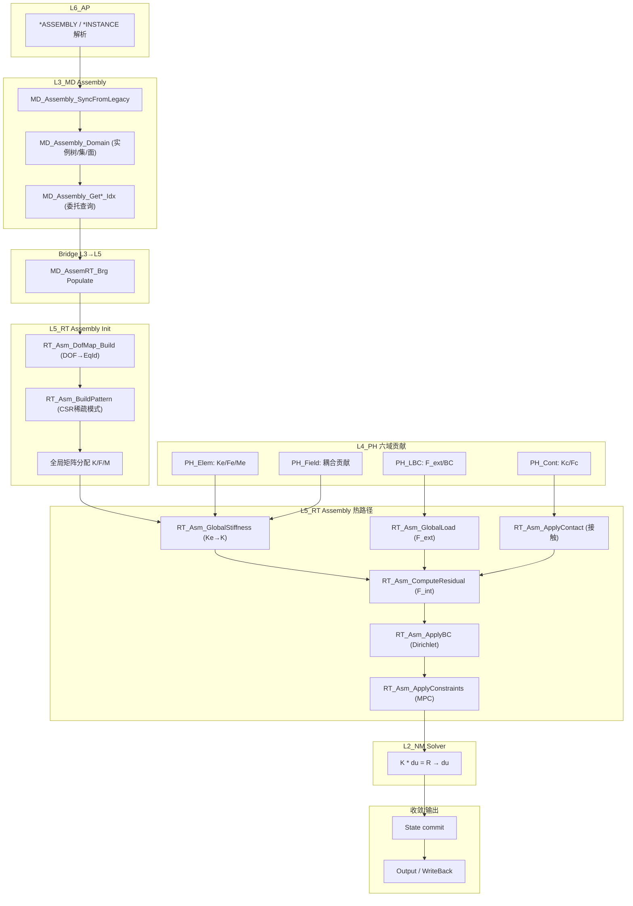
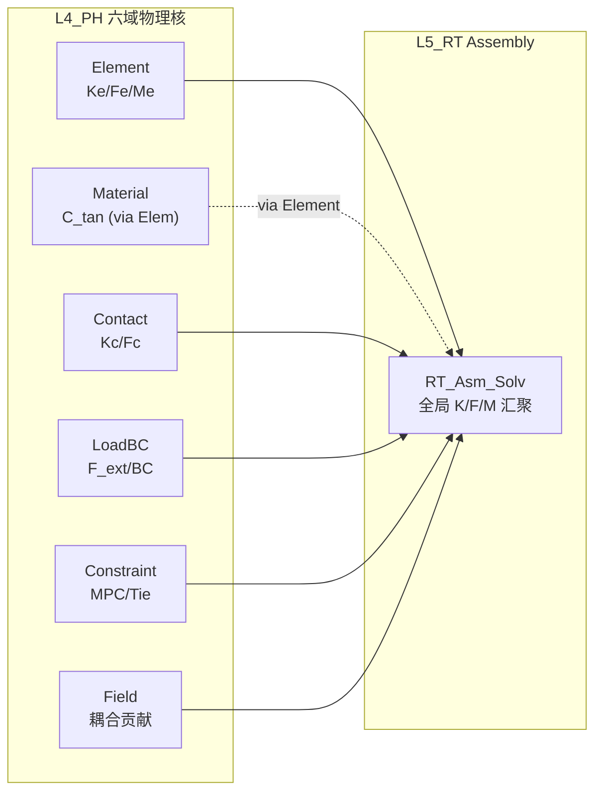

# L3_MD / L5_RT Assembly 标准域柱卡

**域路径**：`L3_MD/Assembly` → L4 无独立域（消费 Element/Material/Contact/LoadBC/Constraint/Field 的 L4 层） → `L5_RT/Assembly`  
**角色**：H3 半柱域 — 装配体定义真源(L3)、全局矩阵/向量汇聚运行时(L5)、L4 无独立 Assembly 域  
**文档日期**：2026-04-28  
**柱型**：半柱（H2：L3 + L5，L4 无独立域目录）

---

## 0. 源文件与权威入口核对

| 项 | 说明 |
|----|------|
| 合同卡 | `L3_MD/Assembly/CONTRACT.md`、`L5_RT/Assembly/CONTRACT.md` |
| 设计文档 | `L3_MD/Assembly/DESIGN_Assembly_FourTypes.md` |
| 衍生卡 | `L3_MD/Assembly/DERIVATION_CARD.md` |
| 闭环测试 | 待建：`tests/TEST_Assembly_L3_L5_Closure.f90` |

### 0.1 L3_MD/Assembly 源文件清单

| 文件 | 行数 | 大小 | 状态 | 角色 |
|------|------|------|------|------|
| `MD_Asm_Mgr.f90` | 1249 | 46.1KB | **ACTIVE** | **AUTHORITY** — 域容器 + 四型 + Idx API |
| `MD_Asm_Inst.f90` | 294 | 12.4KB | **ACTIVE** | UF Instance + 变换 TBP |
| `MD_Asm_Sync.f90` | 907 | 38.6KB | **ACTIVE** | Legacy UF + SyncFromLegacy |
| ~~`MD_Asm_Brg.f90`~~ | — | — | **DELETED** | 空壳；桥接由 `Bridge_L5/MD_AssemRT_Brg.f90` 承担 |

**L3 小计**：3 个活跃文件，2450 行，97.1KB

### 0.2 L5_RT/Assembly 源文件清单

| 文件 | 行数 | 大小 | 状态 | 角色 |
|------|------|------|------|------|
| `RT_Asm_Solv.f90` | 3416 | 149.2KB | **ACTIVE** | **GOLDEN-LINE** — 全局装配/载荷/接触/约束/求解核心 |
| `RT_Asm_NLGeomEval.f90` | 2219 | 78.6KB | **ACTIVE** | 几何非线性求值（变形梯度/应变/应力变换） |
| `RT_Asm_NLGeomDispatch.f90` | 1394 | 65.6KB | **ACTIVE** | NLGeom 调度（TL/UL 分派） |
| `RT_Asm_MassDamp.f90` | 1597 | 59.2KB | **ACTIVE** | 质量/阻尼矩阵组装 |
| `RT_Asm_Mgr.f90` | 1190 | 46.1KB | **ACTIVE** | 管理器 |
| `RT_Asm_DofMap.f90` | 813 | 31.5KB | **ACTIVE** | DOF 映射（节点→全局方程编号） |
| `RT_Asm_ShapeScalarField.f90` | 541 | 23.7KB | **ACTIVE** | Scalar Field 形函数 |
| `RT_Asm_Global.f90` | 494 | 19.4KB | **ACTIVE** | 全局 CSR 矩阵操作 |
| `RT_Asm_Util.f90` | 433 | 15.7KB | **ACTIVE** | 工具函数（单元坐标/密度/DOF 查询） |
| `RT_Asm_Def.f90` | 414 | 16.0KB | **ACTIVE** | **AUTHORITY** — L5 四型 TYPE 定义 |
| `RT_Asm_Impl.f90` | 409 | 15.6KB | **ACTIVE** | 实现分派（K/M/F/Constraint/Residual） |
| `RT_Asm_ShapeMechanicalField.f90` | 384 | 15.6KB | **ACTIVE** | Mechanical 形函数 |
| `RT_Asm_Core.f90` | 363 | 13.5KB | **ACTIVE** | FACADE — SIO 结构化装配过程 |
| `RT_Asm_Proc.f90` | 316 | 11.7KB | **ACTIVE** | SIO Proc 层入口（Init/Build/K/M/F/Constraint/Residual/Finalize） |
| `RT_Asm_Domain.f90` | 243 | 10.0KB | **ACTIVE** | Domain 容器（Ctx/State/Ctrl + TBP） |
| `RT_Asm_ShapeMech2D.f90` | 225 | 7.8KB | **ACTIVE** | 2D Mechanical 形函数 |
| `RT_Asm_ShapeShell.f90` | 214 | 8.3KB | **ACTIVE** | Shell 形函数 |
| `RT_Asm_Color.f90` | 186 | 5.8KB | **ACTIVE** | SMP Graph-Coloring 并行装配 |
| `RT_Asm_ShapeMembrane.f90` | 179 | 6.7KB | **ACTIVE** | Membrane 形函数 |
| `RT_Asm_Brg.f90` | 111 | 4.2KB | **ACTIVE** | L3→L5 Populate 桥接 |
| `RT_Asm_ShapeBeam.f90` | 105 | 3.6KB | **ACTIVE** | Beam 形函数 |
| `RT_ElemWS_Default.f90` | 58 | 1.7KB | **ACTIVE** | 单元工作空间默认实现 |

**L5 小计**：22 个活跃文件，15304 行，629.4KB

---

## 1. 域职责十件套

| # | 项 | Assembly 落地要点 |
|---|----|-------------------|
| 1 | **域定位** | L3/L5 半柱域(H2)：L3 持有装配体定义真源(实例/集/面/DOF映射)，L5 承载全局矩阵/向量汇聚运行时，L4 无独立域(消费六域L4贡献)。 |
| 2 | **职责边界** | **L3 负责**：装配体 Desc(实例树/节点集/面集/约束引用)、State(约束监控)、Algo(容差/策略)、Ctx(变换缓存)。**L5 负责**：DOF 映射、全局 K/F/M/C 矩阵组装、BC/载荷施加、接触约束集成、NLGeom 计算、SMP 并行装配、求解调度。**禁止**：L3 做全局矩阵 CSR 装配；L5 步内热路径直读 L3 深层容器。 |
| 3 | **功能模块** | 见 Section 4 两层 `.f90` 清单。 |
| 4 | **四型 TYPE** | **Desc**：`MD_Assembly_Domain`(L3真源) / `RT_Asm_Desc`(L5 Populate)。**State**：`MD_Asm_State`(L3) / `RT_Assembly_State`(L5 CSR/向量/进度)。**Algo**：`MD_Asm_Algo`(L3容差) / `Asm_Algo`(L5装配策略/稀疏格式/并行模式)。**Ctx**：`MD_Asm_Ctx`(L3变换缓存) / `RT_Assembly_Ctx`(L5组装上下文/内存池/分区)。 |
| 5 | **公开接口** | L3 = Init/Finalize/Add*/Get*/Sync；L5 = Init/BuildPattern/AssembleK/M/F/ApplyConstraints/ComputeResidual/Finalize + DofMap + GlobalStiffness + ApplyBC/Contact。 |
| 6 | **数据所有权** | L3 持有装配体 Desc 权威真源；Populate 后 L5 持有 DOF 映射、CSR 结构、全局矩阵/向量；步内热路径不反向读 L3。 |
| 7 | **依赖规则** | 允许：L5 经 Bridge/Populate 读 L3 Desc + L4 Ke/Fe/Ce 贡献。禁止：L5 IP 循环内 USE L3 深层容器；L5 新建第二套 Desc 真源。 |
| 8 | **合同卡** | L3/L5 各维护 `CONTRACT.md`。 |
| 9 | **Harness 验收** | 见 Section 6。 |
| 10 | **扩展点** | 新装配策略：通过 `RT_Asm_Color` 扩展并行模式(SERIAL→OMP_COLORING→OMP_ATOMIC→MPI)；新物理场：通过 L4 域增加贡献核 + L5 Assembly 新增 `Assemble*Matrices`。 |

---

## 2. 域柱定位与主链

Assembly 是 H2 半柱域（又称 H3 Assembly）：L3 持有装配体定义真源，L5 为全局汇聚运行时主体，L4 无独立 Assembly 域。

**双重 Assembly 语义**：
- **L3 Assembly** = 部件实例化 (Part Instance) — 管理几何装配、实例树、集合定义、DOF 编号方案
- **L5 Assembly** = 全局矩阵装配 (Global K/F Assembly) — 汇聚单元/接触/载荷/约束贡献到全局系统

| 层 | 职责 | 禁止 |
|----|------|------|
| L3_MD | 装配体拓扑：实例树/节点集/面集/约束引用/DOF映射方案 | 矩阵操作/CSR装配/求解 |
| L4_PH | (无独立域) 计算贡献来自 Element/Material/Contact/LoadBC/Constraint/Field 的 L4 层 | N/A |
| L5_RT | 全局汇聚：遍历单元→累加 Ke→K / Fe→F_int / 施加 BC→F_ext / Contact→F_cont / MPC→K/F 修正 / 求解调度 | 具体单元/材料/接触算法实现 |

**L4 缺席设计说明**：Assembly 在 L4 无独立目录，因为 L4 的 Element/Material/Contact/LoadBC/Constraint/Field 域各自提供局部 Ke/Fe/Ce/Fe_bc/K_mpc/K_field 贡献，L5 Assembly 汇聚这些贡献到全局系统。这是**设计意图**而非遗漏。

主链：

```text
L6_AP *ASSEMBLY/*INSTANCE 解析
  -> L3_MD MD_Assembly_SyncFromLegacy(实例/集/面/约束)
  -> L3→L5 MD_AssemRT_Brg Populate
  -> L5 RT_Asm_DofMap_Build (DOF→全局方程号)
  -> L5 RT_Asm_BuildPattern (CSR稀疏模式)
  -> L5 RT_Asm_GlobalStiffness (遍历单元→L4 Ke→CSR)
  -> L5 RT_Asm_ComputeResidual (F_int + F_ext + F_cont)
  -> L5 RT_Asm_ApplyBC / ApplyContact / ApplyConstraints
  -> L2_NM Solver (K*du = R)
  -> L5 State commit → Output
```

---

## 3. 四型裁剪决策

| 层 | Desc | State | Algo | Ctx |
|----|------|-------|------|-----|
| L3 | RETAINED(`MD_Assembly_Domain`) | RETAINED(`MD_Asm_State`) | RETAINED(`MD_Asm_Algo`) | RETAINED(`MD_Asm_Ctx`) |
| L4 | N/A(无独立域) | N/A | N/A | N/A |
| L5 | DELEGATED→L3(via Populate `RT_Asm_Desc`) | RETAINED(`RT_Assembly_State`: CSR矩阵/向量/进度) | RETAINED(`Asm_Algo`: 装配策略/稀疏格式/并行模式) | RETAINED(`RT_Assembly_Ctx`: 组装上下文/内存池/分区) |

设计详情：`L3_MD/Assembly/DESIGN_Assembly_FourTypes.md`

---

## 4. .f90 功能模块清单（两层分列）

### 4.1 L3_MD/Assembly（真源层）

| 文件 | 后缀 | 模块命名 | 职责 | 现有 |
|------|------|----------|------|------|
| `MD_Asm_Mgr.f90` | Mgr | `MD_Asm_Mgr` | **AUTHORITY** — 域容器 `MD_Assembly_Domain` + 四型(Desc/State/Algo/Ctx) + 实例/集/面/约束Add/Get API + Idx 委托 | Y |
| `MD_Asm_Inst.f90` | Inst | `MD_Asm_Inst` | UF 侧实例 `UF_InstanceDef` + 变换 TBP (translate/rotate/transform) | Y |
| `MD_Asm_Sync.f90` | Sync | `MD_Asm_Sync` | Legacy `UF_AssemblyDef` + `MD_Assembly_SyncFromLegacy` / `MirrorUFConstraintToDomain` | Y |

### 4.2 L4_PH（无独立 Assembly 域）

Assembly 不拥有 L4 独立域目录。L5 在装配循环中调用以下 L4 域物理核：

| L4 被调用域 | 模块前缀 | 调用性质 |
|-------------|----------|----------|
| `L4_PH/Element` | `PH_Elem_*` / `PH_ElemKe_*` | 单元刚度 Ke、内力 Fe、质量 Me |
| `L4_PH/Material` | `PH_Mat_*` | 本构切线 C_tan（经 Element 间接消费） |
| `L4_PH/Contact` | `PH_Cont_*` | 接触力 Kc/Fc、搜索/间隙/摩擦 |
| `L4_PH/LoadBC` | `PH_LBC_*` / `PH_BC_*` / `PH_Load_*` | 载荷等效力、边界条件施加 |
| `L4_PH/Constraint` | `PH_Constr_*` | MPC/Tie/Periodic 约束贡献 |
| `L4_PH/Field` | `PH_Field_Cpl` | 声学/电磁/传输/压电等 Field 耦合贡献 |

### 4.3 L5_RT/Assembly（运行时主体层）

| 文件 | 后缀 | 模块命名 | 职责 | 现有 |
|------|------|----------|------|------|
| `RT_Asm_Def.f90` | Def | `RT_Asm_Def` | **AUTHORITY** — L5 四型 TYPE：`RT_Asm_Desc`/State/Algo + TBP | Y |
| `RT_Asm_Domain.f90` | Domain | `RT_Asm_Domain` | Domain 容器：`RT_Assembly_Domain`/Ctx/State/Ctrl + Init/BuildPattern/GetSummary | Y |
| `RT_Asm_Proc.f90` | Proc | `RT_Asm_Proc` | SIO Proc 入口：Init/BuildPattern/AssembleK/M/F/ApplyConstraints/ComputeResidual/Finalize | Y |
| `RT_Asm_Impl.f90` | Impl | `RT_Asm_Impl` | 实现分派：*_Impl 过程（K/M/F/Constraint/Residual） | Y |
| `RT_Asm_Solv.f90` | Solv | `RT_Asm_Solv` | **GOLDEN-LINE** — 全局装配 hub（GlobalStiffness/ComputeResidual/ApplyBC/ApplyContact/GlobalLoad + 多物理场） | Y |
| `RT_Asm_Core.f90` | Core | `RT_Asm_Core` | FACADE — SIO 结构化散射/装配操作（Ke→K/Fe→F/Mass/Damp） | Y |
| `RT_Asm_DofMap.f90` | DofMap | `RT_Asm_DofMap` | DOF 映射：节点 DOF → 全局方程编号 | Y |
| `RT_Asm_Global.f90` | Global | `RT_Asm_Global` | CSR 矩阵操作：`CSR_Matrix` TYPE + Init/AddEntry/BuildGlobSys/ApplyBC | Y |
| `RT_Asm_MassDamp.f90` | MassDamp | `RT_Asm_MassDamp` | 质量/阻尼矩阵组装（一致/集中/Rayleigh/模态） | Y |
| `RT_Asm_NLGeomDispatch.f90` | NLGeomDispatch | `RT_Asm_NLGeomDispatch` | NLGeom 调度：TL/UL 分派 + 单元族注册 | Y |
| `RT_Asm_NLGeomEval.f90` | NLGeomEval | `RT_Asm_NLGeomEval` | NLGeom 求值：变形梯度/B矩阵/应变/应力变换/几何刚度 | Y |
| `RT_Asm_Color.f90` | Color | `RT_Asm_Color` | SMP Graph-Coloring：贪心着色 + DOF-to-element 逆映射 + 颜色分组 | Y |
| `RT_Asm_Brg.f90` | Brg | `RT_Asm_Brg` | L3→L5 Populate 桥接 | Y |
| `RT_Asm_Util.f90` | Util | `RT_Asm_Util` | 工具函数：单元坐标/密度/DOF/Info 查询 | Y |
| `RT_Asm_Mgr.f90` | Mgr | `RT_Asm_Mgr` | 管理器 | Y |
| `RT_Asm_ShapeMechanicalField.f90` | Shape | `RT_Asm_ShapeMechanicalField` | 3D Mechanical 形函数 | Y |
| `RT_Asm_ShapeMech2D.f90` | Shape | `RT_Asm_ShapeMech2D` | 2D Mechanical 形函数 | Y |
| `RT_Asm_ShapeShell.f90` | Shape | `RT_Asm_ShapeShell` | Shell 形函数 | Y |
| `RT_Asm_ShapeMembrane.f90` | Shape | `RT_Asm_ShapeMembrane` | Membrane 形函数 | Y |
| `RT_Asm_ShapeBeam.f90` | Shape | `RT_Asm_ShapeBeam` | Beam 形函数 | Y |
| `RT_Asm_ShapeScalarField.f90` | Shape | `RT_Asm_ShapeScalarField` | Scalar Field 形函数 | Y |
| `RT_ElemWS_Default.f90` | WS | `RT_ElemWS_Default` | 单元工作空间默认实现 | Y |

---

## 5. 数据生命周期图



**文字要点**：

1. **创建(Model Build)**：L6 解析 `*ASSEMBLY` / `*INSTANCE` → L3 `MD_Assembly_SyncFromLegacy` 灌入实例/集/面/约束。
2. **桥接(Populate)**：`MD_AssemRT_Brg` 将 L3 Desc 映射到 L5 `RT_Asm_Desc`(DOF 方案)。
3. **初始化(Step Init)**：L5 `RT_Asm_DofMap_Build` 构建全局 DOF 映射 → `BuildPattern` 确定 CSR 稀疏模式 → 分配全局 K/F/M。
4. **装配(Element Loop)**：遍历单元调用 L4 `PH_Element_Compute_Ke/Fe` → L5 `RT_Asm_GlobalStiffness` 散射 Ke 到全局 CSR。
5. **接触(Contact Loop)**：L4 `PH_Cont_*` 计算接触力 → L5 `RT_Asm_ApplyContact` 装配到全局系统。
6. **载荷/BC**：L5 `RT_Asm_GlobalLoad`(F_ext) + `RT_Asm_ApplyBC`(Dirichlet) + `RT_Asm_ApplyConstraints`(MPC/Tie)。
7. **求解(Solve)**：`K * du = R` → `du`。
8. **收敛/输出**：State commit → Output/WriteBack。

---

## 6. Harness 验收项

| 类别 | 验收项 |
|------|--------|
| **命名** | `MD_Asm_*`(L3) / `RT_Asm_*`(L5) 前缀与层域一致；`check_naming.py` 通过。 |
| **依赖/架构** | 步内热路径禁止 `USE` L3 深层容器（**热路径零 L3**）；`arch_guardian.py` 通过。 |
| **合同** | L3/L5 `CONTRACT.md` 存在且与公开过程签名一致。 |
| **DOF 映射** | `RT_Asm_DofMap_Build` 正确映射节点 DOF → 全局方程号；边界条件节点正确标记。 |
| **CSR 一致性** | `BuildPattern` 生成的 CSR 稀疏模式与实际非零元一致；对称矩阵上/下三角正确。 |
| **金线闭环** | L6 *ASSEMBLY → L3 Sync → Populate → L5 DofMap → L4 Ke → L5 CSR → Solver 全链验证。 |
| **并行** | Graph-Coloring / ATOMIC 模式装配结果与串行一致（数值精度内）。 |
| **多物理场** | 热/电/声/压电等 `Assemble*Matrices` 入口可达且不引入 L3 依赖。 |

**工具入口**

- `tools/arch_guardian.py`
- `ufc_harness/run_harness.py`
- `scripts/ci/check_naming.py`

---

## 7. 清旧资产台账

### 7.1 已删除模块

| 文件 | 原域 | 处置 | 理由 |
|------|------|------|------|
| ~~`MD_Asm_Brg.f90`~~ | L3 | DELETED | 空壳零消费者；桥接由 `Bridge_L5/MD_AssemRT_Brg.f90` 承担 |
| ~~`MD_Asm_Def.f90`~~ | L3 | DELETED | 平坦原型类型，与 `MD_Asm_Mgr` 重复 |
| ~~`MD_Asm_Core.f90`~~ | L3 | DELETED | 原型过程，仅被自身和骨架测试引用 |
| ~~`MD_Assem_Domain.f90`~~ | L3 | DELETED | 薄门面 re-export，消费者已迁移至 `MD_Asm_Mgr` |
| ~~`RT_Asm_NLMat_Eval.f90`~~ | L5 | DELETED | 零调用的 NLMat 计算 |
| ~~`RT_Asm_Ldbc_Apply.f90`~~ | L5 | DELETED | 零调用的 LoadBC Apply |

### 7.2 后续任务触发表

| ID | 任务 | 触发条件 | 优先级 |
|----|------|----------|--------|
| `Asm-MPI-01` | MPI 分布式装配实现 | 大规模并行需求出现时 | 触发式 |
| `Asm-Solver-Split` | RT_Asm_Solv 拆分 | 文件超 4000 行时 | 触发式 |
| `Asm-NLGeom-Split` | NLGeomEval/Dispatch 拆分 | 维护负担过大时 | 触发式 |
| `Asm-Test-Closure` | L3→L5 闭环测试建设 | 基础闭环完成后 | 计划式 |
| `Asm-Field-Route` | Field 耦合贡献路由标准化 | `L4_PH/Field/CONTRACT.md` 定义 Proc 边界后 | 触发式 |

### 7.3 冻结规则

| 规则 | 说明 |
|------|------|
| `RT_Asm_Def.f90` 四型 TYPE 签名冻结 | `RT_Asm_Desc`/State/Algo 字段新增需域审批 |
| `RT_Asm_Solv.f90` 金线入口冻结 | `GlobalStiffness`/`ComputeResidual`/`ApplyBC`/`ApplyContact` 签名稳定 |
| L3 `MD_Assembly_Domain` 建模后只读 | Write-Once 语义，建模完成后禁止修改 |

---

## 8. 域间关系表（附录 A）

### 8.1 L3_MD/Assembly 域际关系

| 编号 | 对端域 | 关系类型 | 说明 |
|------|--------|----------|------|
| R1 | L3_MD/Part | S(消费) | 实例引用 Part 定义 |
| R2 | L3_MD/Element/Mesh | S(消费) | 全局坐标/连通依赖 Mesh |
| R3 | L3_MD/Constraint | T(合同) | 约束引用装配体集/面 |
| R4 | L3_MD/Interaction | T(合同) | 接触引用装配体表面 |
| R5 | L5_RT/Assembly | B(桥接) | 经 MD_AssemRT_Brg 映射 |
| R6 | L4_PH/Populate | B(桥接) | 表面解析经 Assembly API |
| R7 | L1_IF/Error | U(USE) | 错误码定义 |

### 8.2 L5_RT/Assembly 域际关系

| 编号 | 对端域 | 方向 | 关系类型 | 主要接触面 | 热路径 |
|------|--------|------|----------|------------|--------|
| R1 | L3_MD/Assembly | 上游 | T+B | Assembly Desc via Populate | 否(冷) |
| R2 | L3_MD/Element/Mesh | 上游 | T+B | 拓扑/DOF via Bridge | 否(冷) |
| R3 | L4_PH/Element | 上游 | T+B | Ke/Fe/Me 贡献 | **是** |
| R4 | L4_PH/Material | 上游(间接) | T | C_tan 经 Element 间接消费 | **是** |
| R5 | L4_PH/Contact | 上游 | T+B | 接触 Kc/Fc 贡献 | **是** |
| R6 | L4_PH/LoadBC | 上游 | T | 载荷 F_ext / BC 施加 | **是** |
| R7 | L4_PH/Constraint | 上游 | T | MPC/Tie/Periodic 贡献 | **是** |
| R8 | L4_PH/Field | 上游 | T | 声学/电磁/传输/压电耦合贡献 | 部分 |
| R9 | L5_RT/StepDriver | 上游 | S | 步驱动调用组装 | — |
| R10 | L5_RT/Solver(L2_NM) | 下游 | T | 全局 K/F/u → Solver | **是** |
| R11 | L5_RT/Output | 下游 | S | 结果输出 | — |
| R12 | L1_IF/Error | 基础 | U(USE) | 错误码传播 | — |
| R13 | L1_IF/Prec | 基础 | U(USE) | wp/i4 精度参数 | — |

### 8.3 Assembly 六域消费关系汇总



---

## 附录 B：SMP 并行装配模式

| 模式 | 枚举值 | 实现 | 说明 |
|------|--------|------|------|
| SERIAL | `RT_ASM_SERIAL = 0` | 顺序遍历单元 | 默认模式 |
| OMP_COLORING | `RT_ASM_OMP = 1` | Graph-Coloring + 同颜色组内直接写入 | `RT_Asm_Color.f90` |
| OMP_ATOMIC | `RT_ASM_ATOMIC = 2` | 逐 DOF 对 ATOMIC 保护写入 | `RT_Asm_Core.f90` |
| MPI | `RT_ASM_MPI = 3` | 分布式装配 | 后续规划 |

---

## 附录 C：四链说明

| 链 | 本域可核对说明 |
|----|---------------|
| **理论链** | 有限元全局组装：`K_global = Σ_e Ke`，`F_global = Σ_e Fe`（含边界、接触、约束、多物理场贡献） |
| **逻辑链** | `*ASSEMBLY/*INSTANCE`(L6) → `MD_Assembly_SyncFromLegacy`(L3) → `MD_AssemRT_Brg`(Bridge) → `RT_Asm_DofMap_Build`(L5) → `PH_Element_Compute_Ke/Fe`(L4) → `RT_Asm_GlobalStiffness`(Triplet→CSR)(L5) → Solver(L2) |
| **计算链** | DofMap 构建 → CSR 稀疏模式 → 单元循环(Ke散射) → BC/Contact/MPC 惩罚施加 → 求解 K*du=R |
| **数据链** | `MD_Assembly_Domain`(L3冷) → `RT_Asm_Desc`(L5冷Populate) → `RT_Sol_DofMap`(L5热) + `CSR_Matrix`(L5热) → Solver 消费 |

---

## 附录 D：变更日志

| 版本 | 日期 | 变更 |
|------|------|------|
| v1.0 | 2026-04-28 | 初始版本：Assembly 域完整十件套域柱卡 |
