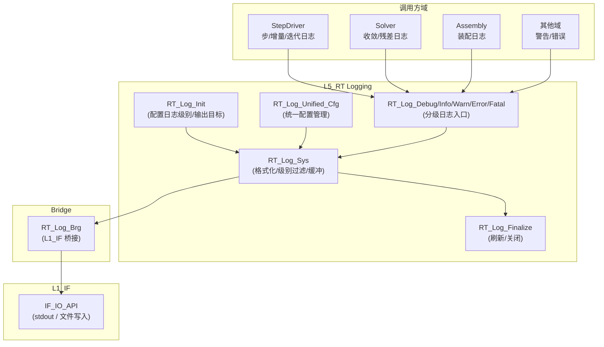
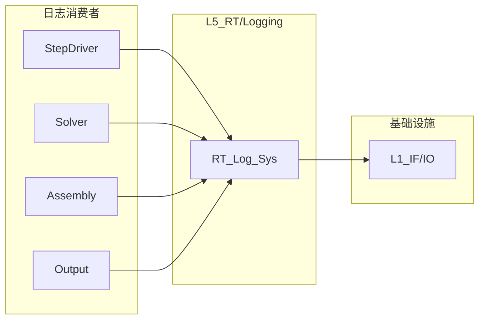

# L5_RT Logging 标准域柱卡

**域路径**：`L5_RT/Logging`（L5 专属域，不跨 L3/L4）  
**角色**：S5 单层型 — 运行时日志管理（分级日志/格式化/性能计时）  
**文档日期**：2026-04-28  
**柱型**：单层（S5：仅 L5_RT，L3/L4 无独立 Logging 域目录）

---

## 0. 源文件与权威入口核对

| 项 | 说明 |
|----|------|
| 合同卡 | `L5_RT/Logging/CONTRACT.md` |
| 闭环测试 | 待建 |

### 0.1 L5_RT/Logging 源文件清单

| 文件 | 大小 | 状态 | 模块 | 角色 |
|------|------|------|------|------|
| `RT_Log_Def.f90` | 1.3KB | **ACTIVE** | `RT_Log_Def` | **AUTHORITY** — 日志级别常量/基础类型定义 |
| `RT_Log_Sys.f90` | 14.1KB | **ACTIVE** | `RT_Log_Sys` | **GOLDEN-LINE** — 日志主系统（Init/Debug/Info/Warn/Error/Fatal/Finalize/UnifiedManage/UnifiedCfg） |
| `RT_Log_Core.f90` | 5.9KB | **ACTIVE** | `RT_Log_Core` | 日志核心逻辑 |
| `RT_Log_Brg.f90` | 0.7KB | **ACTIVE** | `RT_Log_Brg` | 桥接模块（L1_IF 对接） |

**L5 小计**：4 个活跃 .f90 文件

---

## 1. 域职责十件套

| # | 项 | Logging 落地要点 |
|---|----|------------------|
| 1 | **域定位** | L5 单层型(S5)：运行时日志管理，为所有 L5 域及上下层提供可观测性基础设施。 |
| 2 | **职责边界** | **负责**：日志级别控制(DEBUG/INFO/WARN/ERROR/FATAL)、消息格式化(时间戳/模块名/步索引)、输出目标管理(stdout/file)、统一日志配置、AI 遥测钩子。**禁止**：定义输出变量（委托 Output 域）；写 ODB/HDF5 文件（委托 L6_AP）；执行物理计算；阻塞热路径。 |
| 3 | **功能模块** | 见 Section 4 `.f90` 清单。 |
| 4 | **四型 TYPE** | 见 Section 3 四型裁剪。 |
| 5 | **公开接口** | Init/Debug/Info/Warn/Error/Fatal/Finalize/UnifiedManage/UnifiedCfg。 |
| 6 | **数据所有权** | L5 持有日志配置(RT_LogConfig)和日志器实例(RT_Logger)；无 L3 真源依赖。 |
| 7 | **依赖规则** | 允许：使用 L1 `IF_IO_API` 底层 IO。禁止：依赖 L3/L4 模块；在热路径内执行重量级 IO。 |
| 8 | **合同卡** | `CONTRACT.md`。 |
| 9 | **Harness 验收** | 见 Section 6。 |
| 10 | **扩展点** | 新日志级别：扩展 `RT_Log_Def` 常量；AI 遥测：通过遥测钩子记录 AI 推理耗时/回退/置信度；输出目标：新增网络/数据库等目标。 |

---

## 2. 域柱定位与主链

Logging 是 S5 单层型域（仅 L5_RT），作为全系统可观测性基础设施：

| 层 | 职责 | 禁止 |
|----|------|------|
| L1_IF | 底层 IO API（文件/stdout 写入） | 日志语义/格式/级别 |
| L5_RT | 日志级别控制/格式化/输出目标/统一配置/AI 遥测 | 文件格式定义/物理计算/ODB 写入 |

主链：

```text
各域(StepDriver/Solver/Assembly/Element...)
  → RT_Log_Info / RT_Log_Warn / RT_Log_Error (日志记录)
  → RT_Log_Sys (格式化/级别过滤/缓冲)
  → RT_Log_Brg (桥接)
  → L1_IF IO_API (stdout / 文件输出)
```

---

## 3. 四型裁剪决策

| 层 | Desc | State | Algo | Ctx |
|----|------|-------|------|-----|
| L5 | RETAINED(`RT_Log_Desc`: log_level/log_unit/prefix；`RT_LogConfig`: 配置) | RETAINED(`RT_Logging_State`: active/n_messages/n_warnings/n_errors) | N/A(无独立 Algo；缓冲/轮转策略内嵌于 RT_LogSys) | RETAINED(`RT_Log_Ctx`: line_buffer/step_id/inc_num) |

---

## 4. .f90 功能模块清单

| 文件 | 后缀 | 模块命名 | 职责 | 现有 |
|------|------|----------|------|------|
| `RT_Log_Def.f90` | Def | `RT_Log_Def` | **AUTHORITY** — 日志级别常量（DEBUG/INFO/WARN/ERROR/FATAL）、基础类型 | Y |
| `RT_Log_Sys.f90` | Sys | `RT_Log_Sys` | **GOLDEN-LINE** — 日志主系统：`RT_LogConfig`/`RT_Logger` TYPE + Init/Debug/Info/Warn/Error/Fatal/Finalize/UnifiedManage/UnifiedCfg | Y |
| `RT_Log_Core.f90` | Core | `RT_Log_Core` | 日志核心逻辑 | Y |
| `RT_Log_Brg.f90` | Brg | `RT_Log_Brg` | L1_IF 桥接 | Y |

---

## 5. 数据生命周期图



**文字要点**：

1. **初始化**：`RT_Log_Init` 配置日志级别（DEBUG/INFO/WARN/ERROR/FATAL）和输出目标（stdout/file）。
2. **记录**：各域调用 `RT_Log_Info`/`RT_Log_Warn`/`RT_Log_Error` 等分级接口。
3. **格式化**：`RT_Log_Sys` 执行级别过滤、时间戳/模块名/步索引格式化、缓冲管理。
4. **输出**：经 `RT_Log_Brg` 桥接至 L1 `IF_IO_API` 写入 stdout 或日志文件。
5. **终结**：`RT_Log_Finalize` 刷新缓冲区、关闭文件句柄。

---

## 6. Harness 验收项

| 类别 | 验收项 |
|------|--------|
| **命名** | `RT_Log_*` 前缀与层域一致；`check_naming.py` 通过。 |
| **依赖/架构** | 仅依赖 L1_IF；不引入 L3/L4 模块。 |
| **合同** | `CONTRACT.md` 存在且与公开过程签名一致。 |
| **热路径** | ERROR 检查在热路径内为轻量级（O(1)）；日志写入不阻塞热路径。 |
| **不使用 STOP** | 日志子系统自身错误不终止分析；错误降级处理（如回退到 stdout）。 |
| **级别过滤** | 设置为 ERROR 级别时，DEBUG/INFO/WARN 消息不产生 IO 开销。 |

**工具入口**

- `scripts/ci/check_naming.py`
- `tools/arch_guardian.py`

---

## 7. 清旧资产台账

### 7.1 已移除模块

| 文件 | 处置 | 理由 |
|------|------|------|
| ~~`RT_Logging.f90`~~ | DELETED | 冗余封装层 |
| ~~`RT_Logging_Domain_Core.f90`~~ | DELETED | 零消费者 |
| ~~`RT_Log_Async.f90`~~ | DELETED | 未使用的异步模块 |
| ~~`RT_Monitor_Brg.f90`~~ | DELETED | 未使用的监控桥接 |

### 7.2 后续任务触发表

| ID | 任务 | 触发条件 | 优先级 |
|----|------|----------|--------|
| `Log-Async` | 异步日志写入 | 大规模并行时 IO 成为瓶颈 | 触发式 |
| `Log-AI-Telemetry` | AI 遥测钩子生产化 | AI 插槽启用后 | 触发式 |
| `Log-Test-Suite` | 日志子系统测试 | 基础闭环完成后 | 计划式 |
| `Log-Rotate` | 日志轮转/归档 | 长时间运行分析产生大量日志 | 触发式 |

### 7.3 冻结规则

| 规则 | 说明 |
|------|------|
| `RT_Log_Def.f90` 级别常量冻结 | DEBUG/INFO/WARN/ERROR/FATAL 语义不变 |
| `RT_Log_Sys.f90` 公开接口冻结 | Init/Debug/Info/Warn/Error/Fatal/Finalize 签名稳定 |
| 日志不阻塞热路径 | 硬性约束，不可放松 |

---

## 附录 A：域际关系

| 编号 | 对端域 | 方向 | 关系类型 | 说明 |
|------|--------|------|----------|------|
| R1 | L1_IF/IO | 下游 | U(USE) | 使用 L1 IF_IO_API 底层 IO |
| R2 | L5_RT/StepDriver | 上游 | S(被消费) | StepDriver 调用日志记录步/增量/迭代信息 |
| R3 | L5_RT/Solver | 上游 | S(被消费) | Solver 调用日志记录收敛/残差信息 |
| R4 | L5_RT/Assembly | 上游 | S(被消费) | Assembly 调用日志记录装配信息 |
| R5 | L5_RT/Output | 上游 | S(被消费) | Output 调用日志记录输出信息 |



---

## 附录 B：四链说明

| 链 | 本域可核对说明 |
|----|---------------|
| **理论链** | 无自有理论；职责为运行时状态的可观测性（分级日志输出、ERROR 检查） |
| **逻辑链** | 各域(StepDriver/Solver/Element...) → Logging(RT_Log_Sys) → RT_Log_Brg → L1_IF(IO) → stdout/文件 |
| **计算链** | 无计算；日志写入 O(1) per call，缓冲刷新 O(buf_size) |
| **数据链** | 运行时状态消息(热/冷) → 日志缓冲区 → L1_IF IO 输出 |

---

## 附录 C：AI 遥测钩子

| 钩子 | 说明 | 状态 |
|------|------|------|
| AI 推理耗时 | 每个 AI 插槽调用后记录 `inference_time_ms` | 规划 |
| AI 回退计数 | `n_fallbacks` (AI 预测信心不足时回退经典算法) | 规划 |
| AI 置信度 | 每步/每增量的置信度直方图 | 规划 |
| ORT 会话管理 | 模型加载/释放事件 | 规划 |

> AI 关闭时零开销。参见 `04_Tactic_AI_Telemetry_Hooks_智能化接管战术.md`。

---

## 附录 D：错误处理

| 错误码 | 场景 | 严重级 | 恢复策略 |
|--------|------|--------|----------|
| ERR_L5_LOGGING_50500 | 日志文件打开失败 | WARNING | 回退到 stdout |
| ERR_L5_LOGGING_50501 | 日志缓冲区溢出 | WARNING | 截断并刷新 |
| ERR_L5_LOGGING_50502 | 无效日志级别 | WARNING | 使用 INFO 级别 |

日志子系统自身错误不终止分析，仅降级处理。错误码范围：**50500–50599**。

---

## 附录 E：变更日志

| 版本 | 日期 | 变更 |
|------|------|------|
| v1.0 | 2026-04-28 | 初始版本：Logging 域完整十件套域柱卡（S5 单层型） |
