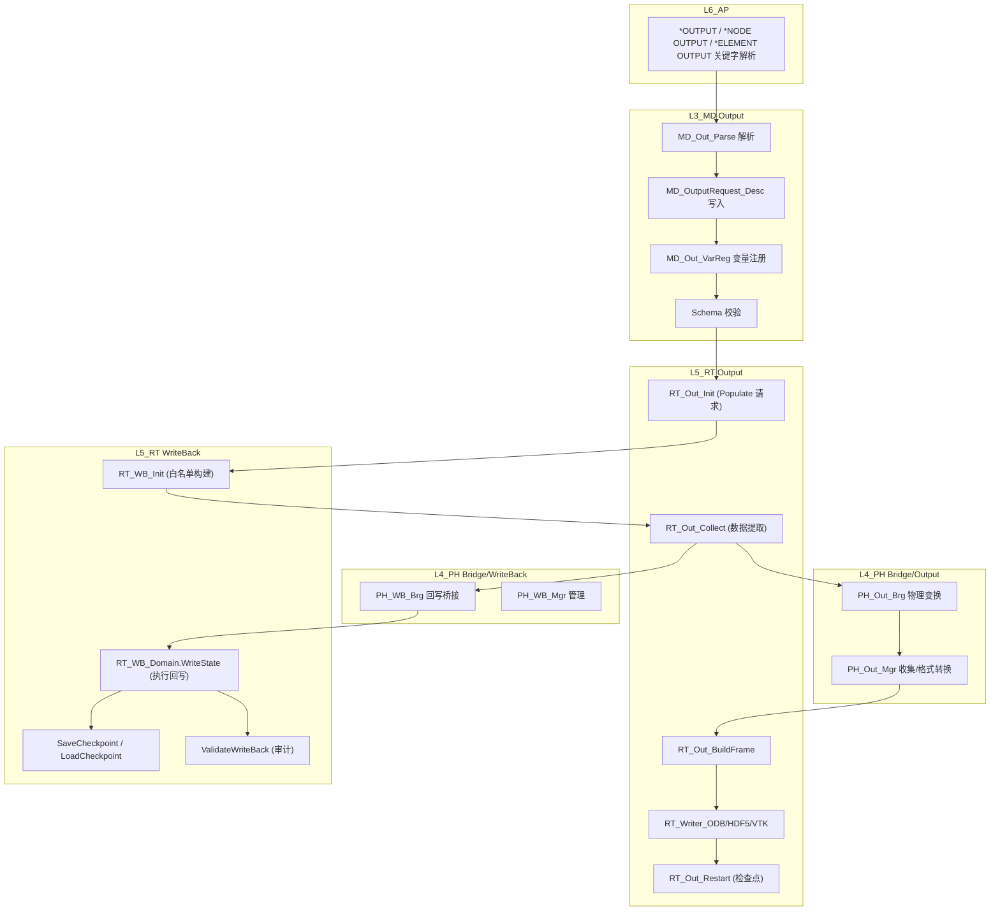

# L3_MD/L4_PH/L5_RT Output/WriteBack 标准域柱卡

**域路径**：`L3_MD/Output` -> `L4_PH/Bridge/Output` + `L4_PH/Bridge/WriteBack` -> `L5_RT/Output` + `L5_RT/WriteBack`  
**角色**：P5 全贯通域柱 -- 输出请求定义真源(L3)、物理变换/数据桥接(L4)、运行时写回与文件输出(L5)  
**文档日期**：2026-04-28  
**柱型**：全柱（F2：三层均有独立域目录）

---

## 0. 源文件与权威入口核对

| 项 | 说明 |
|----|------|
| 合同卡 | `L3_MD/Output/CONTRACT.md`、`L4_PH/Bridge/Output/CONTRACT.md`、`L4_PH/Bridge/WriteBack/CONTRACT.md`、`L5_RT/Output/CONTRACT.md`、`L5_RT/WriteBack/CONTRACT.md` |
| 设计文档 | 无独立设计文档（合同卡内含四型定义） |
| L3 源文件 | `L3_MD/Output/`: 16 个 .f90（MD_Out_*.f90 系列） |
| L4 源文件 | `L4_PH/Bridge/Output/`: PH_Out_Brg.f90, PH_Out_Mgr.f90；`L4_PH/Bridge/WriteBack/`: PH_WB_Brg.f90, PH_WB_Init.f90, PH_WB_Mgr.f90 |
| L5 Output | `L5_RT/Output/`: 9 个 .f90（RT_Out_*.f90 + RT_Writer_*.f90） |
| L5 WriteBack | `L5_RT/WriteBack/`: 6 个 .f90（RT_WB_*.f90） |

---

## 1. 域职责十件套

| # | 项 | Output/WriteBack 落地要点 |
|---|----|---------------------------|
| 1 | **域定位** | L3/L4/L5 三层贯通全柱域：L3 持有输出请求 Schema 唯一真源，L4 承载物理变换/数据桥接，L5 执行运行时写回与文件输出。Output 与 WriteBack 为同一域柱的两个子域：Output 负责"输出什么+写文件"，WriteBack 负责"计算结果→模型树回写"。 |
| 2 | **职责边界** | **L3 负责**：输出请求定义（变量名/节点集/单元集/输出频率/格式）、UniFld Schema、输出变量注册表。**L4 负责**：纯物理计算（坐标变换、张量变换、场插值、分量提取）、WriteBack 数据桥接。**L5 负责**：输出编排(RT_Out)、WriteBack 白名单执行(RT_WB)、检查点、ODB/HDF5/VTK 写入。**禁止**：L3 执行写文件/数据提取；L4 执行调度/IO；L5 修改输出定义/重新计算物理量。 |
| 3 | **功能模块** | 见 Section 4 三层 `.f90` 清单。 |
| 4 | **四型 TYPE** | **Desc**：`MD_OutputRequest_Desc`(L3) / `PH_Output_Params`(L4) / `RT_Out_Base_Desc`(L5) / `RT_WB_Base_Desc`(L5)。**State**：`MD_Output_State`(L3) / `PH_Output_State`(L4) / `RT_Out_FieldState`(L5) / `CheckpointStatus`(L5)。**Algo**：`OutputAlgo`(L3) / 无独立(L4) / `OutAlgo`(L5) / `WBAlgo`(L5)。**Ctx**：`MD_Output_Ctx`(L3) / 无(L4 无状态) / `OutCtx`(L5) / `WriteBackCtx`(L5)。 |
| 5 | **公开接口** | 以各层 `CONTRACT.md` 为准：L3 = Parse/AddRequest/Query/Bridge；L4 = TransformCoords/TransformTensor/Interpolate/Extract；L5 Output = Init/Collect/Write/CheckFreq/Restart；L5 WriteBack = Init/WriteState/SaveCheckpoint/LoadCheckpoint/Validate。 |
| 6 | **数据所有权** | L3 持有输出请求 Desc 真源（Write-Once）；L4 无持久状态（纯计算桥）；L5 Output 持有运行期输出帧/缓冲区；L5 WriteBack 持有白名单 + 回写上下文。步内热路径不反向读 L3。 |
| 7 | **依赖规则** | 允许：L5 经 Bridge 读 L3 输出请求 Desc（仅 Populate 时）；L5 Output 消费 L5 WriteBack 结果。禁止：L5 步内循环 USE L3 深层容器；L4 包含 IO 操作；L5 新建第二套输出请求 Schema。 |
| 8 | **合同卡** | 五份 CONTRACT.md 各维护一致金线（L3/L4-Output/L4-WriteBack/L5-Output/L5-WriteBack）。 |
| 9 | **Harness 验收** | 见 Section 6。 |
| 10 | **扩展点** | 新输出格式：通过 `RT_Writer_*` 模式增加新 Writer；新输出变量：通过 `MD_Out_VarReg` 注册 + WriteBack 白名单扩展；AI 输出优化：通过输出频率自适应策略插槽。 |

---

## 2. 域柱定位与主链

Output/WriteBack 是 P5 全贯通域柱。三层职责正交：

| 层 | 职责 | 禁止 |
|----|------|------|
| L3_MD | 输出请求定义：变量名/节点集/单元集/输出频率/格式/Report/Plot/UniFld Schema | 数据提取/文件 IO/物理量计算 |
| L4_PH | 数据桥接：坐标变换/张量变换/场插值/分量提取(Output)；状态回写桥接(WriteBack) | 调度/存储输出定义/文件 IO/生命周期管理 |
| L5_RT | 写回执行(WriteBack 白名单→模型树)；输出编排(Collect→Frame→Write→ODB/HDF5/VTK)；检查点 | 重新计算物理量/修改输出定义 |

主链：

```text
L6_AP: *OUTPUT/*NODE OUTPUT/*ELEMENT OUTPUT 关键字解析
  -> L3: MD_Out_Parse → MD_OutputRequest_Desc（输出请求真源）
  -> L3: MD_Out_VarReg 变量注册
  -> L5: RT_Out_Init（Populate 输出请求 → 运行期 slot）
  -> L5: RT_WB_Init（构建 WriteBack 白名单）
  -> [增量步末] L5: RT_Out_Collect → 从 L4/L5 State 提取数据
  -> L4: PH_Out_Brg（物理变换）/ PH_WB_Brg（回写桥接）
  -> L5: RT_WB_Domain.WriteState（执行白名单回写）
  -> L5: RT_Out_WriteFrame → RT_Writer_ODB/HDF5（文件输出）
  -> [步末] RT_Out_Restart（检查点保存）
```

---

## 3. 四型裁剪决策

| 层 | Desc | State | Algo | Ctx |
|----|------|-------|------|-----|
| L3 | RETAINED(`MD_OutputRequest_Desc`, `MD_Output_Desc`) | RETAINED(`MD_Output_State`) | RETAINED(`OutputAlgo`) | RETAINED(`MD_Output_Ctx`) |
| L4 Output | RETAINED(`PH_Output_Params`) | RETAINED(`PH_Output_State`) | N/A(无状态) | N/A(无状态) |
| L4 WriteBack | RETAINED(`PH_WriteBack_Desc`) | N/A(纯桥接) | N/A | N/A |
| L5 Output | RETAINED(`RT_Out_Base_Desc`) | RETAINED(`RT_Out_FieldState`) | RETAINED(`OutAlgo`) | RETAINED(`OutCtx`) |
| L5 WriteBack | RETAINED(`RT_WB_Base_Desc`) | RETAINED(`CheckpointStatus`) | RETAINED(`WBAlgo`) | RETAINED(`WriteBackCtx`) |

---

## 4. .f90 功能模块清单（三层分列）

### 4.1 L3_MD/Output（真源层 — 12 个 .f90；竖切已删 `MD_Out_Core` / `MD_Out_Parser` / `MD_Out_Mapper`）

| 文件 | 后缀 | 模块命名 | 职责 | 现有 |
|------|------|----------|------|------|
| `MD_Out_Def.f90` | Def | `MD_Out_Def` | 四型 + 场/历输出等 TYPE 定义 | Y |
| `MD_Out_Lib.f90` | Lib | `MD_Out_Lib` | 输出库：FieldOutputDef/HistoryOutputDef 管理 | Y |
| `MD_Out_Parse.f90` | Parse | `MD_Out_Parse` | 输出关键字解析（*OUTPUT / FILTER / FORMAT 等，KW 接入） | Y |
| `MD_Out_Mgr.f90` | Mgr | `MD_Out_Mgr` | 管理器外观：RegisterRequest / GetRequestsForStep | Y |
| `MD_Out_VarReg.f90` | Reg | `MD_Out_VarReg` | 输出变量注册表 | Y |
| `MD_Out_FieldExport.f90` | Export | `MD_Out_FieldExport` | 场数据导出 | Y |
| `MD_Out_Sync.f90` | Sync | `MD_Out_Sync` | Legacy→Domain 同步 | Y |
| `MD_Out_ReportPlot.f90` | Report | `MD_Out_ReportPlot` | Report/Plot/Animation/Export 解析 | Y |
| `MD_Out_UniFld.f90` | UniFld | `MD_Out_UniFld` | 统一场系统 | Y |
| `MD_Out_UniFldOps.f90` | Ops | `MD_Out_UniFldOps` | UniFld 操作 | Y |
| `MD_OutDP_Brg.f90` | Brg | `MD_OutDP_Brg` | DP Bridge | Y |
| `MD_Out_API.f90` | API | `MD_Out_API` | **域容器** `MD_Output_Domain`、Request/State 真源 | Y |

### 4.2 L4_PH/Bridge/Output（物理变换层 — 2 个 .f90）

| 文件 | 后缀 | 模块命名 | 职责 | 现有 |
|------|------|----------|------|------|
| `PH_Out_Brg.f90` | Brg | `PH_Out_Brg` | 坐标/张量变换、场插值、分量提取 Bridge API | Y |
| `PH_Out_Mgr.f90` | Mgr | `PH_Out_Mgr` | 输出管理器：场变量收集/格式转换 | Y |

### 4.3 L4_PH/Bridge/WriteBack（回写桥接层 — 3 个 .f90）

| 文件 | 后缀 | 模块命名 | 职责 | 现有 |
|------|------|----------|------|------|
| `PH_WB_Brg.f90` | Brg | `PH_WB_Brg` | WriteBack 桥接：L4 State → L5 回写 | Y |
| `PH_WB_Init.f90` | Init | `PH_WB_Init` | WriteBack 桥接初始化 | Y |
| `PH_WB_Mgr.f90` | Mgr | `PH_WB_Mgr` | WriteBack 管理器 | Y |

### 4.4 L5_RT/Output（运行时输出层 — 9 个 .f90）

| 文件 | 后缀 | 模块命名 | 职责 | 现有 |
|------|------|----------|------|------|
| `RT_Out_Def.f90` | Def | `RT_Out_Def` | L5 输出四型TYPE：RT_Out_Base_Desc/FieldState/OutAlgo/OutCtx/OutFrame/OutBuffer | Y |
| `RT_Out_Core.f90` | Core | `RT_Out_Core` | 输出核心编排 | Y |
| `RT_Out_Brg.f90` | Brg | `RT_Out_Brg` | L5→L4/L3 桥接 | Y |
| `RT_Out_Impl.f90` | Impl | `RT_OutImpl` | 实现逻辑：Collect/CheckFreq/Write | Y |
| `RT_Out_Proc.f90` | Proc | `RT_OutProc` | SIO 过程接口（_In/_Out 结构化IO） | Y |
| `RT_Out_Mgr.f90` | Mgr | `RT_OutMgr` | 输出管理器（UnifMgr 统一调度） | Y |
| `RT_Out_Restart.f90` | Restart | `RT_OutRestart` | 检查点保存/恢复 | Y |
| `RT_Writer_HDF5.f90` | Writer | `RT_WriterHDF5` | HDF5 格式写入器 | Y |
| `RT_Writer_ODB.f90` | Writer | `RT_WriterODB` | ODB 格式写入器 | Y |

### 4.5 L5_RT/WriteBack（运行时回写层 — 6 个 .f90）

| 文件 | 后缀 | 模块命名 | 职责 | 现有 |
|------|------|----------|------|------|
| `RT_WB_Def.f90` | Def | `RT_WB_Def` | L5 WriteBack 四型TYPE：RT_WB_Base_Desc + 白名单常量 | Y |
| `RT_WB_Domain.f90` | Domain | `RT_WBDomain` | **WriteBack 白名单机制**：白名单注册/校验/执行 + 完整回写流程 | Y |
| `RT_WB_Core.f90` | Core | `RT_WB_Core` | 核心逻辑 | Y |
| `RT_WB_Impl.f90` | Impl | `RT_WBImpl` | 实现：NodePos/NodeDisp/ElemStress 回写 | Y |
| `RT_WB_Proc.f90` | Proc | `RT_WBProc` | SIO 过程接口（_In/_Out 结构化IO） | Y |
| `RT_WB_Brg.f90` | Brg | `RT_WB_Brg` | L5→L4 桥接 | Y |

---

## 5. 数据生命周期图



**文字要点**

1. **创建(Model Build)**：L6 解析 `*OUTPUT` 关键字 -> L3 `MD_Out_Parse` -> 写入 `MD_OutputRequest_Desc` -> 变量注册 -> Schema 校验。
2. **映射(Populate/Init)**：L5 `RT_Out_Init` Populate L3 输出请求到运行期 slot；`RT_WB_Init` 构建 WriteBack 白名单。
3. **提取(Increment End)**：L5 `RT_Out_Collect` 从 L4/L5 运行时 State 提取输出数据；L4 `PH_Out_Brg` 执行物理变换。
4. **回写(WriteBack)**：L5 `RT_WB_Domain.WriteState` 按白名单将计算结果写回模型树；`PH_WB_Brg` 桥接 L4 数据。
5. **输出(Write)**：`RT_Out_BuildFrame` 构造输出帧 -> `RT_Writer_*` 写入 ODB/HDF5/VTK。
6. **检查点(Step End)**：`RT_Out_Restart` 保存输出状态；`RT_WB_SaveCheckpoint` 保存回写状态。

---

## 5.1 WriteBack 白名单机制

WriteBack 白名单是 L5_RT/WriteBack 域的核心治理机制，确保只有经过授权的变量才能被写回模型树：

| 概念 | 说明 |
|------|------|
| **白名单注册** | `RT_WriteBack_RegisterTarget` — 在 Init 阶段注册允许回写的变量目标 |
| **白名单校验** | `RT_WriteBack_IsAllowed` — 每次回写前校验目标是否在白名单内 |
| **白名单常量** | `RT_WB_TARGET_NODE_*` / `RT_WB_TARGET_L3_*` — 预定义回写目标 ID |
| **审计** | `AuditWriteBack` — 输出所有回写操作的审计记录 |
| **校验和** | `ComputeChecksum` / `ValidateStateData` — 数据完整性验证 |

**白名单回写目标**：

| 回写类型 | 入口过程 | 说明 |
|----------|----------|------|
| 节点坐标 | `RT_WriteBack_NodePos` | 更新变形后坐标 |
| 节点位移 | `RT_WriteBack_NodeDisp` / `_Batch` | 位移场回写 |
| 单元应力 | `RT_WriteBack_ElemStress` | 积分点→节点应力 |
| 单元应变 | `RT_WriteBack_ElemStrain` | 应变场回写 |
| 塑性应变 | `RT_WriteBack_ElemEplas` | 等效塑性应变 |
| 节点加速度 | `RT_WriteBack_NodeAccel` | 动力学加速度 |
| 积分点状态变量 | `RT_WriteBack_GPStateVar` | SDV/内变量 |
| 当前时间 | `RT_WriteBack_CurrentTime` | 分析时间更新 |

**工作流**：
```text
RT_WB_Init_Arg → 构建白名单 (RegisterTarget × N)
  ↓
增量步末 → WriteState 触发
  ↓
对每个回写目标: IsAllowed? → Y → 执行回写 → LogAudit
                              → N → 跳过 + WARNING
  ↓
SaveCheckpoint (含 ComputeChecksum)
```

---

## 6. Harness 验收项

| 类别 | 验收项 |
|------|--------|
| **命名** | `MD_Out_*` / `PH_Out_*` / `PH_WB_*` / `RT_Out_*` / `RT_WB_*` 前缀与层域一致；`check_naming.py` 通过。 |
| **依赖/架构** | `arch_guardian.py`：L5 步内循环禁止 `USE` L3 深层 Output 模块；L4 Output 禁止 IO 操作。 |
| **合同** | 五份 `CONTRACT.md` 存在且与公开过程签名一致。 |
| **热路径零 L3** | 输出/回写过程仅消费 Populate 后的运行期 slot，不直读 L3 Desc。 |
| **白名单** | 所有 `WriteState` 调用必须经过 `IsAllowed` 白名单校验。 |
| **检查点一致性** | `SaveCheckpoint` → `LoadCheckpoint` 往返一致；`ComputeChecksum` 验证数据完整性。 |
| **输出格式** | ODB/HDF5 Writer 基本功能：Init/WriteFrame/Close 链路通畅。 |
| **SIO 合规** | L5 `RT_Out_Proc.f90` / `RT_WB_Proc.f90` 使用 `_In/_Out` 结构化IO。 |
| **不使用 STOP** | 所有错误通过 `ErrorStatusType` 传播，grep 无 `STOP`。 |

**工具入口**

- `scripts/ci/check_naming.py`
- `tools/arch_guardian.py`
- `ufc_harness/run_harness.py`

---

## 7. 后续任务与清旧资产

### 7.1 清旧资产台账

| 文件 | 处置 | 说明 |
|------|------|------|
| `L5_RT/Output/RT_Output_Def.f90` (如存在) | LEGACY | 旧 TYPE 系统，被 `RT_Out_Def` AUTHORITY 替代 |
| `L5_RT/Output/RT_Output_Core.f90` (如存在) | LEGACY / FACADE | 旧门面，Golden Path 为 `RT_Out_Core` |
| `L5_RT/WriteBack/RT_WriteBack_Def.f90` (如存在) | LEGACY | 旧 TYPE 系统，被 `RT_WB_Def` AUTHORITY 替代 |
| `L5_RT/WriteBack/RT_WriteBack_Core.f90` (如存在) | LEGACY / FACADE | 旧门面 |
| `L3_MD/Output/MD_Out_API.f90` | 评估 | API 聚合层，确认是否有外部引用 |
| `RT_WB_TARGET_NODE_*` vs `RT_WB_TARGET_L3_*` | 语义重叠 | 需统一为单一常量命名空间 |

### 7.2 后续任务触发表

| 任务 | 触发条件 | 处理原则 |
|------|----------|----------|
| `Output-UniFld-Cleanup` | UniFld 过大(5000+ 行)阻碍维护 | 拆分为独立子域或精简 |
| `Output-VarReg-Unify` | 多形态请求类型并存 | 统一为 `MD_OutputRequest_Desc` 单一权威 |
| `WriteBack-Whitelist-Extend` | 新回写变量需求 | 扩展白名单常量 + 注册 |
| `Output-Writer-VTK` | VTK 格式需求 | 新增 `RT_Writer_VTK.f90` |
| `Output-Test-Suite` | 测试覆盖率不足 | 建立 Output/WriteBack 金线闭环测试 |
| `WriteBack-Const-Unify` | `RT_WB_TARGET_NODE_*` / `RT_WB_TARGET_L3_*` 混乱 | 统一常量命名空间 |

### 7.3 全量域治理冻结规则

| 规则 | 说明 |
|------|------|
| `RT_Out_Def.f90` 为 AUTHORITY | L5 Output 域四型权威定义，不新增第二套 |
| `RT_WB_Def.f90` 为 AUTHORITY | L5 WriteBack 域四型权威定义 |
| `RT_WBDomain.f90` 为 GOLDEN-LINE | WriteBack 白名单核心逻辑，修改需审计 |
| 白名单机制不可绕过 | 所有回写必须经过 `IsAllowed` 校验 |
| Output 不影响求解收敛性 | 输出操作为纯观察，不修改求解状态 |

---

## 8. 域间关系表

| 关系类型 | 从 | 到 | 机制 |
|----------|----|----|------|
| **包含** | `L3_MD` | `Output/` | 目录与模块前缀 `MD_Out_*` |
| **包含** | `L4_PH` | `Bridge/Output/` | 目录与模块前缀 `PH_Out_*` |
| **包含** | `L4_PH` | `Bridge/WriteBack/` | 目录与模块前缀 `PH_WB_*` |
| **包含** | `L5_RT` | `Output/` | 目录与模块前缀 `RT_Out_*` |
| **包含** | `L5_RT` | `WriteBack/` | 目录与模块前缀 `RT_WB_*` |
| **数据** | `L3_MD/Output` | `L5_RT/Output` | Populate：L3 OutputRequest → L5 运行期 slot |
| **桥接** | `L5_RT/Output` | `L4_PH/Bridge/Output` | 物理变换：张量/坐标/场插值 |
| **桥接** | `L5_RT/WriteBack` | `L4_PH/Bridge/WriteBack` | 回写桥接：L4 State → L3 模型树 |
| **调度** | `L5_RT/StepDriver` | `L5_RT/Output` | 步末触发输出 |
| **调度** | `L5_RT/StepDriver` | `L5_RT/WriteBack` | 步末触发回写 |
| **消费** | `L5_RT/Output` | `L5_RT/WriteBack` | Output 消费 WriteBack 回写后的状态 |
| **消费** | `L5_RT/Output` | `L5_RT/Assembly` | 从装配结果提取输出数据 |
| **消费** | `L3_MD/Output` | `L3_MD/Analysis/Step` | 输出请求关联分析步 |
| **消费** | `L3_MD/Output` | `L3_MD/Element/Mesh` | 节点/单元集引用 |
| **消费** | `L3_MD/Output` | `L3_MD/Field` | 场变量名引用 |
| **接口** | `L6_AP` | `L3_MD/Output` | *OUTPUT 关键字解析 → MD_Out_Parse |
| **接口** | `L5_RT/Output` | `L6_AP` | 文件写入（ODB/HDF5/VTK） |

---

## 附录 A：当前执行批次（2026-04-28）

| 批次 | 状态 | 验收 |
|------|------|------|
| CONTRACT 完备 | DONE | 五份 CONTRACT.md 均已存在并维护 |
| Domain Pillar v2.0 | ACTIVE | 本域柱卡创建，AUTHORITY/LEGACY 标记完成 |
| WriteBack 白名单 | ACTIVE | `RT_WBDomain` 白名单注册/校验/审计链路通畅 |
| Output Writers | ACTIVE | ODB + HDF5 Writer 已实现，VTK 待补 |
| 检查点机制 | ACTIVE | Save/Load/Rollback 三操作实现 |
| 测试覆盖 | DEFERRED | 待建：Output/WriteBack 金线闭环测试 |

## 附录 B：变更日志

| 版本 | 日期 | 变更 | 验证 |
|------|------|------|------|
| 1.0 | 2026-04-28 | 初始域柱卡创建 | AI Agent |
