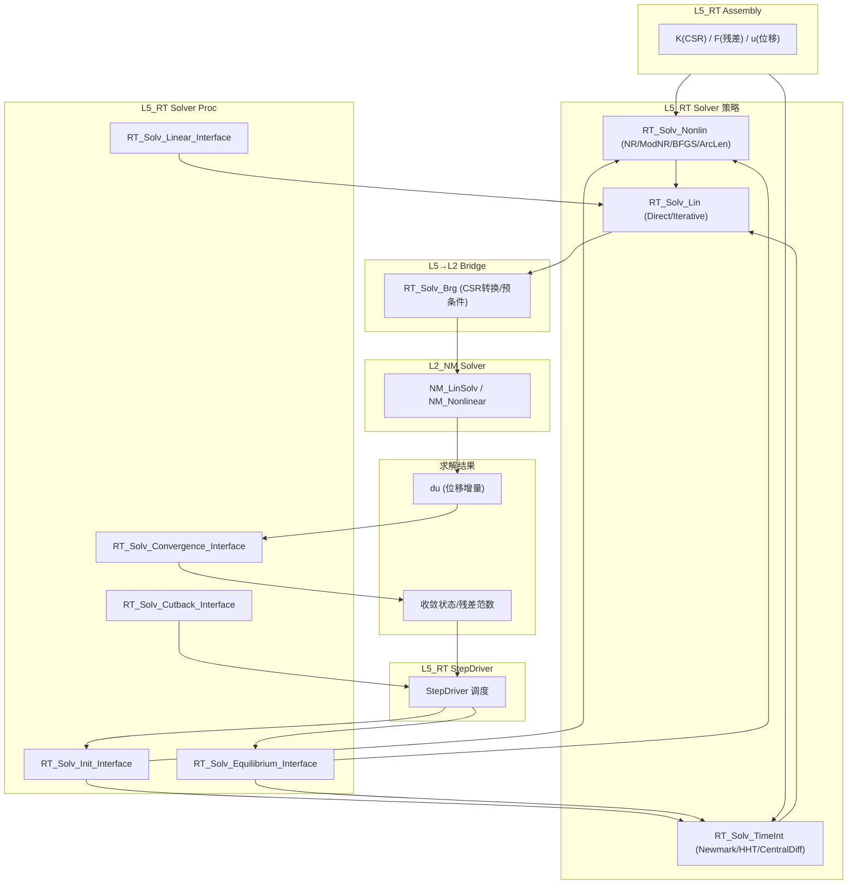
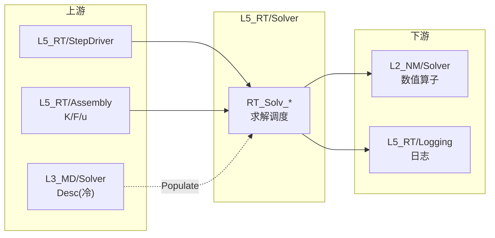

# L5_RT Solver 标准域柱卡

**域路径**：`L5_RT/Solver`（L5 专属域，不跨 L3/L4）  
**角色**：S5 单层型 — 求解器调度层（线性/非线性/时间积分），封装 L2_NM 数值库为物理语义接口  
**文档日期**：2026-04-28  
**柱型**：单层（S5：仅 L5_RT，L3/L4 无独立 Solver 域目录）

---

## 0. 源文件与权威入口核对

| 项 | 说明 |
|----|------|
| 合同卡 | `L5_RT/Solver/CONTRACT.md` |
| 设计文档 | `DESIGN_Solv_FourTypes.md`、`DESIGN_Solver_Domain.md`、`DESIGN_Solver_Domain_Detail.md` |
| 上游合同 | `L2_NM/Solver/CONTRACT.md`（底层数值求解器） |
| 闭环测试 | 待建 |

### 0.1 L5_RT/Solver 源文件清单

| 文件 | 大小 | 状态 | 角色 |
|------|------|------|------|
| `RT_Solv_Def.f90` | 26.2KB | **ACTIVE** | **AUTHORITY** — 四型 TYPE 定义（Cfg/DofMap/NRState/Base_Desc） |
| `RT_Solv_Mgr.f90` | 285.3KB | **ACTIVE** | **GOLDEN-LINE** — 生产求解器框架（NR/ModNR/LBFGS/ArcLen/Newmark/Explicit/Ctx/Coordinator） |
| `RT_Solv_Nonlin.f90` | 48.1KB | **ACTIVE** | 非线性求解核（NR/Modified NR/Quasi-Newton/ArcLen/LineSearch） |
| `RT_Solv_TimeInt.f90` | 50.0KB | **ACTIVE** | 时间积分（Newmark/HHT-α/GenAlpha/Central Difference/Explicit） |
| `RT_Solv_Brg.f90` | 35.7KB | **ACTIVE** | L2↔L5 桥接（CSR 转换/预条件/线性求解统一入口） |
| `RT_Solv_Sparse.f90` | 21.1KB | **ACTIVE** | CSR 稀疏矩阵操作（Triplet→CSR/SpMV/LU） |
| `RT_Solv_ContResidual.f90` | 14.8KB | **ACTIVE** | 接触残差装配与收敛检查 |
| `RT_Solv_Impl.f90` | 14.5KB | **ACTIVE** | 求解实现分派（Init/Equilibrium/Linear/Convergence/Cutback） |
| `RT_Solv_Proc.f90` | 13.9KB | **ACTIVE** | SIO Proc 入口（结构化 _In/_Out 接口） |
| `RT_Solv_CoreMemPool.f90` | 13.2KB | **ACTIVE** | 核心内存池管理 |
| `RT_Solv_Lin.f90` | 12.0KB | **ACTIVE** | 线性求解策略选择（Direct/Iterative） |
| `RT_Solv_ABAQUSReg.f90` | 10.4KB | **ACTIVE** | ABAQUS 求解器注册表（按 ID/Keyword 查询） |
| `RT_Solv_Core.f90` | 8.8KB | **ACTIVE** | 求解器核心门面 |
| `RT_AI_ConvPredictAlgo.f90` | 7.9KB | **ACTIVE** | AI 收敛预测算法（插槽 7 经由 L5 编排） |
| `RT_Asm_DofMapUtils.f90` | 2.7KB | **ACTIVE** | DOF 映射工具（EqId 查询） |

**L5 小计**：15 个活跃 .f90 文件

### 0.2 Coupling 子域源文件清单

| 文件 | 大小 | 状态 | 角色 |
|------|------|------|------|
| `Coupling/RT_MF_Def.f90` | 29.4KB | **ACTIVE** | 多场耦合类型定义 |
| `Coupling/RT_MF_Coordinator.f90` | 22.5KB | **ACTIVE** | 多场耦合协调器 |
| `Coupling/RT_MF_Brg.f90` | 4.4KB | **ACTIVE** | 多场耦合桥接 |
| `Coupling/CONTRACT.md` | 4.5KB | **ACTIVE** | 耦合子域合同 |

**Coupling 小计**：3 个活跃 .f90 文件

---

## 1. 域职责十件套

| # | 项 | Solver 落地要点 |
|---|----|-----------------|
| 1 | **域定位** | L5 单层型(S5)：求解器调度层，封装 L2_NM 数值算子为物理语义接口，被 StepDriver 编排调用。 |
| 2 | **职责边界** | **负责**：线性求解器调度(Direct/Iterative)、非线性求解(NR/ModNR/BFGS/ArcLen)、时间积分(Newmark/HHT/CentralDiff/GenAlpha)、CSR 稀疏操作、收敛判据、接触残差装配、求解器注册、AI 收敛预测编排。**禁止**：矩阵底层算法实现（委托 L2_NM）；全局矩阵装配（委托 Assembly）；物理模型知识（委托 L4_PH）；分析步类型定义（委托 StepDriver）。 |
| 3 | **功能模块** | 见 Section 4 `.f90` 清单。 |
| 4 | **四型 TYPE** | 见 Section 3 四型裁剪。 |
| 5 | **公开接口** | Init/Equilibrium/Linear/Convergence/Cutback(Proc 层) + NR/ModNR/BFGS/ArcLen(Nonlin) + Newmark/HHT/CentralDiff(TimeInt) + Direct/Iterative(Lin) + CSR/Triplet/LU(Sparse) + SolverSys 结构化入口。 |
| 6 | **数据所有权** | L5 持有求解器运行时状态(NRState/SolverState/TimeIntState/CSR)；消费 Assembly 产出的 K/F/u；不持有 L3 Desc 真源。 |
| 7 | **依赖规则** | 允许：消费 L2_NM Solver 线性/非线性求解能力；消费 Assembly 全局 CSR/向量。禁止：步内热路径直读 L3 深层容器（**热路径零 L3**）。 |
| 8 | **合同卡** | `CONTRACT.md`（本域）+ `Coupling/CONTRACT.md`（耦合子域）。 |
| 9 | **Harness 验收** | 见 Section 6。 |
| 10 | **扩展点** | 新求解策略：通过 `RT_Solv_Nonlin` 增加非线性策略；新时间积分：通过 `RT_Solv_TimeInt` 增加积分方案；AI 增强：通过 AI 插槽(5/6/7)经 L5 编排。 |

---

## 2. 域柱定位与主链

Solver 是 S5 单层型域（仅 L5_RT），作为 StepDriver 与 L2_NM 数值库之间的桥梁：

| 层 | 职责 | 禁止 |
|----|------|------|
| L2_NM | 底层数值算子：LU/Cholesky/GMRES/CG/BiCGSTAB、预处理、SVD | 物理语义/步控制 |
| L5_RT | 求解器调度：策略选择、收敛判据、时间积分编排、CSR 管理、AI 编排 | 矩阵底层实现/物理模型/全局装配 |

主链：

```text
StepDriver 调度求解
  → RT_Solv_Proc (SIO 入口)
  → RT_Solv_Impl (策略分派)
  → RT_Solv_Nonlin (非线性迭代: NR/ModNR/BFGS/ArcLen)
     ├→ Assembly 提供 K(CSR) + F(残差)
     ├→ RT_Solv_Lin → RT_Solv_Brg → L2_NM 线性求解
     └→ 收敛检查 → 返回 StepDriver
  → RT_Solv_TimeInt (时间积分: Newmark/HHT/CentralDiff)
     ├→ 预测 → Assembly 装配 → 校正
     └→ 状态更新 → 返回 StepDriver
```

---

## 3. 四型裁剪决策

| 层 | Desc | State | Algo | Ctx |
|----|------|-------|------|-----|
| L5 | RETAINED(`RT_Solv_Cfg`: solver_type/控制参数；`RT_Solv_Base_Desc`: 求解器描述) | RETAINED(`RT_Solv_NRState`: 迭代索引/残差范数；`UF_TimeIntState`: 时间积分状态；`UF_EnergyState`: 能量) | RETAINED(NR/ModNR/BFGS/ArcLen 策略；Newmark-β/HHT-α/CentralDiff/GenAlpha) | RETAINED(`RT_Sol_DofMap`: DOF 映射；`UF_CoreMemPool_t`: 内存池；`RT_NLSolver_Args`: 非线性上下文) |

设计详情：`DESIGN_Solv_FourTypes.md`

---

## 4. .f90 功能模块清单

### 4.1 核心模块

| 文件 | 后缀 | 模块命名 | 职责 | 现有 |
|------|------|----------|------|------|
| `RT_Solv_Def.f90` | Def | `RT_Solv_Def` | **AUTHORITY** — 四型 TYPE：`RT_Solv_Cfg`/`SolCfg`/`SolDofMap`/`RT_Solv_Base_Desc`/`RT_Solv_NRState` + TBP | Y |
| `RT_Solv_Mgr.f90` | Mgr | `RT_Solv_Mgr` | **GOLDEN-LINE** — 生产求解框架：IncMgr/IterMgr/SolverSys/SolverCoordinator/Ctx 管理/Newmark 编排/显式动力/组装分派 | Y |
| `RT_Solv_Nonlin.f90` | Nonlin | `RT_Solv_Nonlin` | 非线性求解核：NR/Modified NR/Quasi-Newton(BFGS)/ArcLen/LineSearch/统一入口 | Y |
| `RT_Solv_TimeInt.f90` | TimeInt | `RT_Solv_TimeInt` | 时间积分：Newmark-β/HHT-α/GenAlpha/Central Difference/Explicit/自适应步长 | Y |
| `RT_Solv_Brg.f90` | Brg | `RT_Solv_Brg` | L2↔L5 桥接：CSR 格式转换/预条件创建/线性求解统一/AGMG/SparsePak/配置映射 | Y |
| `RT_Solv_Proc.f90` | Proc | `RT_Solv_Proc` | SIO Proc 入口：Init/Equilibrium/Linear/Convergence/Cutback（_In/_Out 结构化IO） | Y |
| `RT_Solv_Impl.f90` | Impl | `RT_Solv_Impl` | 实现分派：Init/Equilibrium/SolveLinearSystem/ApplyLineSearch/Linear/Convergence/Cutback | Y |
| `RT_Solv_Core.f90` | Core | `RT_Solv_Core` | 求解器核心门面 | Y |

### 4.2 稀疏/线性/接触

| 文件 | 后缀 | 模块命名 | 职责 | 现有 |
|------|------|----------|------|------|
| `RT_Solv_Sparse.f90` | Sparse | `RT_Solv_Sparse` | CSR 稀疏操作：Triplet→CSR/BlockCSR/LU 分解/SpMV/AddToValue | Y |
| `RT_Solv_Lin.f90` | Lin | `RT_Solv_Lin` | 线性求解策略选择：Direct/Iterative 统一分派 | Y |
| `RT_Solv_ContResidual.f90` | ContRes | `RT_Solv_ContResidual` | 接触残差：全局残差装配/接触状态更新/收敛检查 | Y |

### 4.3 工具/注册/AI

| 文件 | 后缀 | 模块命名 | 职责 | 现有 |
|------|------|----------|------|------|
| `RT_Solv_CoreMemPool.f90` | MemPool | `RT_Solv_CoreMemPool` | 内存池：DP1D/Int1D 分配/释放/复用 | Y |
| `RT_Solv_ABAQUSReg.f90` | Reg | `RT_Solv_ABAQUSReg` | ABAQUS 求解器注册表：按 ID/Keyword/Capabilities 查询/打印/验证 | Y |
| `RT_Asm_DofMapUtils.f90` | Utils | `RT_Asm_DofMapUtils` | DOF 映射工具：`UF_GetEqId`/`RT_GetEqId` | Y |
| `RT_AI_ConvPredictAlgo.f90` | AI | `RT_AI_ConvPredictAlgo` | AI 收敛预测：Init/Finalize/Update/Predict（插槽 7 经 L5 编排） | Y |

### 4.4 Coupling 子域

| 文件 | 后缀 | 模块命名 | 职责 | 现有 |
|------|------|----------|------|------|
| `Coupling/RT_MF_Def.f90` | Def | `RT_MF_Def` | 多场耦合类型定义 | Y |
| `Coupling/RT_MF_Coordinator.f90` | Coord | `RT_MF_Coordinator` | 多场耦合协调器 | Y |
| `Coupling/RT_MF_Brg.f90` | Brg | `RT_MF_Brg` | 多场耦合桥接 | Y |

---

## 5. 数据生命周期图



**文字要点**：

1. **调度(Step)**：StepDriver 通过 `RT_Solv_Proc` SIO 入口调度求解。
2. **策略选择(Impl)**：根据分析类型分派到非线性(NR/ModNR/BFGS/ArcLen)或时间积分(Newmark/HHT/CentralDiff)。
3. **装配消费(Assembly)**：每次迭代从 Assembly 获取全局 K(CSR)、F(残差)、u(位移)。
4. **线性求解(LinSolv)**：通过 `RT_Solv_Lin` 选择 Direct/Iterative，经 `RT_Solv_Brg` 桥接至 L2_NM。
5. **收敛判断(Convergence)**：检查残差范数/位移增量收敛，结果返回 StepDriver。
6. **回切(Cutback)**：不收敛时返回 status，由 StepDriver 决策回切。

---

## 6. Harness 验收项

| 类别 | 验收项 |
|------|--------|
| **命名** | `RT_Solv_*`(主域) / `RT_MF_*`(Coupling) / `RT_AI_*`(AI) 前缀与层域一致；`check_naming.py` 通过。 |
| **依赖/架构** | 步内热路径禁止 `USE` L3 深层容器（**热路径零 L3**）；`arch_guardian.py` 通过。 |
| **合同** | `CONTRACT.md` 存在且与公开过程签名一致。 |
| **L2 桥接** | `RT_Solv_Brg` CSR 格式转换与 L2_NM 接口对齐；预条件创建/销毁完整。 |
| **非线性收敛** | NR/ModNR/BFGS 迭代正确收敛；ArcLen 弧长约束方程正确。 |
| **时间积分** | Newmark-β/HHT-α 稳定性参数正确；Central Difference 时间步满足 CFL 条件。 |
| **错误传播** | 不使用 `STOP`；错误通过 `ErrorStatusType` 传播至 StepDriver。 |
| **SIO 合规** | `RT_Solv_Proc.f90` 使用 `_In/_Out` 结构化IO。 |

**工具入口**

- `scripts/ci/check_naming.py`
- `tools/arch_guardian.py`
- `ufc_harness/run_harness.py`

---

## 7. 清旧资产台账

### 7.1 后续任务触发表

| ID | 任务 | 触发条件 | 优先级 |
|----|------|----------|--------|
| `Solv-Mgr-Split` | RT_Solv_Mgr 拆分 | 文件已超 285KB，维护负担过大 | 高优 |
| `Solv-TimeInt-Split` | RT_Solv_TimeInt 独立子域化 | 新增积分方案导致文件过大 | 触发式 |
| `Solv-Riks-Restore` | Riks/特征值/屈曲求解恢复 | 产品需求出现时 | 触发式 |
| `Solv-Test-Suite` | 求解器闭环测试建设 | 基础闭环完成后 | 计划式 |
| `Solv-AI-Slot567` | AI 插槽 5/6/7 生产化 | AI 训练侧就绪后 | 触发式 |

### 7.2 冻结规则

| 规则 | 说明 |
|------|------|
| `RT_Solv_Def.f90` 四型 TYPE 签名冻结 | `RT_Solv_Cfg`/`NRState`/`DofMap` 字段新增需域审批 |
| `RT_Solv_Proc.f90` SIO 入口冻结 | Init/Equilibrium/Linear/Convergence/Cutback 签名稳定 |
| L2 桥接接口冻结 | `RT_Solv_Brg` 统一求解入口签名稳定 |

---

## 附录 A：域际关系

| 编号 | 对端域 | 方向 | 关系类型 | 主要接触面 | 热路径 |
|------|--------|------|----------|------------|--------|
| R1 | L5_RT/StepDriver | 上游 | S(被调度) | StepDriver 调用求解 Proc | — |
| R2 | L5_RT/Assembly | 上游 | T(合同) | 消费 K(CSR)/F(残差)/u(位移) | **是** |
| R3 | L2_NM/Solver | 下游 | U(USE) | 线性求解/非线性求解数值算子 | **是** |
| R4 | L5_RT/Logging | 下游 | S(消费) | 记录收敛/残差/迭代日志 | 部分 |
| R5 | L3_MD/Analysis/Solver | 上游(冷) | T+B | `MD_Solver_Desc` 消费(via Populate) | 否 |
| R6 | L1_IF/Error | 基础 | U(USE) | 错误码定义与传播 | — |
| R7 | L1_IF/Prec | 基础 | U(USE) | wp/i4 精度参数 | — |



---

## 附录 B：四链说明

| 链 | 本域可核对说明 |
|----|---------------|
| **理论链** | Newton-Raphson: K·Δu = −R → 迭代直至 ‖R‖ < tol；弧长法: ‖Δu‖² + ψ·Δλ² = Δs²；Newmark-β: Mü + Cu̇ + Ku = F，β/γ 参数控制稳定性 |
| **逻辑链** | StepDriver → RT_Solv_Proc(SIO) → RT_Solv_Impl(分派) → Nonlin/TimeInt → RT_Solv_Lin → RT_Solv_Brg → L2_NM LinSolv → 收敛判据 → 返回 StepDriver |
| **计算链** | 全局 K(CSR) + F → L2 LinSolv → Δu → 残差更新 → 收敛检查；时间积分: 预测 → 装配 → 校正 → 状态更新 |
| **数据链** | `RT_Solv_Cfg`(冷配置) + `RT_Sol_DofMap`/`RT_CSRMatrix`(Assembly 产) → Solver 消费 → `u`/`lambda`/`NRState` 输出 |

---

## 附录 C：非线性策略契约

| 策略 | 典型迭代内工作 | 对 Assembly 的期望 | 对 UMAT 切线 |
|------|----------------|-------------------|--------------|
| **Newton-Raphson（全切线）** | 每迭代更新 K、R；解 K·Δu = −R | 每迭代完整切线 + 残差 | 一致切线 |
| **修正 NR / 常刚度** | 多轮共用同一 K，仅更新 R | 残差每迭代；切线可隔若干迭代 | 可仅在重算 K 的迭代提供 |
| **BFGS / L-BFGS** | 用 secant 更新搜索方向 | 残差每迭代；精确切线可低频 | 可标注为非一致 |
| **弧长（Riks）** | 引入荷载因子 λ；解增广系统 | 外载与 λ 耦合进入全局 R/K | 与 NR 相同或随实现降级 |

---

## 附录 D：AI Enhancement 插槽

| 项 | 插槽 5 | 插槽 6 | 插槽 7 |
|----|--------|--------|--------|
| **名称** | AI_Precond | AI_SparseSolver | AI_AdjointSolver |
| **实体层** | L2_NM | L2_NM | L2_NM |
| **L5 编排** | `RT_SolverSys_SetAI_ConvPredictor` | 经 `RT_Solv_Brg` 路由 | 经 `RT_Solv_Brg` 路由 |
| **默认** | 关闭 | 关闭 | 关闭 (仅训练侧) |

---

## 附录 E：变更日志

| 版本 | 日期 | 变更 |
|------|------|------|
| v1.0 | 2026-04-28 | 初始版本：Solver 域完整十件套域柱卡（S5 单层型） |
