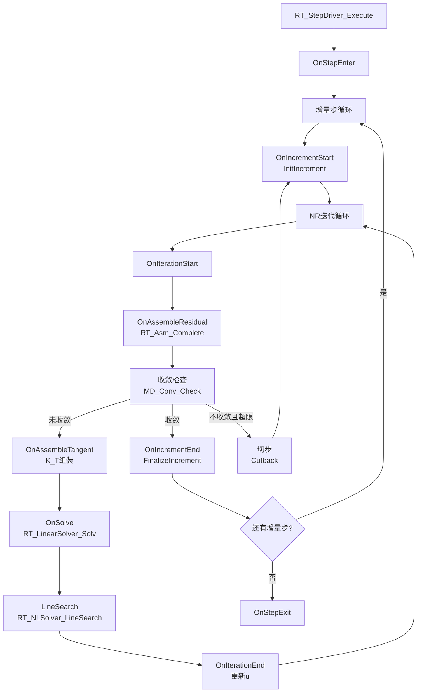
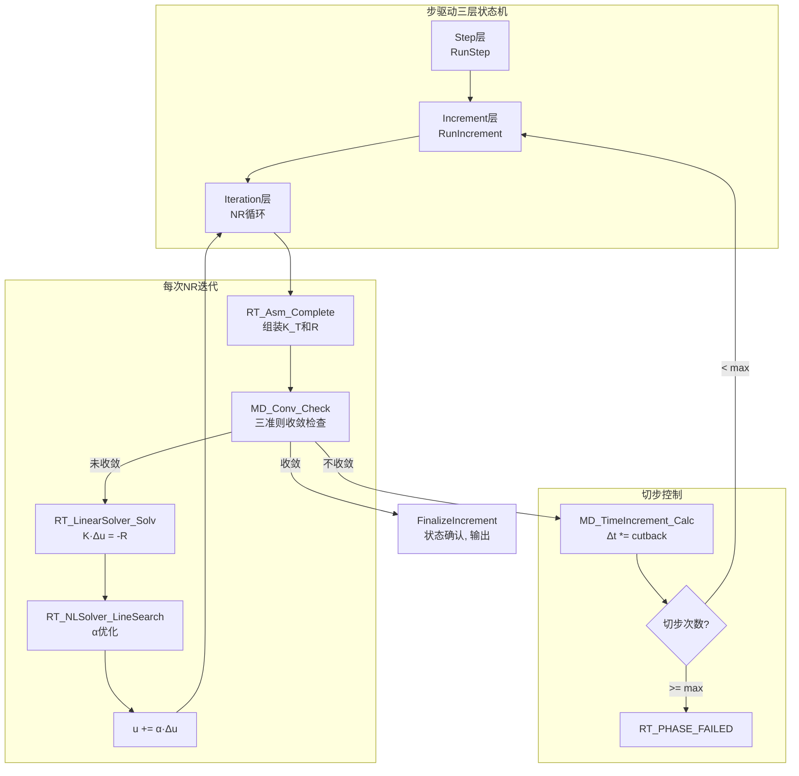

# StepDriver域热路径算法设计

**Layer**: L5_RT | **Domain**: StepDriver | **Version**: v1.0 | **Date**: 2026-04-28  
**依据**: `CONTRACT.md`, Phase A 评估结论 (96% 完整度, L1 直接复用)  
**关联代码**: `RT_Step_Exec.f90` (815行), `RT_Step_Impl.f90`, `RT_Solv_Nonlin.f90` (1143行), `RT_Step_Def.f90`

---

## 1. 设计概要

### 1.1 评估结论

StepDriver 域 **96%** 已实现, L1 直接复用:
- NR迭代: **100%** — `RT_NLSolver_NewtonRaph` + `RT_NLSolver_LineSearch` 完整
- 收敛准则: **98%** — 三准则 (力/位移/能量) 完整 (`MD_Conv_Check`)
- 自动切步: **95%** — `MD_TimeIncrement_Calc` 完整, 多级回退框架完成
- 动力学: **90%** — 显式 (`RT_DynExpl_Run`) + 隐式 (`RT_DynImpl_Run`) 完整

本文档聚焦:
- NR 迭代完整数学流程文档化
- 收敛准则三准则的精确定义
- 自动切步策略的参数配置
- 与 Assembly/Solver 的调度时序

### 1.2 现有资产

| 模块 | 文件 | 核心过程 | 状态 |
|------|------|---------|------|
| 步驱动主入口 | `RT_Step_Exec.f90` | `RT_StepDriver_Execute` | ✅ GOLDEN-LINE |
| 状态机 | `RT_Step_Exec.f90` | `StepStateMachine`, `RunStep`, `RunIncrement` | ✅ 完整 |
| NR求解器 | `RT_Solv_Nonlin.f90` | `RT_NLSolver_NewtonRaph` | ✅ 完整 |
| 线搜索 | `RT_Solv_Nonlin.f90` | `RT_NLSolver_LineSearch` | ✅ 完整 |
| 显式动力 | `RT_Step_Impl.f90` | `RT_DynExpl_Run` | ✅ 完整 |
| 隐式动力 | `RT_Step_Impl.f90` | `RT_DynImpl_Run` | ✅ 完整 |
| CFL控制 | `RT_Step_Impl.f90` | `RT_Dyn_CFL_dt_central_diff` | ✅ 完整 |
| 时间步控制 | `MD_Step_Proc` | `MD_TimeIncrement_Calc` | ✅ 完整 |
| 收敛检查 | `MD_Step_Proc` | `MD_Conv_Check` | ✅ 完整 |
| AI步长控制 | `RT_AI_StepCtrAlgo.f90` | `AI_StepCtr_Predict` | ✅ 框架 |

### 1.3 热路径约束 (CONTRACT §约束分级)

- 不在热路径直触 L3 巨型模块 (硬约束)
- 不使用 STOP, 错误通过 `ErrorStatusType` 传播 (硬约束)
- 步驱动为 Phase 4 核心闭环链链首 (硬约束)

---

## 2. Newton-Raphson完整流程

### 2.1 非线性方程

平衡方程:

$$\mathbf{R}(\mathbf{u}) = \mathbf{F}_{int}(\mathbf{u}) - \mathbf{F}_{ext} = \mathbf{0}$$

其中:
- $\mathbf{F}_{int}(\mathbf{u}) = \sum_e \int_{\Omega_e} \mathbf{B}^T \cdot \boldsymbol{\sigma}(\mathbf{u}) \, d\Omega$ — 内力向量
- $\mathbf{F}_{ext}$ — 外力向量 (由 LoadBC 域提供)

线性化 (Taylor展开):

$$\mathbf{R}(\mathbf{u} + \Delta\mathbf{u}) \approx \mathbf{R}(\mathbf{u}) + \mathbf{K}_T(\mathbf{u}) \cdot \Delta\mathbf{u} = \mathbf{0}$$

切线刚度:

$$\mathbf{K}_T = \frac{\partial \mathbf{R}}{\partial \mathbf{u}} = \frac{\partial \mathbf{F}_{int}}{\partial \mathbf{u}} = \sum_e \int_{\Omega_e} \mathbf{B}^T \cdot \mathbf{D}_{ep} \cdot \mathbf{B} \, d\Omega$$

### 2.2 NR迭代算法

**实现**: `RT_NLSolver_NewtonRaph` (`RT_Solv_Nonlin.f90`)

```fortran
! 伪代码: Newton-Raphson 完整流程
subroutine NR_Solve(model, step, u, converged, status)
  real(wp) :: u(:)          ! 当前位移
  real(wp) :: R(:)          ! 残差向量
  real(wp) :: du(:)         ! 位移增量
  real(wp) :: alpha         ! 线搜索步长

  ! 施加载荷增量
  call Assemble_Fext(step, F_ext)

  do iter = 1, max_iter
    ! (1) 计算残差: R = F_int(u) - F_ext
    call RT_Asm_Complete(model, u, K_T, R)  ! 组装K_T和R
    R = R - F_ext

    ! (2) 收敛检查
    call MD_Conv_Check(R, du, F_ext, conv_criteria, conv_result)
    if (conv_result%converged) then
      converged = .true.
      return
    end if

    ! (3) 求解线性方程组: K_T · du = -R
    call RT_LinearSolver_Solv(K_T, -R, du, status)

    ! (4) 线搜索: 寻找最优步长 alpha
    call RT_NLSolver_LineSearch(model, u, du, R, alpha, status)

    ! (5) 更新位移
    u = u + alpha * du

    ! (6) 更新本构状态 (应力/内变量)
    call UpdateMaterialState(model, u)
  end do

  converged = .false.
end subroutine
```

### 2.3 修正NR与BFGS (策略变体)

| 策略 | 切线更新频率 | 计算量 | 收敛速度 | CONTRACT §非线性策略 |
|------|-------------|--------|---------|---------------------|
| 全NR | 每次迭代 | 高 | 二次 | 默认 |
| 修正NR | 仅首次迭代 | 低 | 线性 | 支持 |
| BFGS | 秩-2更新 | 中 | 超线性 | 框架预留 |
| 弧长法 | Riks增广 | 中高 | 二次 | 预留 |

---

## 3. 收敛判据 (三准则)

### 3.1 力准则 (残差准则)

$$\frac{\|\mathbf{R}\|}{\|\mathbf{F}_{ext}\|} < \text{tol}_f$$

典型容差: $\text{tol}_f = 5 \times 10^{-3}$

分子: $\|\mathbf{R}\| = \sqrt{\sum_i R_i^2}$ (L2范数)  
分母: $\|\mathbf{F}_{ext}\| = \max(\sqrt{\sum_i F_{ext,i}^2}, \, \epsilon_{min})$ (防除零)

### 3.2 位移准则

$$\frac{\|\Delta\mathbf{u}\|}{\|\mathbf{u}\|} < \text{tol}_u$$

典型容差: $\text{tol}_u = 10^{-2}$

### 3.3 能量准则

$$\frac{|\Delta\mathbf{u}^T \cdot \mathbf{R}|}{|\Delta\mathbf{u}_1^T \cdot \mathbf{R}_1|} < \text{tol}_e$$

典型容差: $\text{tol}_e = 10^{-2}$

分子: 当前迭代的位移增量与残差的内积 (增量功)  
分母: 第1次迭代的增量功 (归一化)

### 3.4 组合模式

**实现**: `MD_Conv_Check` 支持三种组合 (`RT_StepDriver_Config%conv_combination_mode`):

| 模式 | 常量 | 逻辑 |
|------|------|------|
| AND | `CONV_MODE_AND` | 所有准则同时满足 |
| OR | `CONV_MODE_OR` | 任一准则满足 |
| WEIGHTED | `CONV_MODE_WEIGHTED` | 加权评分 |

---

## 4. 自动切步策略

### 4.1 时间步控制

**实现**: `MD_TimeIncrement_Calc` (`MD_Step_Proc`)

**成功增量后**:

$$\Delta t_{n+1} = \min(\Delta t_n \cdot \alpha_{grow}, \, \Delta t_{max})$$

其中增长因子 $\alpha_{grow}$ 基于迭代次数:

$$\alpha_{grow} = \begin{cases}
2.0 & \text{if } n_{iter} \leq n_{opt}/2 \\
1.5 & \text{if } n_{iter} \leq n_{opt} \\
1.0 & \text{if } n_{iter} > n_{opt}
\end{cases}$$

$n_{opt}$: 目标迭代次数 (典型 $n_{opt} = 5$)

**失败增量后**:

$$\Delta t_{n+1} = \Delta t_n \cdot \alpha_{cut}, \quad \alpha_{cut} \in [0.25, 0.5]$$

### 4.2 多级回退 (Bisection)

**实现**: `RT_StepDriver_Execute` 中切步逻辑 (L289-291: `consecutive_cutbacks`, `max_cutbacks`)

```fortran
! 伪代码: 多级回退
if (.not. converged) then
  consecutive_cutbacks = consecutive_cutbacks + 1
  if (consecutive_cutbacks > max_cutbacks) then
    ! 步彻底失败
    result%phase = RT_PHASE_FAILED
    return
  end if
  ! 回退位移到上一步
  u = u_old
  ! 切步
  dt = dt * cutback_factor  ! cutback_factor ∈ [0.25, 0.5]
  if (dt < dt_min) then
    result%phase = RT_PHASE_FAILED
    return
  end if
  cycle  ! 重新尝试本增量步
end if
```

### 4.3 基于迭代次数的自适应

| 条件 | 动作 | 参数 |
|------|------|------|
| $n_{iter} \leq \lfloor n_{opt}/2 \rfloor$ | 激进增长 | $\Delta t \times 2.0$ |
| $\lfloor n_{opt}/2 \rfloor < n_{iter} \leq n_{opt}$ | 温和增长 | $\Delta t \times 1.5$ |
| $n_{opt} < n_{iter} \leq n_{max}$ | 保持 | $\Delta t \times 1.0$ |
| 不收敛 | 切步 | $\Delta t \times 0.25 \sim 0.5$ |
| 连续切步 $> 5$ | 终止 | `RT_PHASE_FAILED` |

---

## 5. 线搜索

### 5.1 目标函数

寻找 $\alpha \in (0, 1]$ 使能量函数最小:

$$g(\alpha) = \Delta\mathbf{u}^T \cdot \mathbf{R}(\mathbf{u} + \alpha \cdot \Delta\mathbf{u})$$

### 5.2 算法

**实现**: `RT_NLSolver_LineSearch` (`RT_Solv_Nonlin.f90`)

```fortran
! 伪代码: 线搜索
subroutine LineSearch(model, u, du, R0, alpha_out)
  real(wp) :: alpha, g0, g1, alpha_lo, alpha_hi

  g0 = dot_product(du, R0)       ! g(0): 初始斜率
  alpha = 1.0_wp                 ! 全步

  do iter = 1, max_ls_iter
    u_trial = u + alpha * du
    call ComputeResidual(model, u_trial, R_trial)
    g1 = dot_product(du, R_trial) ! g(alpha)

    ! Armijo条件: g(alpha) <= c1 * g(0)
    if (abs(g1) <= c1 * abs(g0)) then
      alpha_out = alpha
      return
    end if

    ! 二分法回退
    alpha = alpha * 0.5_wp
  end do

  alpha_out = alpha
end subroutine
```

典型参数: $c_1 = 10^{-4}$ (Armijo), 最大线搜索迭代 = 10

---

## 6. 与Assembly/Solver的调度关系

### 6.1 调度时序 (Runner钩子)



### 6.2 与域级的调用关系

| 步骤 | StepDriver调用 | 被调用域 | 说明 |
|------|---------------|---------|------|
| 组装 K/R | `RT_Asm_Complete` | Assembly → Element → Material | 切线+残差 |
| 施加 BC | `RT_Asm_Ldbc_Apply` | Assembly → LoadBC | F_ext + Dirichlet |
| 施加接触 | `RT_Cont_Solv` | Assembly → Contact | K_c + f_c |
| 线性求解 | `RT_LinearSolver_Solv` | Solver | K·Δu = -R |
| 时间积分 | `RT_DynImpl_Run` / `RT_DynExpl_Run` | StepDriver/Impl | Newmark/Central Diff |
| 场更新 | Field Compute | Field | 温度/孔压/浓度 |
| 输出 | `RT_Out_UnifMgr` | Output | 结果输出 |

---

## 7. 动力学时间积分

### 7.1 Central Difference (显式)

$$\mathbf{v}_{n+1/2} = \mathbf{v}_{n-1/2} + \Delta t \cdot \mathbf{M}^{-1} \cdot \mathbf{F}_n$$
$$\mathbf{u}_{n+1} = \mathbf{u}_n + \Delta t \cdot \mathbf{v}_{n+1/2}$$

CFL 稳定性:

$$\Delta t \leq \Delta t_{cfl} = \frac{c_{safety}}{\omega_{max}}, \quad \omega_{max} = \sqrt{\frac{K_{max}}{M_{min}}}$$

**实现**: `RT_DynExpl_Run` + `RT_Dyn_CFL_dt_central_diff` + `RT_Dyn_Estimate_omega_max_csr_lumped`

### 7.2 Newmark / HHT-α (隐式)

$$\mathbf{u}_{n+1} = \mathbf{u}_n + \Delta t \cdot \dot{\mathbf{u}}_n + \frac{\Delta t^2}{2} [(1-2\beta) \cdot \ddot{\mathbf{u}}_n + 2\beta \cdot \ddot{\mathbf{u}}_{n+1}]$$
$$\dot{\mathbf{u}}_{n+1} = \dot{\mathbf{u}}_n + \Delta t [(1-\gamma) \cdot \ddot{\mathbf{u}}_n + \gamma \cdot \ddot{\mathbf{u}}_{n+1}]$$

典型参数: $\beta = 1/4$, $\gamma = 1/2$ (无条件稳定, 梯形规则)

**实现**: `RT_DynImpl_Run` (含 Newton 内循环)

---

## 8. 数据流图



---

## 9. 完善点清单

| 项目 | 当前状态 | 需完善 | 工期 |
|------|---------|--------|------|
| NR完整流程 | ✅ 完整 | 无 | 0天 |
| 三准则收敛 | ✅ 完整 | 无 | 0天 |
| 自动切步 | ✅ 95% | 多级回退日志增强 | 0.5天 |
| 线搜索 | ✅ 完整 | 无 | 0天 |
| 显式动力学 | ✅ 完整 | 无 | 0天 |
| 隐式动力学 | ✅ 完整 | 无 | 0天 |
| 弧长法 | ⚠️ 预留 | 后续按需 | — |
| AI步长控制 | ✅ 框架 | 策略增强 | — |
| **合计** | 96% | — | **0-1天** |
