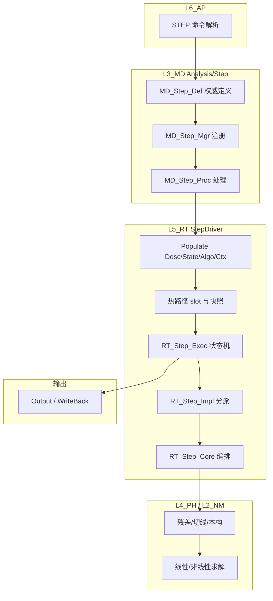

# L5_RT / StepDriver 标准域柱卡

**域路径**：`L3_MD/Analysis/Step`(模型层) -> L4 无独立域(调用L4物理核) -> `L5_RT/StepDriver`(运行时层)  
**角色**：H1 半柱域 -- 步定义真源(L3/Analysis/Step)、无独立L4域(消费式调用)、步驱动运行时(L5)  
**文档日期**：2026-04-28  
**柱型**：半柱（L4 无独立域目录，L5 为主体域）

---

## 0. 源文件与权威入口核对

| 项 | 说明 |
|----|------|
| 合同卡 | `L3_MD/Analysis/Step/CONTRACT.md`、`L5_RT/StepDriver/CONTRACT.md` |
| DESIGN | `L5_RT/StepDriver/DESIGN_Step_FourTypes.md` |
| 标准域卡参照 | `UFC/docs/05_Project_Planning/PPLAN/StepDriver_标准域卡.md`（模板样板） |
| 闭环测试 | `tests/TEST_StepDriver_L3_L5_Closure.f90`（计划中） |

---

## 1. 域职责十件套

| # | 项 | StepDriver 落地要点 |
|---|----|---------------------|
| 1 | **域定位** | L3/L5 半柱域：L3 保存分析步定义真源(Analysis/Step)，L5 承担步/增量/迭代状态机运行时编排，L4 无独立域(被调用方)。 |
| 2 | **职责边界** | **L3 负责**：步类型/时间配置/求解器配置Desc权威。**L5 负责**：步/增量/迭代状态机、时间步策略、收敛/切步编排、Populate后slot热路径消费、输出写回衔接。**禁止**：L5 步内热路径直读L3；L3 执行求解算法。 |
| 3 | **功能模块** | 见 Section 4 `.f90` 清单。 |
| 4 | **四型 TYPE** | **Desc**：`MD_Step_Desc`(L3权威)/`RT_Step_Desc`(L5 Populate)。**State**：`RT_Step_State`(步/增量/迭代/收敛)。**Algo**：`RT_Step_Algo`(容差/最大迭代/步长策略)。**Ctx**：`RT_Step_Ctx`(工作向量/内存池/临时标量)。 |
| 5 | **公开接口** | L3 = Def/Mgr/Proc/Sync；L5 = Def/Ctx/WS/Exec/Impl/Core/Brg。 |
| 6 | **数据所有权** | L3 持有步定义权威；Populate后L5持有运行期四型与快照；步内热路径不反向直读L3。 |
| 7 | **依赖规则** | 允许：L5经合同指向L4 `PH_*_Domain`、L2 `NM_*`、L1错误/内存/日志。禁止：步内热路径中`USE`深层L3模型容器。 |
| 8 | **合同卡** | L3/L5各维护`CONTRACT.md`。 |
| 9 | **Harness 验收** | 见 Section 6。 |
| 10 | **扩展点** | 新分析类型/新时间积分器：通过Impl分派扩展；合同版本号递增；保持Exec状态机语义稳定。 |

---

## 2. 域柱定位与主链

StepDriver 是 H1 半柱域：L3 保存步定义真源，L5 为运行时主体域，L4 无独立StepDriver域（L5直接调用L4物理核）。

| 层 | 职责 | 禁止 |
|----|------|------|
| L3_MD | 步定义真源：步类型/时间配置/求解器配置/步序列 | 执行求解算法 |
| L4_PH | (无独立域)被L5调用的残差/切线/本构物理核 | N/A |
| L5_RT | 步驱动运行时：状态机/增量循环/迭代控制/收敛切步/输出写回 | 步内热路径直读L3 |

主链：

```text
L6_AP STEP命令解析
  -> L3_MD MD_Step_Def/Mgr 权威定义
  -> L5_RT Populate Desc/State/Algo/Ctx
  -> L5_RT RT_Step_Exec 状态机
  -> L5_RT RT_Step_Impl 分派(静力/显式/隐式)
  -> L4_PH 残差/切线 物理核调用
  -> L2_NM 线性/非线性求解
  -> L5_RT Output/WriteBack
```

---

## 3. 四型裁剪决策

| 层 | Desc | State | Algo | Ctx |
|----|------|-------|------|-----|
| L3 | RETAINED(`MD_Step_Desc`) | RETAINED(`MD_Step_State`) | RETAINED(`MD_Step_Algo`) | TRIMMED |
| L4 | N/A(无独立域) | N/A | N/A | N/A |
| L5 | DELEGATED->L3(via Populate) | RETAINED(`RT_Step_State`) | RETAINED(`RT_Step_Algo`) | RETAINED(`RT_Step_Ctx`) |

---

## 4. .f90 功能模块清单（两层分列）

### 4.1 L3_MD/Analysis/Step（真源层）

| 文件 | 后缀 | 模块命名 | 职责 | 现有 |
|------|------|----------|------|------|
| `MD_Step_Def.f90` | Def | `MD_Step_Def` | 步TYPE/类型枚举/时间配置Desc权威 | Y |
| `MD_Step_Mgr.f90` | Mgr | `MD_Step_Mgr` | 步容器与注册/查询/生命周期管理 | Y |
| `MD_Step_Proc.f90` | Proc | `MD_Step_Proc` | 步处理编排流程 | Y |
| `MD_Step_Sync.f90` | Sync | `MD_Step_Sync` | 步同步（多域步定义一致性） | Y |

### 4.2 L4_PH（无独立StepDriver域）

StepDriver 不拥有 L4 独立域目录。L5 直接通过合同调用以下 L4 域：

| L4 被调用域 | 调用性质 |
|-------------|----------|
| `L4_PH/Material/PH_Mat_*` | 本构状态更新/切线计算 |
| `L4_PH/Element/PH_Elem_*` | 残差/刚度矩阵装配 |
| `L4_PH/Field/PH_Field_*` | 场方程贡献 |
| `L4_PH/Contact/PH_Cont_*` | 接触力贡献 |
| `L4_PH/LoadBC/PH_LBC_*` | 荷载/边界条件施加 |

### 4.3 L5_RT/StepDriver（运行时主体层）

| 文件 | 后缀 | 模块命名 | 职责 | 现有 |
|------|------|----------|------|------|
| `RT_Step_Def.f90` | Def | `RT_Step_Def` | L5四大TYPE定义(Desc/State/Algo/Ctx) | Y |
| `RT_Step_Ctx.f90` | Ctx | `RT_Step_Ctx` | 上下文快照构建/销毁(MeshSnapshot/DOF映射) | Y |
| `RT_Step_WS.f90` | WS | `RT_Step_WS` | 工作空间管理(Job级/线程级/结构化WS) | Y |
| `RT_Step_Exec.f90` | Exec | `RT_Step_Exec` | 执行驱动与状态机(步/增量/迭代循环) | Y |
| `RT_Step_Impl.f90` | Impl | `RT_Step_Impl` | 算法分派(静力/显式/隐式动力学实现) | Y |
| `RT_Step_Core.f90` | Core | `RT_Step_Core` | 初始化/清理/分发核心逻辑 | Y |
| `RT_Step_Brg.f90` | Brg | `RT_Step_Brg` | 跨层桥接接口(L5↔L4/L2) | Y |
| `RT_AI_StepCtrAlgo.f90` | AI | `RT_AI_StepCtrAlgo` | AI步长控制(插槽①) | Y |

---

## 5. 数据生命周期图



---

## 6. Harness 验收项

| 类别 | 验收项 |
|------|--------|
| **命名** | `MD_Step_*`(L3) / `RT_Step_*`(L5) 前缀与层域一致。 |
| **依赖/架构** | 步内热路径禁止`USE`L3深层容器；Bridge与层间边符合仓库规则。 |
| **合同** | L3/L5 `CONTRACT.md` 存在且源码匹配。 |
| **状态机** | INIT→INCREMENT→CONVERGED/CUTBACK/FAILED 覆盖；切步后状态可恢复。 |
| **路径** | 至少一条静态隐式、一条显式动力学最小用例通过。 |
| **金线闭环** | L6 STEP → L3 MD_Step → L5 Populate → Exec → L4/L2 → Output 验证。 |

---

## 7. 清旧资产台账

| 旧资产 | 决策 | 理由 |
|--------|------|------|
| `StepDriver_标准域卡.md`（`docs/05_Project_Planning/PPLAN`） | 保留为参照模板 | 本域柱卡与之内容对齐，以域内版本为准 |
| `RT_StepDriver_Types.f90`(旧名) | 已重命名为`RT_Step_Def.f90` | 统一后缀命名规范 |
| `RT_StepDriver_Ctx/Exec/Impl.f90`(旧名) | 已重命名为`RT_Step_*.f90` | 缩短域缩写 StepDriver→Step |

**后续任务**：

| ID | 任务 | 触发条件 | 优先级 |
|----|------|----------|--------|
| `Step-AI-01` | AI步长控制插槽验证 | RT_AI_StepCtrAlgo功能完善后 | 触发式 |
| `Step-Explicit-01` | 显式动力学CFL/频率验证 | 显式分析完整闭环时 | 触发式 |
| `Step-Output-01` | 步完成→输出写回合同稳定 | Output域定稿后 | 触发式 |

**冻结规则**：`RT_Step_Def.f90` 中四大TYPE签名冻结，字段新增需域审批。

---

## 8. 域间关系表

| 关系类型 | 从 | 到 | 机制 |
|----------|----|----|------|
| **包含** | `L3_MD/Analysis` | `Step/` | 子域目录与模块前缀`MD_Step_*` |
| **包含** | `L5_RT` | `StepDriver/` | 目录与模块前缀`RT_Step_*` |
| **数据** | `L3_MD` | `L5_RT` | Populate：L3 Step Desc → L5 Desc/State/Algo/Ctx |
| **接口** | `L6_AP` | `StepDriver` | 命令/作业提交分析步配置 |
| **执行** | `StepDriver` | `L4_PH` | 残差/切线等物理核调用 |
| **执行** | `StepDriver` | `L2_NM` | 线性/非线性求解调用 |
| **执行** | `StepDriver` | `L5_RT/Output` | 结果写回与步完成语义 |
| **消费** | `StepDriver` | `Material` | 调用材料本构更新 |
| **消费** | `StepDriver` | `Element` | 调用单元残差/刚度装配 |
| **消费** | `StepDriver` | `Contact` | 调用接触力计算 |
| **消费** | `StepDriver` | `LoadBC` | 调用荷载/边界条件施加 |
| **消费** | `StepDriver` | `Field` | 调用场方程贡献 |

---

## 附录A：StepDriver 分析类型分派表

| 分析类型 | Impl 分派入口 | 时间积分 |
|----------|--------------|----------|
| 静力隐式 | `RT_StepDriver_RunStatic` | Newton-Raphson |
| 隐式动力 | `RT_StepDriver_RunDynamicImplicit` | Newmark / HHT-α |
| 显式动力 | `RT_StepDriver_RunDynamicExplicit` | Central-difference |
