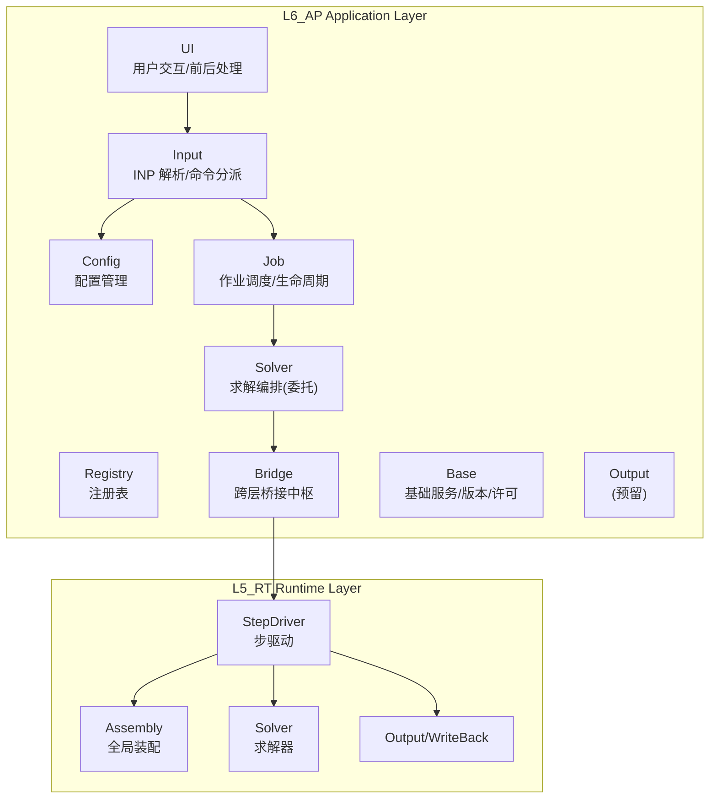
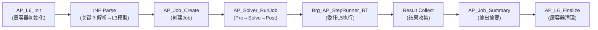
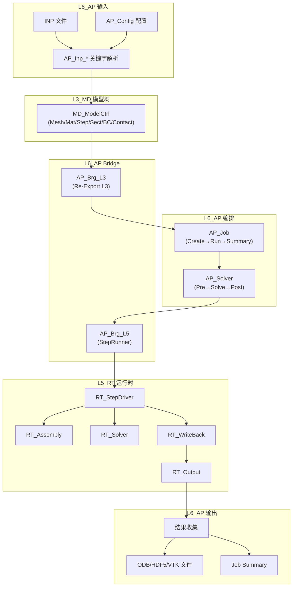

# L6_AP APPLICATION 层级契约

- **层级**: L6_AP  
- **域名**: Application / 应用层顶层编排  
- **缩写**: AP (`AP_*`)  
- **职责**: Job 编排、INP 解析与命令分派、Step 序列调度、L3/L4/L5 桥接、结果收集与输出、用户入口。UFC 六层架构的**最顶层**，用户可见的唯一入口层。  
- **非职责**: 不实现任何物理/数值算法；不管理全局矩阵/向量；不直接调用 L4/L3/L2/L1（经 Bridge 域中转）。  

---

## 1. 层级定位

L6_AP 是 UFC 六层架构的**顶层应用层**。

| 特征 | 说明 |
|------|------|
| **架构角色** | 用户入口 → INP 解析 → Job/Step 编排 → 委托 L5_RT 执行 → 收集结果 → 输出文件 |
| **调用方向** | L6 → L5_RT（单向依赖，L5 **不得**反向依赖 L6） |
| **编排模式** | 委托架构：L6 编排 + L5 执行 + L4 物理核 + L3 模型定义 + L2 数值算子 + L1 基础设施 |
| **热路径** | **否** — L6 仅做宏观编排，实际热路径在 L5_RT/L4_PH |

---

## 2. 子域架构



| 子域 | 路径 | 核心职责 | CONTRACT |
|------|------|----------|----------|
| **Base** | `L6_AP/` | 版本信息、许可验证、错误码范围(6000–6999)、层容器 | — |
| **Input** | `L6_AP/Input/` | INP 文件解析、关键字分派、命令管理器、Mesh/Mat/Step/Sect 解析 | `Input/CONTRACT.md` |
| **Config** | `L6_AP/Config/` | KV 配置管理、配置域生命周期 | `Config/CONTRACT.md` |
| **Registry** | `L6_AP/Registry/` | 应用级注册表（服务/域/回调） | `Registry/CONTRACT.md` |
| **Job** | `L6_AP/Job/` | 作业创建/提交/调度/监控/断点续算 | `Job/CONTRACT.md` |
| **Solver** | `L6_AP/Solver/` | 求解编排（Pre→Solve→Post），委托 Job/L5 执行 | `Solver/CONTRACT.md` |
| **Bridge** | `L6_AP/Bridge/` | L6→L3/L4/L5 跨层桥接中枢(Re-Export/Adapter/StepRunner) | `Bridge/CONTRACT.md` |
| **UI** | `L6_AP/UI/` | INP 驱动的 UI 管理、模型树、Job 管理、ModelMgr | `UI/CONTRACT.md` |
| **Output** | `L6_AP/Output/` | (预留) 应用层输出编排 | — |

---

## 3. 公开接口清单

### 3.1 Job 生命周期接口

| 接口名 | 签名 | 职责 | 消费者 |
|--------|------|------|--------|
| `AP_Job_Create` | `(desc, job_name, input_file, job_type, status)` | 创建 Job 描述 | 主程序 / UI |
| `AP_Job_Core_Init` | `(desc, state, status)` | 初始化 Job 运行时状态 | AP_Solver |
| `AP_Job_Run` | `(desc, state, status)` | 启动 Job（IDLE→RUNNING 状态转换） | AP_Solver |
| `AP_Job_Abort` | `(state, status)` | 中止 Job（→FAILED） | AP_Solver / 错误处理 |
| `AP_Job_Get_Status` | `(state) → status_code` | 查询 Job 状态 | UI / 监控 |
| `AP_Job_Summary` | `(desc, state, unit_num, status)` | 输出 Job 摘要 | 主程序 |
| `AP_Job_Core_Finalize` | `(desc, state, status)` | 清理 Job 资源 | 主程序 |

### 3.2 Solver 编排接口

| 接口名 | 签名 | 职责 | 消费者 |
|--------|------|------|--------|
| `AP_Solver_Domain_Init` | `(this, status)` | Solver 域初始化 | Job |
| `AP_Solver_Domain_RunJob` | `(this, status)` | 运行求解作业（Pre→Solve→Post） | Job |
| `AP_Solver_Domain_SetOMPThreads` | `(this, arg)` | 设置 OpenMP 线程数 | Config |
| `AP_Solver_Domain_GetSummary` | `(this, arg)` | 查询作业状态/时间/内存 | UI / 监控 |
| `AP_Solver_Domain_Finalize` | `(this)` | Solver 域清理 | Job |

### 3.3 Input 解析接口

| 接口名 | 模块 | 职责 | 消费者 |
|--------|------|------|--------|
| `AP_Inp_Init.*` | `AP_Inp_Init` | *HEADING/*NODE/*ELEMENT 等初始化关键字解析 | INP 管道 |
| `AP_Inp_Mat.*` | `AP_Inp_Mat` | *MATERIAL/*ELASTIC/*PLASTIC 材料关键字解析 | INP 管道 |
| `AP_Inp_Mesh.*` | `AP_Inp_Mesh` | *NODE/*ELEMENT/*NSET/*ELSET 网格关键字解析 | INP 管道 |
| `AP_Inp_Step.*` | `AP_Inp_Step` | *STEP/*STATIC/*DYNAMIC 分析步关键字解析 | INP 管道 |
| `AP_Inp_Sect.*` | `AP_Inp_Sect` | *SOLID SECTION/*SHELL SECTION 截面关键字解析 | INP 管道 |
| `AP_Inp_CmdMgr.*` | `AP_Inp_CmdMgr` | 命令管理器（注册/分派/执行） | UI |

### 3.4 Bridge 桥接接口

| 接口名 | 方向 | 职责 | 消费者 |
|--------|------|------|--------|
| `Brg_AP_StepRunner_RT` | L6→L5 | StepRunner 桥接，委托 `RT_RunModel_Ctx` 执行全作业 | Job |
| `Brg_AP_Configure_Solver_ToCtx` | L6→L5 | 配置 L5 求解器（static/dynamic/explicit） | Solver |
| `Brg_AP_SetJobCtx_InContainer` | L6→L5 | 注入 JobCtx 到 L6 容器 | Job |
| `Brg_AP_SetRTDrvCtx` | L6→L5 | 存储 RT_Drv_Ctx 到全局指针 | Job |
| `Brg_AP_Get_Job_Status_FromCtx` | L5→L6 | 查询 L5 运行时作业状态 | UI / 监控 |
| `Brg_AP_Query_Runtime_State_FromField` | L5→L6 | 查询场变量（u/v/a/T） | Output |
| `Brg_AP_Get_Physical_Results` | L4→L6 | 查询物理结果（Ke/Re/Fe） | Output |
| `MD_Mat_Desc_To_UF_MaterialDef` | L3↔L6 | 材料类型双向转换 | Input/Bridge |

### 3.5 Layer 容器接口

| 接口名 | 签名 | 职责 | 消费者 |
|--------|------|------|--------|
| `AP_L6_Init` | `(this, status)` | 初始化 L6 层容器（Base→Input→Registry） | 主程序 |
| `AP_L6_Finalize` | `(this)` | 清理 L6 层容器（Registry→Input→Base，严格逆序） | 主程序 |
| `UF_SimData_Init` | `(sim)` | 初始化 L1~L6 全层聚合根 | 主程序 |
| `UF_SimData_Free` | `(sim)` | 释放全层聚合根所有分配内存 | 主程序 |

---

## 4. 调用协议

### 4.1 Job 生命周期



**完整生命周期**:

```text
1. AP_L6_Init          — 初始化层容器（Base→Input→Registry）
2. INP Parse           — 解析输入文件，构建 L3 模型树
   2a. AP_Inp_Init.*   — 解析几何/网格关键字
   2b. AP_Inp_Mat.*    — 解析材料关键字
   2c. AP_Inp_Step.*   — 解析分析步关键字
3. AP_Job_Create       — 创建 Job 描述（名称/输入文件/类型）
4. AP_Job_Core_Init    — 初始化 Job 运行时状态
5. Brg_AP_Configure_Solver_ToCtx — 配置 L5 求解器参数
6. AP_Solver_RunJob    — 三阶段求解编排：
   6a. Preprocess      — 模型校验/资源分配
   6b. Solve           — 委托 AP_Job_Run → Brg_AP_StepRunner_RT → L5 RT_RunModel_Ctx
   6c. Postprocess     — 输出文件/报告生成
7. AP_Job_Summary      — 输出作业摘要
8. AP_L6_Finalize      — 层容器清理（严格逆序）
```

### 4.2 Step 调度协议

```text
ForEach step in step_list:
  1. L6: AP_Job_Run → 设置 RUNNING 状态
  2. L6: Brg_AP_StepRunner_RT(stepIndex) → 委托 L5
  3. L5: RT_StepDriver_Execute → 分发至 Static/DynExpl/DynImpl
  4. L5: StepStateMachine → Increment → Iteration 三层嵌套
  5. L5: 返回步结果（收敛/失败/切步）
  6. L6: 收集结果 → 判断继续/终止
  7. L6: 若失败 → AP_Job_Abort / Save_Checkpoint
```

### 4.3 错误传播协议

```text
L5_RT ErrorStatusType (步内错误)
  → L5_RT StepDriver 聚合 (步级错误)
  → Brg_AP_StepRunner_RT 桥接传递
  → L6 AP_Solver_RunJob 捕获
  → L6 AP_Job 状态更新 (DONE/FAILED)
  → 日志 + 退出码 (AP_Base_State.exitCode)
```

L6 负责**最终错误处理**：记录日志、设置退出码、释放资源。不使用 `STOP`；所有错误通过 `ErrorStatusType` 传播。

---

## 5. 数据流



**数据流主链**:

```text
INP 文件
  → L6 AP_Inp_* 解析 → L3 模型树 (Mesh/Mat/Step/Sect/BC/Contact)
  → L6 AP_Brg_L3 桥接
  → L6 AP_Job_Create (Job 描述)
  → L6 AP_Solver_RunJob (三阶段编排)
  → L6 AP_Brg_L5 StepRunner → L5 RT_StepDriver_Execute
  → L5 Assembly/Solver/Output/WriteBack
  → L6 结果收集 → ODB/HDF5 输出文件 + Job Summary
```

---

## 6. 四型 TYPE 映射

| 子域 | Desc | State | Algo | Ctx |
|------|------|-------|------|-----|
| **Base** | `AP_SolveCfg_Type`, `AP_LoadCase_Type`, `AP_BCSet_Type`, `AP_OutCtrl_Type`, `AP_JobCtrl_Type` | `AP_Base_State`(licenseValid/startupTime/exitCode) | — | `AP_Base_Ctrl`(configFilePath/workDir/debugMode) |
| **Input** | `AP_Inp_Def` 系列 TYPE | — | — | — |
| **Config** | `AP_Config_Desc`(max_entries) | `AP_Config_State`(entries[]/n_entries) | — | — |
| **Job** | `AP_Job_Desc`(job_name/input_file/job_type) | `AP_Job_State`(job_status/elapsed_time/current_step) | 调度策略(FIFO/Priority) | `AP_Job_Ctx` |
| **Solver** | `AP_Solver_Ctrl`(nOMPThreads/memoryLimitMB/dryRun/dataCheck) | `AP_Solver_State`(jobPhase/步数统计/三阶段时间/峰值内存) | 三阶段生命周期(Pre→Solve→Post) | 无(通过 g_ufc_global 访问) |
| **Bridge** | 无(转发 L3 Desc) | 无(转发 L5 State) | 无 | 无 |
| **Registry** | `AP_Reg_Def` 系列 TYPE | — | — | — |
| **Layer** | `AP_L6_LayerContainer`(base/input/registry/jobName/initialized) | — | — | — |
| **SimData** | `AP_SimData_Def`(L1~L6 全层聚合根) | `UF_GlobState_Type`(isInit/isRun/isConv/exitCode) | — | — |

---

## 7. 禁止事项

| 约束 | 级别 | 说明 |
|------|------|------|
| L6 禁止直接调用 L4/L3/L2/L1 | **硬** | 必须经 Bridge 域中转，`AP_Brg_L3/L4/L5.f90` 为唯一跨层通道 |
| L6 禁止实现任何物理/数值算法 | **硬** | 物理算法 → L4_PH；数值算法 → L2_NM |
| L6 禁止管理全局矩阵/向量分配 | **硬** | CSR/DOF 映射 → L5_RT/Assembly；内存池 → L5_RT/L1_IF |
| L5 不得反向依赖 L6 | **硬** | 单向调用：L6 → L5，无回调/无循环依赖 |
| 不使用 `STOP` | **硬** | 所有错误通过 `ErrorStatusType` 传播至顶层，由 `AP_Base_State.exitCode` 决定退出 |
| 步内热路径不回 L6 | **硬** | L5 步内循环禁止 USE L6 模块 |

---

## 8. 错误处理

| 子域 | 错误码范围 | 说明 |
|------|-----------|------|
| Base | 6000–6099 | 基础错误（许可/配置/版本） |
| Bridge | 60100–60199 | 桥接错误（类型转换/查询失败） |
| Input | 60200–60399 | 解析错误（语法/未知关键字/参数校验） |
| Job | 60400–60499 | 作业错误（状态机违规/资源不足/崩溃） |
| Config | 60500–60599 | 配置错误（键不存在/类型不匹配） |
| Registry | 60600–60699 | 注册表错误（重复注册/未找到） |
| Solver | 60700–60799 | 求解编排错误（全局容器未就绪/求解失败） |
| UI | 60800–60899 | UI 错误（模型树/命令执行） |

**传播规则**: 各子域捕获下层错误 → 附加子域上下文 → 传播至 Job/Solver → 最终由 `AP_Base_State.exitCode` 承载。

---

## 9. 域际关系

| 编号 | 对端域 | 方向 | 关系类型 | 主要接触面 | 备注 |
|------|--------|------|----------|------------|------|
| R1 | L5_RT/StepDriver | 下游 | B(桥接) | Brg_AP_StepRunner_RT → RT_RunModel_Ctx | Job 委托执行 |
| R2 | L5_RT/Solver | 下游 | B(桥接) | Brg_AP_Configure_Solver_ToCtx → RT_Sol_Cfg | 求解器配置 |
| R3 | L5_RT/Output | 下游 | S(消费) | 结果收集 → ODB/HDF5 | 步末输出触发 |
| R4 | L5_RT/WriteBack | 下游 | S(消费) | 状态查询 | 回写结果查询 |
| R5 | L3_MD/* (11域) | 下游 | B(桥接) | AP_Brg_L3 Re-Export | 模型数据访问 |
| R6 | L4_PH/* | 下游 | B(桥接) | AP_Brg_L4 Adapter | 物理结果查询 |
| R7 | L1_IF/Error | 基础 | U(USE) | ErrorStatusType/IF_STATUS_* | 错误码定义 |
| R8 | L1_IF/Prec | 基础 | U(USE) | wp/i4/i8 | 精度参数 |

---

## 10. .f90 文件清单

### 10.1 根级文件

| 文件 | 模块 | 职责 | 状态 |
|------|------|------|------|
| `AP_Base_Def.f90` | `AP_Base_Def` | L6 四型 TYPE 定义（SolveCfg/LoadCase/BCSet/OutCtrl/JobCtrl/AppCtrl） | **ACTIVE** |
| `AP_Base_Mgr.f90` | `AP_Base_Mgr` | Base 域（版本/许可/配置/错误码 6000–6999） | **ACTIVE** |
| `AP_L6_Layer.f90` | `AP_L6_Layer` | L6 层容器（Base→Input→Registry 聚合） | **ACTIVE** |
| `AP_SimData_Def.f90` | `AP_SimData_Def` | L1~L6 全层聚合根（SimData） | **ACTIVE** |

### 10.2 子域文件

| 子域 | 文件数 | 核心文件 |
|------|--------|----------|
| **Input** | 14+ | `AP_Inp_Init.f90`, `AP_Inp_Mat.f90`, `AP_Inp_Mesh.f90`, `AP_Inp_Step.f90`, `AP_Inp_Sect.f90`, `AP_Inp_CmdMgr.f90`, `AP_Inp_Domain.f90` |
| **Config** | 5 | `AP_Config_Def.f90`, `AP_Config_Core.f90`, `AP_Cfg_Domain.f90`, `AP_Cfg_Mgr.f90` |
| **Registry** | 4 | `AP_Reg_Def.f90`, `AP_Reg_Core.f90`, `AP_Reg_Domain.f90` |
| **Job** | 7 | `AP_Job_Def.f90`, `AP_Job_Core.f90`, `AP_Job_Domain.f90`, `AP_Job_Mgr.f90`, `AP_Job_Ctx.f90`, `AP_Job_Util.f90` |
| **Solver** | 4 | `AP_Solv_Def.f90`, `AP_Solv_Core.f90`, `AP_Solv_Domain.f90` |
| **Bridge** | 5 | `AP_Brg_L3.f90`, `AP_Brg_L4.f90`, `AP_Brg_L5.f90`, `AP_Mat_Brg.f90`, `AP_StorageCfg_Brg.f90` |
| **UI** | 9 | `AP_UI_Domain.f90`, `AP_UI_Mgr.f90`, `AP_UI_JobMgr.f90`, `AP_UI_ModelMgr.f90`, `AP_UI_TreeMgr.f90`, `AP_UI_INP_Core.f90` |

---

## 11. 十件套 v2.0 映射

| # | 逻辑件 | 物理落地 | 状态 |
|---|--------|----------|------|
| 1 | Contract | `CONTRACT.md`（本文件）+ 各子域 `CONTRACT.md` | Active |
| 2 | Definition | `AP_Base_Def.f90`, `AP_Job_Def.f90`, `AP_Config_Def.f90`, `AP_Solv_Def.f90`, `AP_Reg_Def.f90` | Active |
| 3 | Desc | `AP_Job_Desc`, `AP_SolveCfg_Type`, `AP_Config_Desc` | Active |
| 4 | State | `AP_Job_State`, `AP_Solver_State`, `AP_Base_State`, `UF_GlobState_Type` | Active |
| 5 | Algo | Job 调度策略 / Solver 三阶段编排 | Active |
| 6 | Ctx | `AP_Job_Ctx`, `AP_Base_Ctrl`, `AP_Solver_Ctrl` | Active |
| 7 | Main/Kernel | `AP_Job_Core.f90`, `AP_Solv_Domain.f90`, `AP_UI_Mgr.f90` | Active |
| 8 | Bridge | `Bridge/AP_Brg_L3.f90`, `AP_Brg_L4.f90`, `AP_Brg_L5.f90` | Active |
| 9 | Runtime Proc | `AP_Job_Domain.f90`, `AP_Solv_Domain.f90` | Active |
| 10 | Registry | `Registry/AP_Reg_Domain.f90` | Active |
| 11 | Populate | INP 解析 → L3 模型树构建 | Active |
| 12 | Diagnostics | `AP_Job_Summary`, `AP_Solver_GetSummary` | Active（基础） |
| 13 | Test | 待建 | Deferred |

---

## 12. 四链说明

| 链 | 本层可核对说明 |
|----|---------------|
| **理论链** | 有限元分析工作流理论：模型定义→分析步编排→求解→后处理；L6 实现 INP→Job→Step→Output 编排 |
| **逻辑链** | INP Parse(L6) → Model Build(L3) → Job Create(L6) → StepRunner(L6→L5) → StepDriver(L5) → Assembly/Solver(L5) → Output(L5) → Summary(L6) |
| **计算链** | L6 无直接计算；编排 L5_RT 执行实际 Step/Increment/Iteration 计算循环 |
| **数据链** | INP 文件(外部) → `AP_Inp_*`(L6 解析) → `MD_ModelCtrl`(L3 冷) → `AP_Brg_*`(L6 桥接) → L5 运行时 slot(热) → `AP_Job_Summary`(L6 收集) → ODB/HDF5(外部) |

---

## 13. SIO / `*_Arg`（本层偏好）

与本项目 Principle #14、**[`AGENTS.md`](../../AGENTS.md)** Repository rules §5 一致：**不**强制本层每个过程都使用 `*_Arg` / `Apply_*`。**避免**仅承载 **`status`**、无其它字段的 `Arg` 薄封装（无必要）。**保留** `*_Arg`（及 `Apply_*` 若适用）当一次交互有 **≥2** 个会一起演进的字段，或明确由 **Harness / 生成器 / 跨层编排** 消费。**层间边界**与 **L5 `_Proc`** 仍以全仓库 SIO 硬约束为准。

---

## 14. 约束分级

| 约束 | 级别 | 检查方式 | Gate |
|------|------|----------|------|
| L6→L5 单向依赖 | **硬** | `arch_guardian.py` 依赖图 | CI |
| 不使用 `STOP` | **硬** | `grep -r 'STOP' L6_AP/` | CI |
| Bridge 为唯一跨层通道 | **硬** | 代码审查 + `arch_guardian.py` | PR 合入 |
| Job 状态机合法转换 | **硬** | 单元测试 | CI |
| Solver 三阶段顺序 | **硬** | 状态机断言 | CI |
| INP 关键字覆盖率 | **软** | 集成测试 | Nightly |
| 测试覆盖率 | **软** | 待建 | Deferred |

---

## 15. 版本与变更

| 版本 | 日期 | 变更 | 验证 |
|------|------|------|------|
| v1.0 | 2026-04-28 | 初始版本：L6_AP 层级契约创建，定义 Job 生命周期 / Step 调度 / 错误传播协议 | AI Agent |
